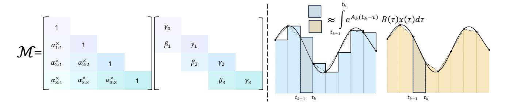
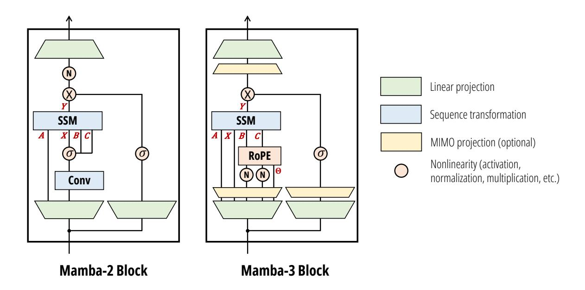
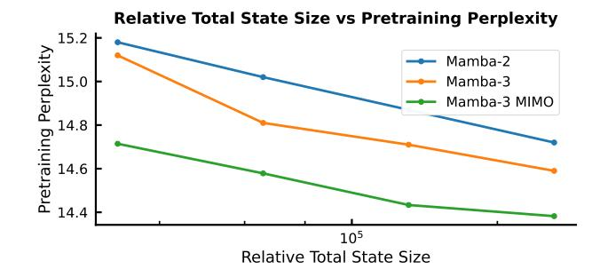
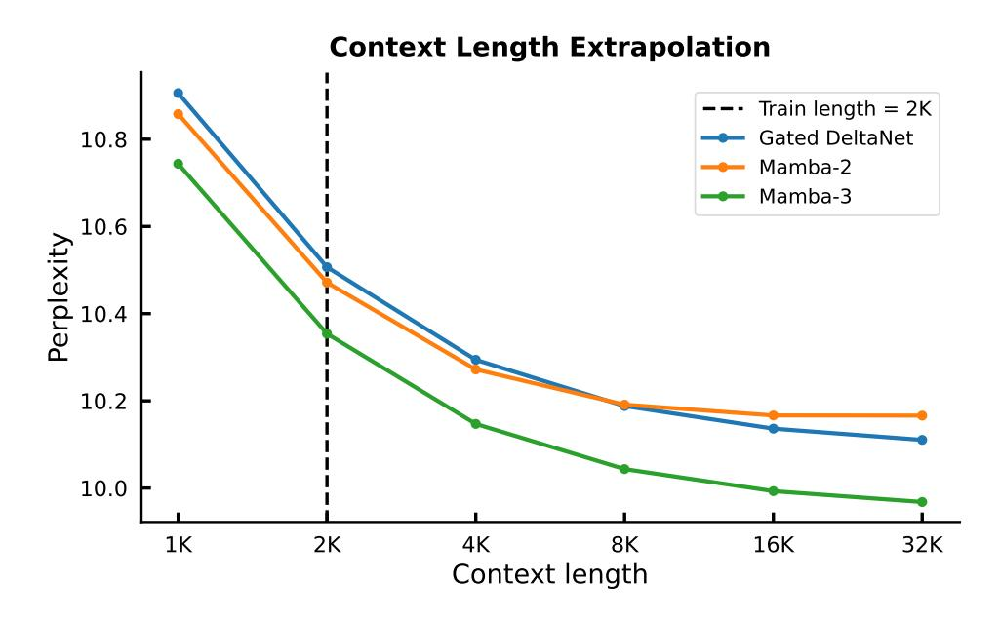
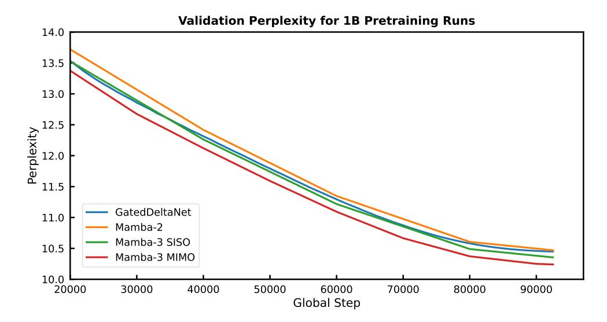
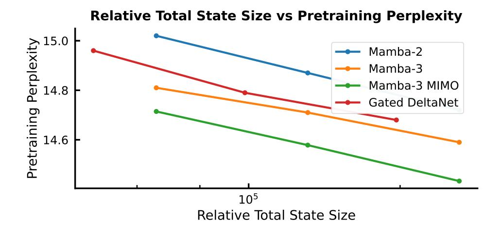

# Mamba-3: Improved Sequence Modeling using State Space Principles

Aakash Lahoti ∗ 1 , Kevin Y. Li ∗ 1 , Berlin Chen ∗ 2 , Caitlin Wang ∗ 2 , Aviv Bick1 , J. Zico Kolter1 , Tri Dao† 23 , and Albert Gu† 14

1Carnegie Mellon University 2Princeton University 3Together AI 4Cartesia AI {alahoti, kyl2, abick, zkolter, agu}@cs.cmu.edu {bc2188, caitlinwang, tridao}@princeton.edu

#### Abstract

Scaling inference-time compute has emerged as an important driver of LLM performance, making inference efficiency a central focus of model design alongside model quality. While the current Transformer-based models deliver strong model quality, their quadratic compute and linear memory make inference expensive. This has spurred the development of sub-quadratic models with reduced linear compute and constant memory requirements. However, many recent linear models trade off model quality and capability for algorithmic efficiency, failing on tasks such as state tracking. Moreover, their theoretically linear inference remains hardware-inefficient in practice. Guided by an inference-first perspective, we introduce three core methodological improvements inspired by the state space model (SSM) viewpoint of linear models. We combine: (1) a more expressive recurrence derived from SSM discretization, (2) a complex-valued state update rule that enables richer state tracking, and (3) a multi-input, multi-output (MIMO) formulation for better model performance without increasing decode latency. Together with architectural refinements, our Mamba-3 model achieves significant gains across retrieval, state-tracking, and downstream language modeling tasks. At the 1.5B scale, Mamba-3 improves average downstream accuracy by 0.6 percentage points compared to the next best model (Gated DeltaNet), with Mamba-3's MIMO variant further improving accuracy by another 1.2 points for a total 1.8 point gain. Across state-size experiments, Mamba-3 achieves comparable perplexity to Mamba-2 despite using half of its predecessor's state size. Our evaluations demonstrate Mamba-3's ability to advance the performance-efficiency Pareto frontier.

## 1 Introduction

Test-time compute has emerged as a key driver of progress in LLMs, with techniques like chain-of-thought reasoning and iterative refinement demonstrating that inference-time scaling can unlock new capabilities (Snell et al. [2024;](#page-19-0) Wu et al. [2025\)](#page-20-0). The rapid rise of parallel, agentic workflows has only intensified the need for efficient inference and deployment of such models (Anthropic [2026;](#page-17-0) OpenAI [2026\)](#page-19-1). This paradigm shift makes inference efficiency (Kwon et al. [2023;](#page-18-0) Li et al. [2024\)](#page-18-1) paramount, as the practical impact of AI systems now depends critically on their ability to perform large-scale inference during deployment. Model architecture design plays a fundamental role in determining inference efficiency, as architectural choices directly dictate the computational and memory requirements during generation. While Transformerbased models (Vaswani et al. [2017\)](#page-20-1) are the current industry standard, they are fundamentally bottlenecked by linearly increasing memory demands through the KV cache and quadratically increasing compute requirements through the selfattention mechanism. These drawbacks have motivated recent lines of work on sub-quadratic models, e.g., state space models (SSMs) and linear attention, which retain constant memory and linear compute while attaining comparable or better performance than their Transformer counterparts. These models have made it into the mainstream, with layers such as Mamba-2 (Dao and Gu [2024\)](#page-17-1) and Gated DeltaNet (GDN) (Schlag, Irie, and Schmidhuber [2021;](#page-19-2) S. Yang, B. Wang, Y. Zhang, et al. [2025\)](#page-20-2) recently incorporated into large-scale hybrid models that match the performance of pure Transformer alternatives with much higher efficiency (Kimi Team et al. [2025;](#page-18-2) NVIDIA et al. [2025;](#page-19-3) Tencent Hunyuan Team et al. [2025;](#page-19-4) A. Yang et al. [2025\)](#page-20-3).

Despite the success of linear models, significant progress remains in improving their performance, in particular on advancing the Pareto frontier between model quality and inference efficiency. For example, Mamba-2 was developed to improve

∗Equal contribution.

†Equal advising.

training speed and simplicity over Mamba-1 (Gu and Dao 2024), by sacrificing some expressivity and thus performing worse for inference-matched models. In addition, they have been shown to lack certain capabilities, such as poor state-tracking abilities, e.g., simply determining parity of bit sequences (Grazzi, Siems, Zela, et al. 2025; Sarrof, Veitsman, and Hahn 2024). Finally, despite these sub-quadratic models being prized for theoretically efficient inference and thus their widespread adoption, their inference algorithms are not hardware efficient. In particular, because these algorithms were developed from a training perspective, their decoding phase has low arithmetic intensity (the ratio of FLOPs to memory traffic), resulting in large portions of hardware remaining idle.

To develop more performant models from an inference-first paradigm, we introduce three core methodological changes on top of Mamba-2, influenced by an SSM-centric viewpoint of sub-quadratic models.

**Exponential-Trapezoidal Discretization.** We provide a simple technique for discretizing time-varying, selective SSMs. Through our framework, we can derive several new discretization methods. One of our instantiations, referred to as "exponential-Euler," formalizes Mamba-1 and Mamba-2's heuristic discretization that previously lacked theoretical justification. Our new "exponential-trapezoidal" instantiation is a more expressive generalization of "exponential-Euler," where the recurrence can be expanded to reveal an implicit convolution applied on the SSM input. Combined with explicit *B*, *C* bias terms, Mamba-3 can empirically replace the short causal convolution in language model architectures, which was previously hypothesized to be essential for recurrent models.

**Complex-valued State Space Model.** By viewing the underlying SSM of Mamba-3 as complex-valued, we enable a more expressive state update than Mamba-2's. This change in update rule, designed to be lightweight for training and inference, overcomes the lack of state-tracking ability common in many current linear models. We show that our complex-valued update rule is equivalent to a data-dependent rotary embedding and can be efficiently computed (Su et al. 2023), and empirically demonstrate its ability to solve synthetic tasks outside the capabilities of prior linear models.

**Multi-Input, Multi-Output (MIMO) SSM.** To improve FLOP efficiency during decoding, we switch from an outer-product-based state update to a matrix-multiplication-based state update. From the view of the signal processing foundations of SSMs, such a transition exactly coincides with the generalization from a single-input single-output (SISO) sequence dynamics to a multiple-input multiple-output (MIMO) one. Here, we find that MIMO is particularly suitable for inference, as the extra expressivity enables more computation during the memory-bound state update during decoding, without increasing the state size and compromising speed.

Put together, these improvements form the core of our **Mamba-3** layer. Methodologically, we note that these all arise naturally from an SSM-centric perspective but are not immediate from other popular viewpoints of modern linear layers such as linear attention or test-time regression; we discuss these connections further in Section 5. Empirically, we validate our new model's abilities and capabilities on a suite of synthetic state-tracking and language-modeling tasks.

- Better Quality. At 1.5B scale, Mamba-3 (MIMO) improves downstream language modeling accuracy by +2.2 over Transformers, +1.9 points over Mamba-2, and +1.8 over GDN, while Mamba-3 (SISO) improves over the next best model, GDN, by +0.6 points. Furthermore, across state size experiments, Mamba-3 (MIMO) with state size 64 matches the perplexity of Mamba-2 with state size 128, effectively achieving the same language modeling performance with half the latency.
- New Capabilities. Mamba-3's complexification of the SSM state enables it to solve synthetic state-tracking tasks that Mamba-2 cannot. We empirically demonstrate that the efficient RoPE-like calculation is able to near perfectly solve arithmetic tasks, while Mamba-3 without RoPE and Mamba-2 perform no better than random guessing.
- Inference Efficiency. Mamba-3 (MIMO) improves hardware utilization. It increases decoding FLOPs by up to 4× relative to Mamba-2 at fixed state size, while maintaining similar wall-clock decode latency, and simultaneously improving perplexity and downstream performance. We release fast training and inference kernels for Mamba-3.1

Mamba-3 (SISO) improves quality and capability over prior linear models, and Mamba-3 (MIMO) further improves performance over Mamba-3 (SISO) and other strong baselines while matching inference speed with Mamba-2. Both of our Mamba-3 variants advance the performance-latency Pareto frontier through their strong modeling capabilities and hardware-efficient design.

1https://github.com/state-spaces/mamba.

#### 2 Preliminaries

#### 2.1 Notation

Scalars are denoted by plain-text letters (e.g., x, y). Tensors, including vectors and matrices, are denoted by bold letters (e.g., h, C). The shape of the tensor can be inferred from the context. We denote the input sequence length as T, the model dimension as D, and the SSM state size as N. For time indices, we use subscripts (e.g.,  $x_t$  for the input at time t). The Hadamard product between two tensors is denoted by  $\odot$ . For a vector  $v \in \mathbb{R}^d$ , we denote  $\mathrm{Diag}(v) \in \mathbb{R}^{d \times d}$  as the diagonal matrix with the vector v as the diagonal, and for products of scalars across time steps, we use the notation  $\alpha_{t\cdots s} = \alpha_{t:s}^* = \prod_{t=s}^t \alpha_t$ .

#### 2.2 SSM Preliminaries

State Space Models (SSMs) describe continuous-time linear dynamics via

$$\dot{\boldsymbol{h}}(t) = \boldsymbol{A}(t)\,\boldsymbol{h}(t) + \boldsymbol{B}(t)\,\boldsymbol{x}(t), \qquad \qquad \boldsymbol{y}(t) = \boldsymbol{C}(t)^{\top}\boldsymbol{h}(t),$$

where  $h(t) \in \mathbb{R}^N$  is the hidden state,  $x(t) \in \mathbb{R}$  the input, and  $A(t) \in \mathbb{R}^{N \times N}$ , B(t),  $C(t) \in \mathbb{R}^N$ . We will occasionally refer to A(t) as the *state-transition* and B(t)x(t) as the *state-input*; this also extends to their discretized counterparts. For discrete sequences with step size  $\Delta_t$ , Mamba-1 and Mamba-2 *discretized* the system to the following recurrence

$$h_t = e^{\Delta_t A_t} h_{t-1} + \Delta_t B_t x_t, \qquad y_t = C_t^{\top} h_t.$$

**Mamba-2's Parameterization.** The core of the Mamba-2 layer (Dao and Gu 2024) is a *data-dependent* and hardware-efficient SSM. Both the state-transition and state-input are made data-dependent through the projection of  $\Delta_t \in \mathbb{R}_{>0}$  and  $B, C \in \mathbb{R}^N$  from the current token. By parameterizing the state-transition  $A_t$  as a scalar times identity ( $A_t = A_t I_{N \times N}$ , where  $A_t \in \mathbb{R}_{<0}$ ), the SSM recurrence can be efficiently computed with the matrix multiplication tensor cores of GPUs. Defining  $\alpha_t := e^{\Delta_t A_t} \in (0, 1)$  and  $\gamma_t := \Delta_t$ , the update becomes

$$h_t = \alpha_t h_{t-1} + \gamma_t B_t x_t, \qquad y_t = C_t^{\mathsf{T}} h_t. \tag{1}$$

The data-dependent state-transition  $\alpha_t$  controls the memory horizon of each SSM within the layer.  $\Delta_t$  in particular modulates both the state-transition and state-input: a larger  $\Delta_t$  forgets faster and up-weights the current token more strongly, while a smaller  $\Delta_t$  retains the hidden state with minimal contributions from the current token.

Remark 1. In Mamba-2,  $A_t$  is data-independent, since the overall discrete transition  $\alpha_t := e^{\Delta_t A_t}$  is data-dependent through  $\Delta_t$ . In Mamba-3, we empirically found that data-dependent  $A_t$  has similar performance to data-independent  $A_t$ , and chose the former as a default for consistency so that all SSM parameters are data-dependent.

### 2.3 Structured Masked Representation and State Space Duality

Mamba-2 showed that a large class of SSMs admit a *matrix* form that vectorizes the time-step recurrence. Through the state space duality (SSD) framework, recurrent SSMs can be represented within a parallel form that incorporates an element-wise mask to model the state-transition decay.

SSD provides a general framework for a duality between linear recurrence and parallelizable (matrix-multiplication-based) computational forms

$$Y = (L \odot CB^{\mathsf{T}})X \tag{2}$$

where  $L \in \mathbb{R}^{T \times T}$  is a structured mask,  $B, C \in \mathbb{R}^{T \times N}$ ,  $X \in \mathbb{R}^{T \times D}$  are the inputs to the SSM and  $Y \in \mathbb{R}^{T \times D}$  is its output. Different structures on L give rise to various instantiations of SSD.

Equation (2) also draws a general connection between recurrence and attention, by setting  $\mathbf{Q} \coloneqq \mathbf{C}$ ,  $\mathbf{K} \coloneqq \mathbf{B}$ ,  $\mathbf{V} \coloneqq \mathbf{X}$  and viewing  $\mathbf{L}$  as a data-dependent mask. In fact, the simplest case of SSD is (causal) linear attention (Katharopoulos et al. 2020), where  $\mathbf{L}$  is the causal triangular mask.

Figure 1: **Left:** The structured mask induced by the exponential-trapezoidal rule (Section 3.1) is a product of the decay and two-band convolutional mask. **Right:** Euler (hold endpoint) versus Trapezoidal (average endpoints) integral approximation.

Mamba-2 is a generalization where

$$\boldsymbol{L} = \begin{bmatrix} 1 & & & \\ \alpha_1 & 1 & & \\ \vdots & & \ddots & \\ \alpha_{T\dots 1} & \cdots & \alpha_T & 1 \end{bmatrix} \cdot \operatorname{Diag}(\gamma) \tag{3}$$

composed of terms  $\alpha_t$ ,  $\gamma_t$  from equation (1).2

In Section 3.1.3, we show that Mamba-3 is a generalization of Mamba-2 with a more expressive L, and hence also an instance of SSD.

## 3 Methodology

We introduce Mamba-3, a state space model with three new innovations: "exponential-trapezoidal" discretization for more expressive dynamics (Section 3.1), complex-valued state spaces for state tracking (Section 3.2), and multi-input multi-output (MIMO) to improve modeling power and inference-time hardware utilization (Section 3.3). These advances address the quality, capability, and efficiency limitations of current sub-quadratic architectures. We combine these together into an updated Mamba architecture block in Section 3.4.

#### 3.1 Exponential-Trapezoidal Discretization

Structured SSMs are naturally defined as continuous-time dynamical systems that map input functions,  $x(t) \in \mathbb{R}$ , to output functions,  $y(t) \in \mathbb{R}$ , for time t > 0. The underlying continuous state space system is defined by a first-order ordinary differential equation (ODE) for the state  $\dot{h}(t)$  and an algebraic equation for the output y(t). In sequence modeling, however, the data is only observed at discrete time steps, which then requires applying a *discretization step* to the SSM to transform its continuous-time dynamics into a discrete recurrence.

Discretization methods are well-studied in classical control theory with several canonical formulas used in earlier SSM works in deep learning (Gu, Goel, and Ré 2022; Gu, Gupta, et al. 2022; Smith, Warrington, and Linderman 2023). These mechanisms were traditionally stated and applied to linear-time invariant (LTI) systems, and their derivations do not directly apply to linear-time varying (LTV) systems. Additionally, while Mamba-1 adapted the zero-order hold (ZOH) method to LTV systems without proof, the complexity associated with selective SSMs prompted the use of an additional heuristic approximation that lacked theoretical justification and did not correspond to any established discretization technique. In the following subsection, we formalize the previous heuristics used in current LTV SSMs through our discretization framework and utilize it to propose a more expressive discretization scheme.

&lt;sup>2In the original Mamba-2 paper,  $\gamma$  does not appear because it is viewed as folded into the B term. In this paper,  $B_t$  represents the continuous parameter, whereas in Mamba-2,  $B_t$  represents the discretized parameter which is equivalent to  $\gamma_t B_t$ .

&lt;sup>3While the Mamba-1 paper reports ZOH discretization, the implementation follows https://github.com/state-spaces/mamba/issues/129.

Table 1: Table of canonical linear-time invariant discretizations (top) and custom linear-time varying discretizations derived from our exponential-adjusted framework (bottom), along with their appearance in structured SSMs used in deep learning. Our theory formalizes the prior Mamba discretization as exponential-Euler and extends it with the more expressive exponential-trapezoidal method. The generalized discretization framework converts a continuous SSM  $\mathbf{h}(t) = \mathbf{A}(t)\mathbf{h}(t) + \mathbf{B}(t)x(t)$  into the discrete recurrence  $\mathbf{h}_t = \alpha_t\mathbf{h}_{t-1} + \beta_t\mathbf{B}_{t-1}x_{t-1} + \gamma_t\mathbf{B}_tx_t$ , where various discretization methods yield different formulas for  $\alpha_t$ ,  $\beta_t$ ,  $\gamma_t$ .

| Discretization Method          | $\alpha_t$                                             | $\beta_t$                                    | Υt                                               | Appearance               |
|--------------------------------|--------------------------------------------------------|----------------------------------------------|--------------------------------------------------|--------------------------|
| Forward Euler                  | $I + \Delta A$                                         | _                                            | Δ                                                | _                        |
| Backward Euler                 | $(I - \Delta A)^{-1}$                                  | _                                            | $(I - \Delta A)^{-1} \Delta$                     | _                        |
| Trapezoidal                    | $(I - \frac{\Delta}{2}A)^{-1} (I + \frac{\Delta}{2}A)$ | _                                            | $(I-\frac{\Delta}{2}A)^{-1}\Delta$               | S4                       |
| Zero-Order Hold                | $\exp(\Delta A)$                                       | _                                            | $A^{-1} \left( \exp(\Delta A) - I \right)$       | S4D, S5                  |
| Zero-Order Hold                | $\exp(\Delta_t A_t)$                                   | _                                            | $A_t^{-1} \left( \exp(\Delta_t A_t) - I \right)$ |                          |
| <b>Exponential-Euler</b>       | $\exp(\Delta_t A_t)$                                   | _                                            | $\Delta_t$                                       | Mamba-1, -2 3 |
| <b>Exponential-Trapezoidal</b> | $\exp(\Delta_t A_t)$                                   | $(1 - \lambda_t)\Delta_t \exp(\Delta_t A_t)$ | $\lambda_t \Delta_t$                             | Mamba-3                  |

#### 3.1.1 Overview of Exponential-Adjusted Discretization

We introduce a simple derivation that leads to a class of new discretization methods for LTV state space models. The method can be instantiated in various ways; we show that one instantiation results in the heuristic used in Mamba-1/2, thereby theoretically justifying it (exponential-Euler). We also introduce a more powerful discretization (exponential-trapezoidal) used in Mamba-3.

The high-level intuition of our derivation originates from the closed form solution  $x(t) = e^{tA}x(0)$  of a simple linear ODE x'(t) = Ax(t), which discretizes to  $x_{t+1} = e^{\Delta A}x_t$ . In this example, the exponential dominates the dynamics of the underlying first-order ODE, resulting in imprecise approximations when using low-order methods without significantly constraining  $\Delta$ . Thus, we analyze the dynamics of the *exponential-adjusted* system  $e^{-At}x(t)$ . The adjusted system yields a discrete recurrent form where the state-transition and the state-input integrals are approximated separately—the state-transition integral is approximated by a right-hand approximation, i.e.  $A(s) := A(\tau_t)$  for all  $s \in [\tau_{t-1}, \tau_t]$ , yielding,

$$\begin{split} \boldsymbol{h}(\tau_t) &= \underbrace{\exp\left(\int_{\tau_{t-1}}^{\tau_t} A(s) ds\right) \boldsymbol{h}(\tau_{t-1})}_{\text{via right-hand approximation}} + \underbrace{\int_{\tau_{t-1}}^{\tau_t} \exp\left(\int_{\tau}^{\tau_t} A(s) ds\right) \boldsymbol{B}(\tau) \boldsymbol{x}(\tau) d\tau}_{\text{via different discretization schemes}}, \\ \boldsymbol{h}_t &\approx \exp\left(\Delta_t A_t\right) \boldsymbol{h}_{t-1} + \int_{\tau_{t-1}}^{\tau_t} \exp\left((\tau_t - \tau) A_t\right) \boldsymbol{B}(\tau) \boldsymbol{x}(\tau) d\tau, \end{split}$$

which serves as the foundation for further discretization techniques for the state-input integral. The full derivation is detailed in Proposition 5.

**ZOH.** The classical zero-order hold discretization method can be derived from the foundation above with a specific approximation of the right-hand side integral. By treating  $A_t$ ,  $B(\tau)$ ,  $x(\tau)$  as constants over the interval  $[\tau_{t-1}, \tau_t]$  where the values are fixed to the right endpoint  $\tau_t$ , the integral results in  $A_t^{-1}$  (exp $(\Delta_t A_t) - I$ )  $B_t x_t$ .

We note that this formally proves that the classical ZOH formula for LTI systems applies to LTV by naively replacing the parameters A, B,  $\Delta$  with their time-varying ones.

**Exponential-Euler (Mamba-1/-2).** While Mamba-1 stated to use the time-varying ZOH formula above, Mamba-1 and Mamba-2 actually used an additional approximation in the released implementation. This discretization can be recovered by approximating the state-input integral with *Euler's rule* (Süli and Mayers 2003) and holding the (right) endpoint constant

throughout the interval (Fig. 1)

$$h_{t} \approx e^{\Delta_{t} A_{t}} h_{t-1} + (\tau_{t} - \tau_{t-1}) e^{(\tau_{t} - \tau_{t}) A_{t}} B_{t} x_{t}$$

$$= e^{\Delta_{t} A_{t}} h_{t-1} + \Delta_{t} B_{t} x_{t}.$$
(4)

We call equation (4) the *exponential-Euler* discretization method, stemming from the exponential integration followed by Euler approximation. This derivation justifies the formulas used in Mamba-1/-2's implementation.

**Exponential-Trapezoidal (Mamba-3).** However, Euler's rule provides only a first-order approximation of the state-input integral and its local truncation error scales as  $O(\Delta_t^2)$ . In contrast, we introduce a *generalized trapezoidal rule*, which provides a second-order accurate approximation of the integral, offering improved accuracy over Euler's rule. Specifically, it approximates the integral with a *data-dependent*, *convex combination of both interval endpoints*. This generalization extends the classical trapezoidal rule (Süli and Mayers 2003), which simply averages the interval endpoints (Figure 1).

**Proposition 1** (Exponential-Trapezoidal Discretization). Approximating the state-input integral in equation (16) by the general trapezoidal rule yields the recurrence,

$$\boldsymbol{h}_{t} = e^{\Delta_{t} A_{t}} \boldsymbol{h}_{t-1} + (1 - \lambda_{t}) \Delta_{t} e^{\Delta_{t} A_{t}} \boldsymbol{B}_{t-1} \boldsymbol{x}_{t-1} + \lambda_{t} \Delta_{t} \boldsymbol{B}_{t} \boldsymbol{x}_{t}, \tag{5}$$

$$=: \alpha_t h_{t-1} + \beta_t B_{t-1} x_{t-1} + \gamma_t B_t x_t, \tag{6}$$

where  $\lambda_t \in [0,1]$  is a data-dependent scalar,  $\alpha_t := e^{\Delta_t A_t}$ ,  $\beta_t := (1-\lambda_t)\Delta_t e^{\Delta_t A_t}$ ,  $\gamma_t := \lambda_t \Delta_t$ .

*Remark* 2 (Expressivity). The exponential-trapezoidal rule is a generalization of (a) the classical trapezoid rule, which is recovered when  $\lambda_t = \frac{1}{2}$ , and (b) Mamba-2's Euler's rule, which is recovered when  $\lambda_t = 1$ .

Remark 3 (Error Rate). This is a second-order discretization of the state-input integral and its error scales as  $O(\Delta_t^3)$  under standard stability assumptions, provided that the trapezoidal parameter satisfies  $\lambda_t = \frac{1}{2} + O(\Delta_t)$ . However, our ablations indicate that not enforcing this constraint is better for empirical performance. See Appendix A.2 and A.3 for details.

Our new discretization framework and the two instantiations, exponential-Euler and exponential-trapezoidal, are, to the best of our knowledge, novel for structured SSMs used in deep learning. Table 1 compares and summarizes canonical and commonly used discretization schemes for state space models.

#### 3.1.2 Exponential-Trapezoidal Recurrence as an Implicit Convolution

Our generalized exponential-trapezoidal discretization is equivalent to applying a *data-dependent* convolution of size two on the state-input to the SSM. In particular, a normal SSM in recurrent form materializes the state-input  $v_t = B_t x_t$ , then computes a linear recurrence  $h_t = \alpha_t h_{t-1} + \gamma_t v_t$ . In equation (6) we instead first apply a width-2 convolution on  $v_t$  (weighted by  $\beta$ ,  $\gamma$ ) before passing it into the linear recurrence.

Remark 4 (Convolution Differences). There is a distinct difference between the "convolution" induced by exponential-trapezoidal discretization and the standard short convolutions used by sequence models such as Mamba and GDN. Standard short convolutions are independent operations applied on  $x_t$  (and often  $B_t$ ,  $C_t$ ) outside the core recurrence, while our new discretization can be interpreted as a convolution on the state-input  $B_t x_t$  within the core recurrence.

## 3.1.3 Parallel Representation of Exponential-Trapezoidal Recurrence

Our new recurrence can be instantiated as a case of SSD and has a corresponding parallel form to equation (2). Expanding the state recurrence from  $h_0 = \gamma_0 B_0 x_0$  results in  $h_T = \alpha_T \dots 2(\gamma_0 \alpha_1 + \beta_1) B_0 x_0 + \dots + \gamma_T B_T x_T$ , where the SSM output is  $y_T = \alpha_T \dots 2(\gamma_0 \alpha_1 + \beta_1) C_T^{\mathsf{T}} B_0 x_0 + \dots + \gamma_T C_T^{\mathsf{T}} B_T x_T$ . Unrolling these rows shows that the mask induced by the trapezoidal update is no longer a fixed averaging of endpoints (as in the classical trapezoid rule), but a *data-dependent convex combination* of the two interval endpoints.

Under the SSD framework (2) with parallel form  $Y = (L \odot CB^{T})X$ , Mamba-3 corresponds to a mask L whose structure

is a 1-semiseparable matrix composed with a 2-band matrix:4

$$\boldsymbol{L} = \begin{bmatrix} \gamma_0 \\ (\gamma_0 \alpha_1 + \beta_1) & \gamma_1 \\ \alpha_2 (\gamma_0 \alpha_1 + \beta_1) & (\gamma_1 \alpha_2 + \beta_2) & \gamma_2 \\ \vdots & & \ddots \\ \alpha_{T \cdots 2} (\gamma_0 \alpha_1 + \beta_1) & & \cdots & \gamma_T \end{bmatrix} = \begin{bmatrix} 1 \\ \alpha_1 & 1 \\ \alpha_2 \alpha_1 & \alpha_2 & 1 \\ \vdots & & \ddots \\ \alpha_{T \cdots 1} & & \cdots & 1 \end{bmatrix} \begin{bmatrix} \gamma_0 \\ \beta_1 & \gamma_1 \\ 0 & \beta_2 & \gamma_2 \\ \vdots & & \ddots \\ 0 & & \cdots & \gamma_T \end{bmatrix} . \tag{7}$$

This parallel formulation enables the hardware-efficient matmul-focused calculation of the SSM output for training.

We note that the convolutional connection of Mamba-3 can also be seen through this parallel dual form, where multiplication by the 2-band matrix in equation (7) represents convolution with weights  $\beta$ ,  $\gamma$ . In Appendix A.1, we use the SSD tensor contraction machinery to prove that the parallel form is equivalent to a vanilla SSM with a state-input convolution.

*Remark* 5. The structured mask of Mamba-3 can be viewed as generalizing Mamba-2, which instead of the 2-band matrix has a diagonal matrix with  $\gamma_t$  only (3).

## 3.2 Complex-Valued SSMs

Modern SSMs are designed with efficiency as the central goal, motivated by the need to scale to larger models and longer sequences. For instance, successive architectures have progressively simplified the state-transition matrix: S4 (Gu, Goel, and Ré 2022) used complex-valued Normal Plus Low Rank (NPLR) matrices, Mamba (Gu and Dao 2024) reduced this to a diagonal of reals, and Mamba-2 (Dao and Gu 2024) further simplified it to a single scaled identity matrix. Although these simplifications largely maintain language modeling performance, recent works (Grazzi, Siems, Zela, et al. 2025; Merrill, Petty, and Sabharwal 2025; Sarrof, Veitsman, and Hahn 2024) have shown that the restriction to real, non-negative eigenvalue transitions degrades the capabilities of the model on simple state-tracking tasks—here referring primarily to the solvable-group regime (TC0) such as parity—which can be solved by a one-layer LSTM. This limitation, formalized in Theorem 1 of (Grazzi, Siems, Schrodi, et al. 2024), arises from restricting the eigenvalues of the transition matrix to real numbers, which cannot represent "rotational" hidden state dynamics. For instance, consider the parity function on binary inputs  $\{0,1\}$ , defined as  $\sum_t x_t$  mod 2. This task can be performed using update:  $h_t = R(\pi x_t)h_{t-1}$ , where  $R(\cdot)$  is a 2-D rotation matrix. Such rotational dynamics cannot be expressed with real eigenvalues.

#### 3.2.1 Complex SSM with Exponential-Euler Discretization

To recover this capability, we begin with complex SSMs (8), which *are* capable of representing state-tracking dynamics. We show that, under discretization (Proposition 5), complex SSMs can be formulated as real SSMs with a *block-diagonal transition matrix composed of*  $2 \times 2$  *rotation matrices* (Proposition 2). We then show that this is equivalent to applying *data-dependent rotary embeddings* on both the input and output projections B, C respectively. This result establishes a theoretical connection between complex SSMs and data-dependent RoPE embeddings (Proposition 3). Finally, the "RoPE trick" used in Su et al. (2023) allows for an efficient implementation of complex-valued state-transition matrices with minimal computational overhead compared to real-valued SSMs.

Proposition 2 (Complex-to-Real SSM Equivalence). Consider a complex-valued SSM

$$\dot{\boldsymbol{h}}(t) = \operatorname{Diag}(\boldsymbol{A}(t) + i\boldsymbol{\theta}(t))\boldsymbol{h}(t) + (\boldsymbol{B}(t) + i\hat{\boldsymbol{B}}(t))\boldsymbol{x}(t), 
y(t) = \operatorname{Re}((\boldsymbol{C}(t) + i\hat{\boldsymbol{C}}(t))^{\mathsf{T}}\boldsymbol{h}(t)),$$
(8)

where  $h(t) \in \mathbb{C}^{N/2}$ ,  $\theta(t)$ ,  $\hat{B}(t)$ ,  $\hat{C}(t)$ ,  $\hat{C}(t)$ ,  $\hat{C}(t) \in \mathbb{R}^{N/2}$ , and x(t),  $A(t) \in \mathbb{R}$ . Under exponential-Euler discretization, this system is equivalent to a real-valued SSM

$$h_t = e^{\Delta_t A_t} R_t h_{t-1} + \Delta_t B_t x_t,$$

$$y_t = C_t^{\top} h_t,$$
(9)

&lt;sup>4Incidentally, this is a special case of a 2-semiseparable matrix.

with state  $h_t \in \mathbb{R}^N$ , projections

$$\begin{aligned} \boldsymbol{B}_t \coloneqq \begin{bmatrix} \boldsymbol{B}_t \ \hat{\boldsymbol{B}}_t \end{bmatrix} \in \mathbb{R}^N, & C_t \coloneqq \begin{bmatrix} C_t \ -\hat{C}_t \end{bmatrix} \in \mathbb{R}^N, \end{aligned}$$

and a transition matrix

$$\boldsymbol{R}_t := Block\Big(\{R(\Delta_t\boldsymbol{\theta_t}[i])\}_{i=1}^{N/2}\Big) \in \mathbb{R}^{N \times N}, \qquad R(\theta) := \begin{bmatrix} \cos(\theta) & -\sin(\theta) \\ \sin(\theta) & \cos(\theta) \end{bmatrix}.$$

The proof is given in Appendix B.1.

Proposition 2 shows that the discretized complex SSM of state dimension N/2 has an equivalent real SSM with doubled state dimension (N), and its transition matrix is a scalar decayed block-diagonal matrix of 2 × 2 data-dependent rotation matrices ( $e^{\Delta_t A_t} \mathbf{R}_t$ ).

**Proposition 3** (Complex SSM, Data-Dependent RoPE Equivalence). Under the notation established in Proposition 2, consider the real SSM defined in equation (9) unrolled for T time-steps. The output of the above SSM is equivalent to that of a vanilla scalar transition matrix-based SSM (4) with a data-dependent rotary embedding applied on the B, C components of the SSM, as defined by:

$$\boldsymbol{h}_{t} = e^{\Delta_{t} A_{t}} \boldsymbol{h}_{t-1} + \left( \prod_{i=0}^{t} \boldsymbol{R}_{i}^{\top} \right) \Delta_{t} \boldsymbol{B}_{t} \boldsymbol{x}_{t}, \qquad \qquad \boldsymbol{y}_{t} = \left[ \left( \prod_{i=0}^{t} \boldsymbol{R}_{i}^{\top} \right) \boldsymbol{C}_{t} \right]^{\top} \boldsymbol{h}_{t}$$

$$(10)$$

where the matrix product represents right matrix multiplication, e.g.,  $\prod_{i=0}^{1} \mathbf{R}_i = \mathbf{R}_0 \mathbf{R}_1$ . We refer to the usage of a transformed real-valued SSM to compute the complex SSM as the "RoPE trick."

The proof is given in Appendix B.2.

To observe the connection of complex SSMs to RoPE embeddings, note that in the above proposition, the data-dependent rotations  $R_i$  are aggregated across time-steps and applied to C, B, which, by the state space duality framework, correspond to the query (Q) and key (K) components of attention (Section 2.3). Analogously, vanilla RoPE (Su et al. 2023) applies *data-independent* rotation matrices, where the rotation angles follow a fixed frequency schedule  $\theta[i] = 10000^{-2i/N}$ .

#### 3.2.2 Complex SSM with Exponential-Trapezoidal Discretization

After deriving the recurrence for complex SSMs with exponential-Euler discretization, the generalization to exponential-trapezoidal discretization is similar. Proposition 4 provides the full recurrence with the RoPE trick for Mamba-3.

**Proposition 4** (Rotary Embedding Equivalence with Exponential-Trapezoidal Discretization). *Discretizing a complex SSM with the exponential-trapezoidal rule (Proposition 1) yields the recurrence* 

$$h_{t} = \alpha_{t} h_{t-1} + \beta_{t} \left( \prod_{i=0}^{t-1} \mathbf{R}_{i}^{\mathsf{T}} \right) \mathbf{B}_{t-1} x_{t-1} + \gamma_{t} \left( \prod_{i=0}^{t} \mathbf{R}_{i}^{\mathsf{T}} \right) \mathbf{B}_{t} x_{t},$$

$$y_{t} = \left[ \left( \prod_{i=0}^{t} \mathbf{R}_{i}^{\mathsf{T}} \right) \mathbf{C}_{t} \right]^{\mathsf{T}} h_{t}.$$
(11)

Here,  $R_t$  is the block-diagonal rotation matrix defined in Proposition 2.

The proof is in Appendix B.3.

We empirically validate that our complex SSM, implemented via data-dependent RoPE, is capable of solving state-tracking tasks that real-valued SSMs with and without standard RoPE cannot (Table 5b), supporting theoretical claims.

## 3.3 Multi-Input, Multi-Output

Scaling test-time compute has opened new frontiers in model capability, such as agentic workflows, where inference takes up an increasing share of the overall compute budget. This has placed a renewed focus on inference efficiency of

Table 2: Arithmetic Intensity for (a) SISO, (b) MIMO. The batch and head dimensions cancel out. The arithmetic intensity of MIMO increases linearly with rank R, enabling better hardware utilization during memory-bound phases like decode. Here N is the state size (expansion factor) and P is the head dimension. For Mamba-3, typically  $R \ll N$ , P.

| Input                                                                      | Output    | FLOPs        | Arithmetic Intensity                                        | Input                                                                   | Output      | FLOPs             | Arithmetic Intensity                                                                     |
|----------------------------------------------------------------------------|-----------|--------------|----------------------------------------------------------------|-------------------------------------------------------------------------|-------------|-------------------|---------------------------------------------------------------------------------------------|
| $H_t : (N, P)$ $x_t : (P)$ $a_t : (1)$ $b_t : (N)$ $c_t : (N)$ | $y_t:(P)$ | 5NP – P      | $\frac{5NP - P}{2(1 + 2N + P + NP)}$ $\approx 2.5 = \Theta(1)$ | $H_t : (N, P)$ $x_t : (P, R)$ $a_t : (1)$ $b_t : (N, R)$ $c_t : (N, R)$ | $y_t:(P,R)$ | 4NPR + NP – PR | $4NPR + NP - PR$ $2(1 + 2NR + PR + NP)$ $= \Theta(\min(N, P, R))$ $= \Theta(R), R \ll N, P$ |
|                                                                            |           | CO (0 1+- 1- |                                                                |                                                                         |             | 10 (0 1-4- 1      |                                                                                             |

(a) SISO (2-byte data).

(b) MIMO (2-byte data).

language models and spurred the adoption of SSMs and sub-quadratic layers which feature fixed-sized hidden states and thus offer lower compute and memory requirements. Although these new layers have a lower wall-clock time compared to Transformers, their decoding is heavily memory-bound, resulting in low hardware utilization. In this section, we use the SSM perspective to introduce a methodological refinement to the Mamba-3 recurrence that allows for *increased model FLOPs without increasing decoding wall-clock time, resulting in a better model with the same decoding speed.* 

**Decoding Arithmetic Intensity.** To improve hardware efficiency, we need to consider the arithmetic intensity of token generation, defined as FLOPs divided by the number of input-output bytes for a given op. Since SSM decoding saturates the memory bandwidth with idle compute (i.e., being *memory-bound*), we would like to increase its arithmetic intensity to effectively overlay compute with memory I/O. More concretely, the arithmetic intensity for a single generation in Mamba is around 2.5 ops per byte (Table 2a), while the arithmetic intensity for bfloat16 matmul is about 295 ops per byte for NVIDIA H100-SXM5 (NVIDIA 2022). Consequently, SSM decoding falls far short of a compute-bound regime, and moreover it is not clear how one can adjust the existing parameters in Mamba to mitigate the lack of hardware efficiency. We note that this observation applies generally to other sub-quadratic models, such as causal linear attention.

**From SISO to MIMO.** Consider a single head of a typical SSM with *head dimension P*, which involves stacking the SISO recurrence  $h_t \leftarrow \alpha_t h_{t-1} + \Delta_t B_t x_t$  with *P* copies sharing the same  $\alpha_t$ ,  $\Delta_t$  and  $B_t$ . The resulting broadcasted recurrence  $h_t \leftarrow \alpha_t h_{t-1} + \Delta_t B_t x_t^{\top}$  takes vector inputs  $x_t \in \mathbb{R}^P$  and has matrix-valued states  $h_t \in \mathbb{R}^{N \times P}$ .

Note that the memory traffic (input and output size) is dominated by the state  $h_t$ , while the computation mainly comprises the outer product  $B_t x_t^{\mathsf{T}}$  which has FLOPs proportional to NP. By increasing the dimension of the latter terms, transforming  $B_t \in \mathbb{R}^N \to B_t \in \mathbb{R}^{N \times R}$  and  $x_t \in \mathbb{R}^P \to x_t \in \mathbb{R}^{P \times R}$ , the memory traffic does not significantly increase (for small R) while the FLOPs consumed increase by a factor of R (Table 2a). Thus, this transformation increases the arithmetic intensity of the recurrence. Furthermore, the increase in arithmetic intensity is translated into practical gains, since the outer product  $B_t x_t^{\mathsf{T}}$  becomes a hardware-efficient matrix-matrix product (matmul), which is computed using fast tensor-cores, incurring only a marginal latency cost. As a result, the MIMO recurrence is more expressive than the original SISO recurrence, computing  $R \times$  more FLOPs while practically preserving the decoding speed.

For similar reasons, the computation of the output from the state,  $y_t \leftarrow C_t^{\mathsf{T}} h_t$  acquires an extra rank R by modifying the output projection as  $C_t \in \mathbb{R}^N \to C_t \in \mathbb{R}^{N \times R}$ . Overall, this transformation is equivalent to expanding the original single-input, single-output (SISO) recurrence to multi-input, multi-output (MIMO).

**Training MIMO SSMs.** While the MIMO formulation is motivated by *inference* efficiency, the *training* algorithms for SSMs (including our developments in Section 3.1, Section 3.2) have been typically developed for SISO models. We begin with the observation that MIMO SSMs can be expressed in terms of  $R^2$  SISO SSMs, where R SISO SSMs sharing the same recurrence are summed for each of the R MIMO outputs. In particular, define  $C_t^{(i)} \in \mathbb{R}^N$ ,  $B_t^{(j)} \in \mathbb{R}^N$ ,  $x_t^{(j)} \in \mathbb{R}$ ,  $\Delta_t \in \mathbb{R}$ ,

where  $i, j \in \{0, ..., R-1\}$ , then we have,

$$\boldsymbol{h}_{t}^{(j)} \leftarrow \alpha_{t} \boldsymbol{h}_{t-1}^{(j)} + \Delta_{t} \boldsymbol{B}_{t}^{(j)} \boldsymbol{x}_{t}^{(j)} \tag{12}$$

$$h_t = \sum_{i=0}^{R-1} h_t^{(j)} \tag{13}$$

$$\boldsymbol{y}_{t}^{(i)} \leftarrow \left(\boldsymbol{C}_{t}^{(i)}\right)^{\mathsf{T}} \boldsymbol{h}_{t} \tag{14}$$

Thus, 
$$y_t^{(i)} = \sum_j \text{SSM}(\alpha, \Delta, \boldsymbol{B}^{(j)}, \boldsymbol{C}^{(i)}, \boldsymbol{x}^{(j)})_t$$
, where  $\text{SSM}(\alpha, \Delta, \boldsymbol{B}^{(j)}, \boldsymbol{C}^{(i)}, \boldsymbol{x}^{(j)})_t \coloneqq \left(\boldsymbol{C}_t^{(i)}\right)^{\top} \boldsymbol{h}_t^{(j)}$  with  $\boldsymbol{h}_t^{(j)}$  from (12).

Furthermore, improvements to standard SISO-based SSM models can be directly applied to MIMO models as the underlying SISO training algorithms can be utilized as a black-box. This observation allows a MIMO model to be trained by invoking the SISO algorithm  $R^2$  times as a black box in parallel. In contrast, when computed in the recurrent form, equation (12), (13), and (14) can be performed sequentially, incurring only an R-times overhead relative to SISO SSMs (recall the discussion on MIMO decoding FLOPs).

Chunked Algorithm for MIMO SSMs. Many modern SISO recurrent models, including Mamba-2, are computed using a *chunked* algorithm, where the sequence is divided into chunks of length C. Within each chunk, a parallel (but asymptotically slower) algorithm is applied, while a recurrence is computed across chunks. Chunked algorithms interpolate between two extremes: a fully parallel and a fully sequential algorithm. By exploiting this structure, we can reduce the training cost of MIMO SSMs to R times that of SISO SSMs. This idea also appears in the SSD framework—SSD applies a hardware-friendly quadratic algorithm within each chunk, while using the recurrent form across chunks, and shows that when the state and head dimensions are comparable, setting the chunk size to this dimension yields an overall linear-time algorithm. Specifically, SSD's intra-chunk computation incurs  $(2C^2N + 2C^2P)$  FLOPs per chunk, giving a total of  $\frac{T}{C}(2C^2N + 2C^2P) = 2TC(N + P)$ . The inter-chunk computation incurs 4NPC + 2NP FLOPs per chunk, for a total of  $\frac{T}{C}(4NPC + 2NP) = 4TNP + \frac{T}{C}2NP$  (ignoring negligible terms). Setting C = P = N, the total FLOP count is  $8TN^2$ , which is linear in T.

The chunked algorithm for SSD can be naturally generalized into MIMO SSMs. In such a case, the FLOP counts of state projection  $\mathbf{B} \mathbf{x}^{\top}$  and state emission  $\mathbf{C}^{\top} \mathbf{h}$  increase by  $R \times$ , while the FLOP count of the intrachunk component  $\mathbf{C}^{\top} \mathbf{B}$  increases by  $R^2 \times$ . As a result, the intra-chunk computation incurs  $2 \cdot \left(\frac{T}{C}(CR)^2 N + \frac{T}{C}(CR)^2 P\right)$  FLOPs and inter-chunk computation incurs  $4 \cdot \frac{T}{C}NP(CR) + 2 \cdot \frac{T}{C}NP$  FLOPs. Thus, setting CR = N = P yields a total FLOP count of  $8TRN^2$ , an R-fold increase in FLOP count. Intuitively, setting MIMO chunk size as  $\frac{1}{R}$  times the SISO chunk size, i.e.,  $C_{\text{MIMO}} \leftarrow \frac{1}{R}C_{\text{SISO}}$ , maintains the SISO intra-chunk FLOP count while increasing the number of chunks by a factor of R, resulting in an overall R-times increase in FLOP count instead of an  $R^2$ -times increase while keeping the algorithm hardware-friendly.

The training speed of algorithms in practice depends on details of the kernel implementation strategy, architectural choices such as how the MIMO parameters are instantiated, and problem dimensions, but should be no more than R times slower. Our released Triton Mamba-3 SISO kernels are roughly on par with the Triton Mamba-2 kernels, and MIMO kernels only incur a slowdown of  $2\times$  when R=4, as compute latency can be parallelized with memory movement. Table 6 benchmarks the prefill speed of various kernels which is equivalent to the forward pass of the training kernel.

**MIMO Instantiation.** Among various choices for MIMO parameterizations, Mamba-3's approach achieves a balance that preserves the state size and number of SSMs of its SISO counterpart, while avoiding excessive growth in parameter count. The naive conversion of a SISO SSM to a rank R MIMO SSM would incur an  $R \times$  increase in parameters as all projections that model the inputs to the SSM, B, C, x, would increase. Block-level components, such as the gate z (which so far has been ignored for simplicity) and output y projection would also be impacted. This influx in parameter count would be intractable at larger model scales. To counteract this, we make the following change. Mamba's multi-value attention (MVA) head structure results in shared B, C across heads, so these components' projections can be directly converted to incorporate the new MIMO rank R with only a slight increase in parameter count from DN to DNR for the entire layer (recall D as the model dimension). However, the SSM input  $x_t$ , output  $y_t$ , and gate  $z_t$  are unique per head and therefore dominate the parameter count. Here, directly adjusting the projections would increase the parameter count from DP to DPR for each head. Instead, we keep the original SISO projection and element-wise scale each dimension of the projected output to size R with a learnable, data-independent vector, resulting in DP + PR parameters for each head.

Figure 2: Contrasting Mamba-2 and Mamba-3 Architectures: Key updates include exponential-trapezoidal discretization, data-dependent RoPE embeddings, MIMO projections, QK normalization, and learnable biases.

This mitigates the multiplicative increase to a more reasonable additive parameter count increase. Appendix C details the parameterization, and all MIMO-variants in our paper are parameter-matched to their SISO counterparts by reducing the MLP width.

*Remark* 6. For simplicity, all discussion in this section was for simpler 2-term recurrences such as that arising from exponential-Euler discretization; the generalization to the 3-term exponential-trapezoidal recurrence is similar.

### 3.4 Mamba-3 Architecture

The overall architecture follows Llama (Grattafiori et al. 2024), alternating Mamba-3 and SwiGLU blocks with pre-norm. The Mamba-3 block retains the overall layout of its predecessor, while introducing several key modifications.

**Updated SSM Recurrence.** The SSD layer is replaced with the more expressive complex-valued exponential-trapezoidal SSM defined in Proposition 4. Mamba-3 employs the SISO SSM by default to enable fair comparisons with other SISO-like models, but its MIMO variant can be trained and deployed as a stronger alternative to baseline Mamba-3 (Table 3). Our SSM  $\boldsymbol{A}$  is complex with both real and imaginary components produced by data-dependent projections. With Figure 2, this is partitioned into the real-valued  $\boldsymbol{A}$  and imaginary-valued Θ; the former is passed into the SSD black box as in Mamba-2, while the latter is computed through the RoPE trick.

BC / QK Normalization. RMS normalizations are added following the B, C projection, mirroring the QKNorm commonly used in modern Transformers (Henry et al. 2020; Wortsman et al. 2023) and other recent linear models (Hu et al. 2025; S. Yang, Kautz, and Hatamizadeh 2025). We call this either BC normalization (BCNorm) or QK normalization (QKNorm) interchangeably. We find that BCNorm is also able to stabilize large-scale runs, resulting in the removal of the post-gate RMSNorm layer (introduced in Mamba-2 for stability) in our pure Mamba-3 models. However, in hybrid models, the removed RMSNorm layer is crucial for long-context extrapolation (Table 4).

B, C Biases. Similarly to Yu and Erichson (2025), which proved that adding channel-specific biases to B in a blockwise variant of Mamba-1 grants universal approximation capabilities, Mamba-3 incorporates learnable, head-specific, channelwise biases into the B and C components after the BCNorm.

Table 3: Downstream language modeling evaluations on models trained with 100B FineWeb-Edu tokens. Best results for each size are **bolded**, and second best are <u>underlined</u>, excluding Mamba-3 MIMO variants. All models are trained with the same procedure. Mamba-3 SISO outperforms Mamba-2 and others at every model scale, and the MIMO variant with rank R = 4 further improves modeling capabilities.

| Model             | FW-Edu ppl↓ | LAMB. ppl↓ | LAMB. acc↑ | HellaS. acc_n↑ | PIQA acc↑ | Arc-E acc↑ | Arc-C acc_n↑ | WinoGr. acc↑ | OBQA acc ↑ | Average acc↑ |
|-------------------|----------------|---------------|---------------|-------------------|--------------|---------------|-----------------|-----------------|---------------|-----------------|
| Transformer-180M  | 16.89          | 45.0          | 32.5          | 39.0              | 67.1         | 59.8          | 27.9            | 51.2            | 21.8          | 42.8            |
| GDN-180M          | 16.52          | 40.8          | 31.3          | 40.2              | 66.3         | 62.3          | 28.2            | 51.7            | 22.0          | 43.2            |
| Mamba-2-180M      | 16.76          | 41.8          | 30.9          | 40.1              | 66.8         | 60.1          | 27.3            | 52.0            | 23.2          | 42.9            |
| Mamba-3-SISO-180M | 16.59          | 37.7          | 32.5          | 40.8              | 66.1         | <u>61.5</u>   | 27.9            | 52.0            | 22.8          | 43.4            |
| Mamba-3-MIMO-180M | 16.46          | 32.1          | 34.0          | 41.0              | 66.7         | 60.6          | 27.7            | 52.9            | 22.0          | 43.5            |
| Transformer-440M  | 13.03          | 21.2          | 41.7          | 50.5              | 69.9         | 67.6          | 34.6            | 56.7            | 26.0          | 49.6            |
| GDN-440M          | 13.01          | 18.0          | 41.9          | 50.9              | 70.0         | 67.0          | 34.6            | 56.1            | 27.6          | 49.7            |
| Mamba-2-440M      | 13.00          | 19.6          | 40.8          | 51.7              | 70.6         | 68.8          | 35.0            | 54.1            | 26.0          | 49.6            |
| Mamba-3-SISO-440M | 12.87          | <u>19.6</u>   | 40.2          | 51.7              | 71.9         | 68.9          | 34.4            | 55.8            | 26.0          | 49.8            |
| Mamba-3-MIMO-440M | 12.72          | 17.1          | 43.4          | 52.8              | 70.8         | 69.6          | 35.6            | 56.3            | 28.4          | 51.0            |
| Transformer-880M  | 11.42          | 15.0          | 44.7          | 57.2              | 72.6         | 71.6          | 39.2            | 57.7            | 26.8          | 52.8            |
| GDN-880M          | 11.37          | 12.9          | 47.6          | 57.3              | 73.3         | 71.4          | 38.7            | 58.8            | 28.6          | 53.7            |
| Mamba-2-880M      | 11.35          | 13.8          | 45.0          | 58.1              | 72.5         | 72.3          | 38.7            | 56.8            | 30.2          | 53.4            |
| Mamba-3-SISO-880M | 11.23          | 12.9          | <u>47.2</u>   | 58.8              | 73.6         | 72.7          | 40.2            | <u>58.4</u>     | 30.0          | 54.4            |
| Mamba-3-MIMO-880M | 11.11          | 11.8          | 49.5          | 59.2              | 73.7         | 74.7          | 41.2            | 59.9            | 28.6          | 55.3            |
| Transformer-1.5B  | 10.51          | 11.1          | 50.3          | 60.6              | 73.8         | 74.0          | 40.4            | 58.7            | 29.6          | 55.4            |
| GDN-1.5B          | 10.45          | 10.9          | 49.2          | 61.3              | 74.3         | 75.3          | 41.2            | 58.0            | 31.6          | 55.8            |
| Mamba-2-1.5B      | 10.47          | 12.0          | 47.8          | 61.4              | 73.6         | 75.3          | 41.8            | 57.5            | 32.6          | 55.7            |
| Mamba-3-SISO-1.5B | 10.35          | 10.9          | <u>49.4</u>   | 61.9              | 73.6         | 75.9          | 42.7            | 59.4            | 32.0          | 56.4            |
| Mamba-3-MIMO-1.5B | 10.24          | 10.2          | 51.7          | 62.3              | 75.3         | 76.5          | 44.5            | 60.6            | 32.6          | 57.6            |

We hypothesize that these biases also induce a convolution-like behavior in the model. Specifically, adding biases to  $\boldsymbol{B}$  and  $\boldsymbol{C}$  introduces data-independent components into SSMs that function more similarly to convolutions. Ablations on the bias parameterization are located in Appendix F.

The combination of data-independent bias parameters, together with exponential-trapezoidal discretization (which itself induces a convolution on the state-input), is empirically able to obviate the short causal convolution and its accompanying activation function present in Mamba-2 and most modern recurrent models (Section 4.2).

## 4 Empirical Validation

We empirically validate our SSM-centric methodological changes through the Mamba-3 model on a host of synthetic and real-world tasks. Section 4.1 evaluates Mamba-3 on language modeling and retrieval-based tasks. Section 4.2 ablates the effect of our new SSM components such as discretization and complex transitions. Section 4.3 explores the inference efficiency of the Mamba-3 family and MIMO Mamba-3's benefits over the SISO variant under fixed inference compute, and Section 4.4 benchmarks the performance of our Mamba-3 training and inference kernels.

#### 4.1 Language Modeling

All models are pretrained with 100B tokens of the FineWeb-Edu dataset (Penedo et al. 2024) with the Llama-3.1 tokenizer (Grattafiori et al. 2024) at a 2K context length with the same standard training protocol. Training and evaluation details can be found in Appendix D.

Across all four model scales, Mamba-3 outperforms popular baselines at various downstream tasks (Table 3). We highlight that Mamba-3 does not utilize the external short convolution that has been empirically identified as an important compo-

nent in many performant linear models (Allen-Zhu 2025; Gu and Dao 2024; S. Yang, Kautz, and Hatamizadeh 2025).

#### 4.1.1 MIMO

We aim to further verify the gain from MIMO by investigating its language-modeling capabilities by training MIMO models with rank R = 4 under the same settings. To ensure that the total parameter count is comparable to SISO-based models, we decrease the inner dimension of the MLP layers in MIMO models to compensate for the increase due to the MIMO projections. In the 1.5B-parameter models, for instance, the MLP inner dimension is reduced by only 6.6%, from 4096 to 3824. See Appendix C for more details.

On both validation perplexity and our suite of language evaluation tasks (Table 3), we see significant gains when moving from SISO to MIMO for our Mamba-3 models. Namely, we achieve a significant perplexity gain of 0.11 on the 1.5B models, and Figure 3 illustrates the downward shift in our validation loss. On the language evaluation front, we see gains on most tasks when compared to SISO, resulting in an average gain of 1.2 percentage points over SISO.

### 4.1.2 Retrieval Capabilities

Beyond standard language modeling, an important measure for linear models is their retrieval ability—how well they can recall information from earlier in the sequence (A. Arora et al. 2025; S. Arora, Eyuboglu, et al. 2025). Unlike attention models, which can freely revisit past context with the growing KV cache, linear models must compress context into a fixed-size state. This trade-off is reflected in the Transformer baseline's substantially stronger retrieval scores. To evaluate Mamba-3 under this lens, Table 4 compares it against baselines on both real-world and synthetic needle-in-a-haystack (NIAH) tasks (Hsieh et al. 2024), using our pretrained 1.5B models from Section 4.1. We restrict the task sequence length to 2K tokens to match the training setup and adopt the cloze-style format for our real-world tasks to mirror the next-token-prediction objective, following S. Arora, Eyuboglu, et al. (2025) and S. Arora, Timalsina, et al. (2024).

Mamba-3 is competitive on real-world associative recall and question-answering (TQA, SQuAD) but struggles when extracting information from semi-structured or unstructured data (SWDE, FDA). On synthetic NIAH tasks, however, Mamba-3 surpasses or matches baselines on most cases and notably demonstrates markedly better out-of-distribution retrieval abilities than its Mamba-2 predecessor.

Improving Retrieval with Hybrid Models. Because of the natural retrieval-based weaknesses of fixed state-size, we predict that linear layers will be predominantly used *in hybrid architectures* that mitigate this downside with quadratic self-attention layers. To evaluate how Mamba-3 performs within this architectural paradigm, we train our hybrid models at the same scale in an interleaving fashion with a 5:1 ratio of linear layer to NoPE self-attention (B. Yang et al. 2025). As seen in prior work (Waleffe et al. 2024), hybrid models outperform the Transformer baseline. We find that the reintroduction of the pre-output projection RMSNorm (pre-gate, grouped RMSNorm in Table 4) to the Mamba-3 layer improves the length generalization retrieval abilities at the slight cost of in-context, real-world retrieval tasks and is highly competitive as a linear sequence mixing backbone when mixed with self-attention. However, the ideal norm type (grouped vs default) and its placement (pre- vs post-gate) is still unclear due to competing tradeoffs (Appendix E, Table 9), as we find that hybrid models and their exact characteristics and dynamics are complex and oftentimes unintuitive, a point echoed in recent works such as Cabannes et al. (2025).

### 4.2 SSM Methodology Ablations

Table 5a ablates the changes that Mamba-3 introduces to core SSM components, mainly the introduction of BC bias and exponential-trapezoidal discretization. We report the pretraining test perplexity on models at the 440M scale, trained for Chinchilla optimal tokens. We find that the bias and exponential-trapezoidal SSM synergize well and make the short convolution utilized by many current linear models redundant.

We empirically demonstrate that data-dependent RoPE in Mamba-3 enables state tracking. Following Grazzi, Siems, Zela, et al. (2025), we evaluate on tasks from the Chomsky hierarchy—Parity, Modular Arithmetic (without brackets), and Modular Arithmetic (with brackets)—and report scaled accuracies in Table 5b. Mamba-3 solves Parity and Modular Arithmetic (without brackets), and nearly closes the accuracy gap on Modular Arithmetic (with brackets). In contrast, Mamba-3 without RoPE, Mamba-3 with standard RoPE (Su et al. 2023), and Mamba-2 fail to learn these tasks. We use the state-tracking-enabled variant of GDN and observe that Mamba-3 is competitive—matching parity and approaching its performance on

Table 4: Retrieval capabilities measured by a mixture of real-world and synthetic retrieval tasks. Real-world retrieval tasks utilize cloze variants of the original datasets and are truncated to 2K length. Mamba-3 demonstrates strong associative recall, question-answering, and length generalization on needle-in-a-haystack (NIAH), but suffers with information extraction of semi-structured and unstructured data. The Transformer baseline uses RoPE which may explain its length generalization issues, and hybrid models utilize NoPE (no positional embeddings). We find a pre-gate, grouped RMSNorm can be added to Mamba-3 SISO hybrid models to improve the length generalization of the NIAH tasks at a slight decrease in real-world retrieval performance.

| Mo     | del (1.5B)                                                   | SWDE                             | SQD.                         | FDA                              | TQA                      | NQ                               | Drop                             | NL                                   | AH-Sing                             | gle-1                            | NL                                   | AH-Sing                          | le-2                             | NL                           | AH-Sing                                 | le-3                             |
|--------|--------------------------------------------------------------|----------------------------------|------------------------------|----------------------------------|--------------------------|----------------------------------|----------------------------------|--------------------------------------|-------------------------------------|----------------------------------|--------------------------------------|----------------------------------|----------------------------------|------------------------------|-----------------------------------------|----------------------------------|
| Con    | itext Length                                                 |                                  |                              | 204                              | 18                       |                                  |                                  | 1024                                 | 2048                                | 4096                             | 1024                                 | 2048                             | 4096                             | 1024                         | 2048                                    | 4096                             |
|        | Transformer                                                  | 48.9                             | 46.6                         | 58.4                             | 67.5                     | 31.7                             | 26.4                             | 100.0                                | 100.0                               | 0.0                              | 92.2                                 | 100.0                            | 0.0                              | 98.6                         | 99.4                                    | 0.0                              |
| Pure   | GDN Mamba-2 Mamba-3 SISO ——————————————————————————————————— | 32.7 30.7 28.5  36.3 | 40.0 39.1 40.1 41.7 | 28.3 23.7 23.4  29.3 | 63.5 64.3 64.5  | 25.7 25.1 26.5  26.2 | 24.5 28.5 - 27.4 - 26.3 | 100.0 100.0 100.0  100.0 | 100.0 99.6 100.0  100.0 | 99.8 62.0 - 88.2 - 93.0 | 100.0 100.0 100.0  100.0 | 93.8 53.8 95.4  86.0 | 49.8 11.8 50.6  40.4 | 83.8 95.8 92.4 95.8 | 68.4 <b>87.4</b> - 81.4 - 84.4 | 34.2 13.4 34.2  25.6 |
| rid    | GDN Mamba-2                                               | 54.6 58.2                     | 48.4 45.6                 | 58.8 71.0                     | 64.9 66.1             | 32.7 33.4                     | 30.0 28.1                     | 100.0 100.0 100.0              | 100.0 100.0 100.0             | $\frac{93.0}{71.4}$              | 99.6 99.6                         | 100.0 98.8                    | 60.2                             | 70.0 98.2                 | 96.2 98.0                            | $\frac{24.0}{0.0}$               |
| Hybrid | Mamba-3 SISO Mamba-3 SISO Norm*                           | $\frac{58.5}{58.6}$              | 47.0 <u>47.3</u>          | $\frac{65.9}{52.4}$              | 64.8 65.7             | 33.4 33.3                     | 27.0 28.5                     | 100.0 100.0                       | 100.0 100.0                      | 36.2 <b>100.0</b>             | 100.0 100.0                       | 100.0 100.0                   | 9.4 <b>96.0</b>               | 99.8 99.8                 | 100.0 97.2                           | 8.8 <b>56.8</b>               |

Table 5: **Left**: Ablations on core modeling components of Mamba-3 SISO, results on test split of dataset. **Right**: Formal language evaluation (scaled accuracy, %). Higher is better. SISO models are trained on short sequences and evaluated on longer lengths to test length generalization. For GDN we report the variant with eigenvalue range [-1, 1].

| Model Variant         | ppl↓  |
|-----------------------|-------|
| Mamba-3 – bias – trap | 16.68 |
| Mamba-3 – bias        | 16.49 |
| Mamba-3               | 15.72 |
| Mamba-3 + conv        | 15.85 |

(a) Component ablation at 440M scale. A combination of our BC bias and exponential-trapezoidal discretization makes the ubiquitous short convolution optional.

| Model                  | Parity ↑ | Arith. w/o brackets↑ | Arith. w/ brackets↑ |
|------------------------|----------|-------------------------|------------------------|
| Mamba-3                | 100.00   | 98.51                   | 87.75                  |
| Mamba-3 (w/ Std. RoPE) | 1.56     | 20.70                   | 2.62                   |
| Mamba-3 (w/o RoPE)     | 2.27     | 1.49                    | 0.72                   |
| Mamba-2                | 0.90     | 47.81                   | 0.88                   |
| GDN [-1,1]             | 100.00   | 99.25                   | 93.50                  |

(b) Performance comparison on formal language tasks. Results show that unlike Mamba-2, Mamba-3 features state-tracking ability stemming from data-dependent RoPE embeddings.

both modular-arithmetic tasks. Experimental settings are covered in Appendix D.

## 4.3 Inference Efficiency to Performance Tradeoff

As  $d_{\text{state}}$  governs the decode runtime for the sub-quadratic models considered in this paper (Section 3.3), we use it as a proxy for inference speed. By plotting the validation perplexity (a proxy for model performance) as a function of  $d_{\text{state}}$ , we aim to formulate a holistic picture about how sub-quadratic models can trade off performance with inference speed.

Figure 3 shows such a Pareto frontier for the Mamba models considered in this paper. For each data point, we train a 440M parameter model to  $2\times$  Chinchilla optimal tokens on the Fineweb-Edu dataset, where the model is configured with a  $d_{\text{state}}$  of {16, 32, 64, 128}. As expected, we observe an inverse correlation between validation loss and  $d_{\text{state}}$ . Moreover, there is a general downward shift on the Pareto frontier moving from Mamba-2 to Mamba-3, indicating a stronger model: in this setting, Mamba-3 with  $2\times$  smaller state size achieves better pretraining perplexity than its Mamba-2 counterpart, resulting in a faster model with the same quality or a better model for the same speed.

A further downward shift is observed when moving from the SISO variant of Mamba-3 to the MIMO variant of Mamba-3 (where we set the MIMO rank R = 4 and decrease the MLP inner dimension to parameter match the SISO variants).

We expand the comparison to include the GDN baseline in Appendix E, Figure 6, which also shows Mamba-3 comparing favorably to GDN.

Figure 3: Exploration of state size (inference speed proxy) versus pretraining perplexity (performance proxy) across different Mamba variants. Mamba-3 improves the Pareto frontier compared to previous recurrent SISO models, while incorporating MIMO further shifts the frontier through better modeling performance without increasing state size.

| Model          | Fl                      | P32                      | BF16                    |                          |  |  |  |
|----------------|-------------------------|--------------------------|-------------------------|--------------------------|--|--|--|
|                | $d_{\text{state}} = 64$ | $d_{\text{state}} = 128$ | $d_{\text{state}} = 64$ | $d_{\text{state}} = 128$ |  |  |  |
| Mamba-2        | 0.295                   | 0.409                    | 0.127                   | 0.203                    |  |  |  |
| GDN            | 0.344                   | 0.423                    | 0.176                   | 0.257                    |  |  |  |
| Mamba-3 (SISO) | 0.310                   | 0.399                    | 0.110                   | 0.156                    |  |  |  |
| Mamba-3 (MIMO) | 0.333                   | 0.431                    | 0.137                   | 0.179                    |  |  |  |

Table 6: Kernel latency (in milliseconds) comparison across models, precision, and  $d_{\rm state}$  values. Mamba-3 introduces minimal overhead compared to Mamba-2 and features highly efficient practical implementations. Our Mamba-3 SISO kernels are faster than reference Mamba-2 and GDN kernels at the commonly used bf16,  $d_{\rm state}=128$  setting. Mamba-3 MIMO (R=4) incurs little additional cost compared to SISO.

Table 7: Prefill and Prefill+Decode latency across sequence lengths. Mamba-3 adds minimal overhead to its forward-pass and retains competitive decode latencies. Details in Appendix G.

| Model                   | 512 tokens |             | 102               | 1024 tokens |          | 8 tokens    | 409     | 6 tokens    | 1638    | 16384 tokens        |  |
|-------------------------|------------|-------------|-------------------|-------------|----------|-------------|---------|-------------|---------|---------------------|--|
|                         | Prefill    | Prefill+Dec | Prefill           | Prefill+Dec | Prefill  | Prefill+Dec | Prefill | Prefill+Dec | Prefill | Prefill+Dec         |  |
| vLLM (Llama-3.2-1B)     | 0.26       | 4.45        | 0.52              | 9.60        | 1.08     | 20.37       | 2.08    | 58.64       | 12.17   | 976.50              |  |
| Gated DeltaNet          | 0.51       | ${4.56}$    | 1.01              | 9.11        | 2.01     | 18.22       | 4.00    | 36.41       | 16.21   | 145.87              |  |
| Mamba-2                 | 0.51       | 4.66        | 1.02              | 9.32        | ${2.02}$ | 18.62       | 4.02    | 37.22       | 16.22   | $\overline{149.02}$ |  |
| Mamba-3 (SISO)          | 0.51       | 4.39        | 1.01              | 8.78        | 2.02     | 17.57       | 4.01    | 35.11       | 16.22   | 140.61              |  |
| Mamba-3 (MIMO $R = 4$ ) | 0.60       | 4.74        | $\overline{1.21}$ | 9.48        | 2.42     | 18.96       | 4.76    | 37.85       | 19.44   | 151.81              |  |

#### 4.4 Fast Mamba-3 Kernels

We complement Mamba-3's methodological advances with optimized kernels that deliver fast inference in practical settings. We implement a new series of inference kernels for Mamba-3—using Triton for the forward (prefill) path and CuTe DSL for decode—and compare their per-token decode latency against the released Triton kernels for Mamba-2 and GDN in Table 6.5 The evaluation measures a single decode step at batch size 128 on a single H100 for both FP32 and BF16 datatypes; models are 1.5B parameters with model dimension 2048 and state dimension ∈ {64, 128}. Across all configurations, SISO achieves the lowest latency amongst baselines. MIMO, with its higher arithmetic intensity, increases the decoding FLOPs without significantly increasing decode runtime. Our benchmarks indicate that our CuTe DSL decode implementation is competitive and that the additional components of Mamba-3 (exponential-trapezoidal update, complex-valued state, and MIMO projections) are lightweight. This supports our overall inference-first perspective: Mamba-3 admits a **simple**, **low-latency implementation** while providing strong empirical performance.

Table 7 benchmarks both end-to-end latency across different decoding sequence length and prefill time for the same sequence length. The decode time is consistent with Table 6, where Mamba-3 (SISO) is fastest; Mamba-3 (MIMO) is on par with Mamba-2; and all linear methods are faster than optimized attention as sequence length grows. We also see that MIMO incurs a moderate overhead for prefill, as discussed in Section 3.3. Details of the benchmark are in Appendix G.

&lt;sup>5Details on each kernel DSL and the exact kernel fusion structure is provided in Appendix G.

## 5 Related Work

## 5.1 Linear-Time Sequence Mixers

A growing body of work seeks to replace the quadratic softmax-based attention mechanism (Bahdanau, Cho, and Bengio [2014;](#page-17-7) Vaswani et al. [2017\)](#page-20-1) with linear runtime alternatives. Prominent approaches can be categorized under three broad frameworks: linear attention, test-time training, and state space models.

Many nascent linear attention (LA) models aimed to approximate softmax attention through kernel feature maps (Choromanski et al. [2022;](#page-17-8) Katharopoulos et al. [2020\)](#page-18-5), while recent models have discarded the feature maps for raw dot-products between queries and keys, modulated by decays or masks (Yutao Sun et al. [2023;](#page-19-12) S. Yang, B. Wang, Shen, et al. [2024\)](#page-20-9). More recently, fast-weight programmers Schlag, Irie, and Schmidhuber [\(2021\)](#page-19-2) that modulate the state memory with key-value pairs have also fallen under the umbrella term "linear attention." S. Yang, Kautz, and Hatamizadeh [\(2025\)](#page-20-5) and S. Yang, B. Wang, Y. Zhang, et al. [\(2025\)](#page-20-2) originated from this line of work and enhanced traditional linear attention by replacing the additive memory update with a delta-rule recurrence. This has further spurred on a host of work improving the efficiency and capabilities of linear models built on the delta rule (Hu et al. [2025;](#page-18-11) Kimi Team et al. [2025\)](#page-18-2).

A parallel line of test-time training (TTT) or test-time regression (TTR) work views sequence modeling as an online learning task during inference. Here, the recurrent state represents a compressed summary of past inputs, and recurrent steps update the state to memorize new information (Yu Sun et al. [2025;](#page-19-13) Tandon et al. [2025;](#page-19-14) T. Zhang et al. [2025\)](#page-20-10). Equivalently, these methods can be viewed as optimization of a global regression objective, and recurrent state updates represent iterative optimization procedures such as variants of gradient descent (K. A. Wang, Shi, and Fox [2025\)](#page-20-11).

Structured state space models (SSMs) are another view of modern recurrent models inspired by classical signal processing and dynamical systems. Early versions of SSMs such as S4 (Gu, Goel, and Ré [2022;](#page-18-6) Gupta, Gu, and Berant [2022;](#page-18-13) Smith, Warrington, and Linderman [2023\)](#page-19-7) used linear time invariant (LTI) layers with structured state transition matrices, for example diagonal or low-rank plus diagonal, to facilitate efficient computation and stable learning of long-context tasks (Gu, Goel, and Ré [2022;](#page-18-6) Gupta, Gu, and Berant [2022;](#page-18-13) Smith, Warrington, and Linderman [2023\)](#page-19-7). The introduction of time-varying, input-dependent selectivity to SSMs in Mamba-1 (Gu and Dao [2024\)](#page-18-3) reduced the disparity between self-attention and linear models on information-dense modalities, notably language modeling. Subsequently, Mamba-2 (Dao and Gu [2024\)](#page-17-1) formalized the connection between SSMs and (linear) attention through the structured state space duality (SSD) that we build on in this work.

## 5.2 State Tracking and Complex State Space Models

Expressivity and State Tracking. Recent work characterizes the types of state that recurrent, constant-memory mixers can maintain, revealing algorithmic deficiencies in previous SSM-based models. Merrill, Petty, and Sabharwal [\(2025\)](#page-19-9) show that under finite precision, practical SSMs collapse to TC0 , leading to failures on tasks like permutation composition over 5 unless the primitive is extended. Similarly, Yu and Erichson [\(2025\)](#page-20-6) prove that a single-layer Mamba is not a universal approximator. Several modifications have been proposed to improve expressivity. For instance, the same work shows that a block-biased variant regains the universal approximation property with only minor changes, either through block decomposition or a channel-specific bias. Allowing negative eigenvalues or non-triangular transitions enables linear RNNs—including diagonal and Householder/DeltaNet forms—to capture parity and, under mild assumptions, regular languages (Grazzi, Siems, Zela, et al. [2025\)](#page-18-4). Complex-valued parameterizations provide another avenue for enhanced expressivity.

Complex State Space Models. Structured SSMs prior to Mamba were frequently complex-valued, rooted in traditional SSM theory. They also generally excelled in domains such as vision and audio, which have explicit frequency-based information content, rather than language. While some models such as H3 (Fu et al. [2023\)](#page-17-9), RetNet (Yutao Sun et al. [2023\)](#page-19-12), and Megalodon (Ma et al. [2024\)](#page-19-15) kept complex-valued SSMs while targeting language modeling, they still noticeably underperformed Transformers.

Additionally, because these models were LTI and were computed using very different algorithms (in particular, convolutions or explicit recurrence) than modern selective SSMs such as Mamba, they generally did not use the RoPE trick to handle the complex part. An exception is RetNet, which introduced a model in between linear attention and Mamba-2 that used constant scalar decays (as opposed to no decay in LA and data-dependent decay in Mamba-2) with an additional constant complex phase that was implemented through RoPE.

In general, complex numbers have been empirically found to be unhelpful for language modeling, and hence were phased out in Mamba-1 and successors, including parallel lines of work on linear attention and test-time training. Mamba-3 represents the first modern recurrent model with complex-valued state transitions, which were introduced for specific purposes of increasing expressivity and state-tracking ability. By incorporating the RoPE trick, this represents, to the best of our knowledge, the first usage of data-dependent RoPE grounded in theoretical motivations.

## 5.3 Multi-Input, Multi-Output

S4 (Gu, Goel, and Ré [2022\)](#page-18-6) is a single-input, single-output LTI system where each dimension of the input was assigned its own independent SSM. Such SISO models have a significantly larger recurrent state than classical RNNs, and necessitated more complicated mathematical machinery to compute them efficiently. Aiming to simplify the model, S5 (Smith, Warrington, and Linderman [2023\)](#page-19-7) and LRU (Orvieto et al. [2023\)](#page-19-16) replaced the set of SISO SSMs with a multi-input, multi-output SSM applied directly on the entire vectorized input. This change reduced the effective state capacity but enabled an alternate computation path by directly computing the recurrence with a parallel scan. While this trade-off between state capacity and modeling performance was less pronounced in LTI models, Mamba-1 (S6) (Gu and Dao [2024\)](#page-18-3) and Mamba-2 (Dao and Gu [2024\)](#page-17-1) returned to the SISO system due to the importance of a large state size in the time-varying setting. The computational bottleneck associated with the increased state size was addressed with a hardware-aware parallel scan algorithm for Mamba-1 and a matrix multiplication-based algorithm for Mamba-2.

The introduction of MIMO to Mamba-3 significantly diverges from prior work. Unlike previous MIMO models, which aimed to simplify training algorithms at the cost of slightly reduced expressivity, Mamba-3's MIMO structure is motivated to increase modeling power while preserving inference efficiency. Accordingly, its state expansion is kept at Mamba-1/-2 levels to maintain modeling capabilities while trading off additional training compute.

## 5.4 The State Space Model Viewpoint

Although modern recurrent models have several different viewpoints that largely converge (Section [5.1\)](#page-15-1), each framework has slightly different interpretations and motivations that can lead to different design spaces and extensions. In particular, linear attention and test-time training are more closely related and can perhaps be lumped together under a framework of associative memory that explicitly aims to memorize input data through "key-value" stores; either through approximations to the canonical KV method (i.e., quadratic attention) in LA, or by minimizing soft optimization objectives in TTT. On the other hand, state space models have a different lineage, as reflected both in terminology (e.g., , ,, instead of , , ) and in their natural extensions. Notably, the methodological improvements in Mamba-3 are all associated with the SSM viewpoint specifically and are less motivated from associative memory frameworks.

- 1. Exponential-Trapezoidal Discretization. The SSM viewpoint entails the discretization of a continuous ODE governing the system; our exponential-trapezoidal discretization falls out of an improved discretization method. As associative memory methods do not use discretization, it is not obvious how to interpret a 3-term recurrence such as exponential-trapezoidal under alternate viewpoints.
- 2. Complex-Valued State Transitions. Complex SSMs have long been a staple of dynamical systems, and it is natural to consider complex values as an extension of selective SSMs. On the other hand, the associative memory framework interprets the state transition as a coefficient of an objective function, for example corresponding to the weight of an L2 regularization (or weight-decay) term in the optimization objective (K. A. Wang, Shi, and Fox [2025\)](#page-20-11). However, complex values are meaningless as the coefficient of a regression objective; hence, Mamba-3 is not obviously interpretable within these frameworks.
- 3. Multi-Input, Multi-Output. MIMO is a classical concept from the state space model literature and does not naturally appear in associative memory (linear attention or test-time training) frameworks. However, we do note that the MIMO formulation introduced in this paper is not directly tied to SSM theory—and instead is motivated from a computational perspective—and our techniques can be adapted to other modern recurrent models as well.

There continues to be vigorous progress in the development of linear-time sequence models, and the discussion here only captures a portion of them. We anticipate a growing space of unified frameworks, improved understanding, and new generalizations as the development of these models continually evolves.

## 6 Conclusion And Future Work

We introduce Mamba-3, a state space model with several methodological improvements over prior SSMs: a more powerful recurrence via exponential-trapezoidal discretization; improved expressivity through complex-valued state transitions; and higher inference efficiency and modeling abilities with a MIMO formulation. The base SISO version of Mamba-3 delivers strong language modeling results, both standalone and in interleaved hybrid architectures, and advances the Pareto frontier on the performance-efficiency tradeoff over prior linear sequence models. The MIMO version trades off slower training for even stronger modeling power, while maintaining competitive inference efficiency compared to Mamba-2. Put together, the techniques in Mamba-3 show simple and theoretically motivated improvements from the state space model viewpoint, and open up new directions and design principles for efficient sequence models.

#### Acknowledgments.

We gratefully acknowledge the support of the Schmidt Sciences AI2050 fellowship, the Google ML and Systems Junior Faculty Awards, the Google Research Scholar program, Princeton Language and Intelligence (PLI), Together AI, and Cartesia AI. KL is supported by the NSF GRFP under Grant DGE2140739. We also thank Sukjun Hwang and Gaurav Ghosal for helpful feedback and discussions.

#### References

- [1] Zeyuan Allen-Zhu. "Physics of Language Models: Part 4.1, Architecture Design and the Magic of Canon Layers". In: SSRN Electronic Journal (May 2025). https://ssrn.com/abstract=5240330.
- [2] Anthropic. *Introducing Claude Opus 4.6.* Feb. 2026. URL: https://www.anthropic.com/news/claude-opus-4-6 (visited on 02/17/2026).
- [3] Aryaman Arora, Neil Rathi, Nikil Roashan Selvam, Róbert Csordás, Dan Jurafsky, and Christopher Potts. *Mechanistic evaluation of Transformers and state space models.* 2025. arXiv: 2505.15105 [cs.CL]. URL: https://arxiv.org/abs/2505.15105.
- [4] Simran Arora, Sabri Eyuboglu, Michael Zhang, Aman Timalsina, Silas Alberti, Dylan Zinsley, James Zou, Atri Rudra, and Christopher Ré. *Simple linear attention language models balance the recall-throughput tradeoff.* 2025. arXiv: 2402.18668 [cs.CL]. URL: https://arxiv.org/abs/2402.18668.
- [5] Simran Arora, Aman Timalsina, Aaryan Singhal, Benjamin Spector, Sabri Eyuboglu, Xinyi Zhao, Ashish Rao, Atri Rudra, and Christopher Ré. *Just read twice: closing the recall gap for recurrent language models.* 2024. arXiv: 2407.05483 [cs.CL]. URL: https://arxiv.org/abs/2407.05483.
- [6] Dzmitry Bahdanau, Kyunghyun Cho, and Yoshua Bengio. *Neural Machine Translation by Jointly Learning to Align and Translate*. 2014. arXiv: 1409.0473 [cs.CL]. url: https://arxiv.org/abs/1409.0473.
- [7] Yonatan Bisk, Rowan Zellers, Ronan Le Bras, Jianfeng Gao, and Yejin Choi. *PIQA: Reasoning about Physical Commonsense in Natural Language*. 2019. arXiv: 1911.11641 [cs.CL]. URL: https://arxiv.org/abs/1911.11641.
- [8] Loïc Cabannes, Maximilian Beck, Gergely Szilvasy, Matthijs Douze, Maria Lomeli, Jade Copet, Pierre-Emmanuel Mazaré, Gabriel Synnaeve, and Hervé Jégou. *Short window attention enables long-term memorization.* 2025. arXiv: 2509.24552 [cs.LG]. URL: https://arxiv.org/abs/2509.24552.
- [9] Krzysztof Choromanski, Valerii Likhosherstov, David Dohan, Xingyou Song, Andreea Gane, Tamas Sarlos, Peter Hawkins, Jared Davis, Afroz Mohiuddin, Lukasz Kaiser, David Belanger, Lucy Colwell, and Adrian Weller. *Rethinking Attention with Performers*. 2022. arXiv: 2009.14794 [cs.LG]. URL: https://arxiv.org/abs/2009.14794.
- [10] Peter Clark, Isaac Cowhey, Oren Etzioni, Tushar Khot, Ashish Sabharwal, Carissa Schoenick, and Oyvind Tafjord. Think you have Solved Question Answering? Try ARC, the AI2 Reasoning Challenge. 2018. arXiv: 1803.05457 [cs.AI]. URL: https://arxiv.org/abs/1803.05457.
- [11] Tri Dao and Albert Gu. *Transformers are SSMs: Generalized Models and Efficient Algorithms Through Structured State Space Duality.* 2024. arXiv: 2405.21060 [cs.LG]. url: https://arxiv.org/abs/2405.21060.
- [12] Dheeru Dua, Yizhong Wang, Pradeep Dasigi, Gabriel Stanovsky, Sameer Singh, and Matt Gardner. *DROP: A Reading Comprehension Benchmark Requiring Discrete Reasoning Over Paragraphs*. 2019. arXiv: 1903.00161 [cs.CL]. URL: https://arxiv.org/abs/1903.00161.
- [13] Daniel Y. Fu, Tri Dao, Khaled K. Saab, Armin W. Thomas, Atri Rudra, and Christopher Ré. *Hungry Hungry Hippos: Towards Language Modeling with State Space Models*. 2023. arXiv: 2212.14052 [cs.LG]. URL: https://arxiv.org/abs/2212.14052.

- [14] Leo Gao, Jonathan Tow, Baber Abbasi, Stella Biderman, Sid Black, Anthony DiPofi, Charles Foster, Laurence Golding, Jeffrey Hsu, Alain Le Noac'h, Haonan Li, Kyle McDonell, Niklas Muennighoff, Chris Ociepa, Jason Phang, Laria Reynolds, Hailey Schoelkopf, Aviya Skowron, Lintang Sutawika, Eric Tang, Anish Thite, Ben Wang, Kevin Wang, and Andy Zou. *The Language Model Evaluation Harness*. Version v0.4.3. July 2024. DOI: 10.5281/zenodo.12608602. URL: https://zenodo.org/records/12608602.
- [15] Aaron Grattafiori et al. The Llama 3 Herd of Models. 2024. arXiv: 2407.21783 [cs.AI]. URL: https://arxiv.org/abs/2407.21783.
- [16] Riccardo Grazzi, Julien Siems, Simon Schrodi, Thomas Brox, and Frank Hutter. *Is Mamba Capable of In-Context Learning?* 2024. arXiv: 2402.03170 [cs.LG]. URL: https://arxiv.org/abs/2402.03170.
- [17] Riccardo Grazzi, Julien Siems, Arber Zela, Jörg K. H. Franke, Frank Hutter, and Massimiliano Pontil. *Unlocking State-Tracking in Linear RNNs Through Negative Eigenvalues*. 2025. arXiv: 2411.12537 [cs.LG]. URL: https://arxiv.org/abs/2411.12537.
- [18] Albert Gu and Tri Dao. Mamba: Linear-Time Sequence Modeling with Selective State Spaces. 2024. arXiv: 2312.00752 [cs.LG]. URL: https://arxiv.org/abs/2312.00752.
- [19] Albert Gu, Karan Goel, and Christopher Ré. *Efficiently Modeling Long Sequences with Structured State Spaces*. 2022. arXiv: 2111.00396 [cs.LG]. URL: https://arxiv.org/abs/2111.00396.
- [20] Albert Gu, Ankit Gupta, Karan Goel, and Christopher Ré. "On the Parameterization and Initialization of Diagonal State Space Models". In: *arXiv preprint arXiv:2206.11893* (2022). URL: https://arxiv.org/abs/2206.11893.
- [21] Ankit Gupta, Albert Gu, and Jonathan Berant. *Diagonal State Spaces are as Effective as Structured State Spaces*. 2022. arXiv: 2203.14343 [cs.LG]. URL: https://arxiv.org/abs/2203.14343.
- [22] Alex Henry, Prudhvi Raj Dachapally, Shubham Pawar, and Yuxuan Chen. *Query-Key Normalization for Transformers*. 2020. arXiv: 2010.04245 [cs.CL]. url: https://arxiv.org/abs/2010.04245.
- [23] Cheng-Ping Hsieh, Simeng Sun, Samuel Kriman, Shantanu Acharya, Dima Rekesh, Fei Jia, Yang Zhang, and Boris Ginsburg. RULER: What's the Real Context Size of Your Long-Context Language Models? 2024. arXiv: 2404.06654 [cs.CL]. URL: https://arxiv.org/abs/2404.06654.
- [24] Jiaxi Hu, Yongqi Pan, Jusen Du, Disen Lan, Xiaqiang Tang, Qingsong Wen, Yuxuan Liang, and Weigao Sun. *Comba: Improving Bilinear RNNs with Closed-loop Control.* 2025. arXiv: 2506.02475 [cs.LG]. URL: https://arxiv.org/abs/2506.02475.
- [25] Mandar Joshi, Eunsol Choi, Daniel S. Weld, and Luke Zettlemoyer. *TriviaQA: A Large Scale Distantly Supervised Challenge Dataset for Reading Comprehension*. 2017. arXiv: 1705.03551 [cs.CL]. URL: https://arxiv.org/abs/1705.03551.
- [26] Angelos Katharopoulos, Apoorv Vyas, Nikolaos Pappas, and François Fleuret. *Transformers are RNNs: Fast Autore-gressive Transformers with Linear Attention*. 2020. arXiv: 2006.16236 [cs.LG]. URL: https://arxiv.org/abs/2006.16236.
- [27] Kimi Team, Yu Zhang, Zongyu Lin, Xingcheng Yao, Jiaxi Hu, Fanqing Meng, Chengyin Liu, Xin Men, Songlin Yang, Zhiyuan Li, Wentao Li, Enzhe Lu, Weizhou Liu, Yanru Chen, Weixin Xu, Longhui Yu, Yejie Wang, Yu Fan, Longguang Zhong, Enming Yuan, Dehao Zhang, Yizhi Zhang, T. Y. Liu, Haiming Wang, Shengjun Fang, Weiran He, Shaowei Liu, Yiwei Li, Jianlin Su, Jiezhong Qiu, Bo Pang, Junjie Yan, Zhejun Jiang, Weixiao Huang, Bohong Yin, Jiacheng You, Chu Wei, Zhengtao Wang, Chao Hong, Yutian Chen, Guanduo Chen, Yucheng Wang, Huabin Zheng, Feng Wang, Yibo Liu, Mengnan Dong, Zheng Zhang, Siyuan Pan, Wenhao Wu, Yuhao Wu, Longyu Guan, Jiawen Tao, Guohong Fu, Xinran Xu, Yuzhi Wang, Guokun Lai, Yuxin Wu, Xinyu Zhou, Zhilin Yang, and Yulun Du. Kimi Linear: An Expressive, Efficient Attention Architecture. 2025. arXiv: 2510.26692 [cs.CL]. URL: https://arxiv.org/abs/2510.26692.
- [28] Tom Kwiatkowski, Jennimaria Palomaki, Olivia Redfield, Michael Collins, Ankur Parikh, Chris Alberti, Danielle Epstein, Illia Polosukhin, Jacob Devlin, Kenton Lee, Kristina Toutanova, Llion Jones, Matthew Kelcey, Ming-Wei Chang, Andrew M. Dai, Jakob Uszkoreit, Quoc Le, and Slav Petrov. "Natural Questions: A Benchmark for Question Answering Research". In: *Transactions of the Association for Computational Linguistics* 7 (2019). Ed. by Lillian Lee, Mark Johnson, Brian Roark, and Ani Nenkova, pp. 452–466. DOI: 10.1162/tacl\_a\_00276. URL: https://aclanthology.org/Q19-1026/.
- [29] Woosuk Kwon, Zhuohan Li, Siyuan Zhuang, Ying Sheng, Lianmin Zheng, Cody Hao Yu, Joseph E. Gonzalez, Hao Zhang, and Ion Stoica. *Efficient Memory Management for Large Language Model Serving with PagedAttention*. 2023. arXiv: 2309.06180 [cs.LG]. URL: https://arxiv.org/abs/2309.06180.
- [30] Baolin Li, Yankai Jiang, Vijay Gadepally, and Devesh Tiwari. *LLM Inference Serving: Survey of Recent Advances and Opportunities*. 2024. arXiv: 2407.12391 [cs.DC]. URL: https://arxiv.org/abs/2407.12391.

- [31] Xuezhe Ma, Xiaomeng Yang, Wenhan Xiong, Beidi Chen, Lili Yu, Hao Zhang, Jonathan May, Luke Zettlemoyer, Omer Levy, and Chunting Zhou. *Megalodon: Efficient LLM Pretraining and Inference with Unlimited Context Length.* 2024. arXiv: 2404.08801 [cs.LG]. URL: https://arxiv.org/abs/2404.08801.
- [32] William Merrill, Jackson Petty, and Ashish Sabharwal. *The Illusion of State in State-Space Models*. 2025. arXiv: 2404. 08819 [cs.LG]. URL: https://arxiv.org/abs/2404.08819.
- [33] Todor Mihaylov, Peter Clark, Tushar Khot, and Ashish Sabharwal. Can a Suit of Armor Conduct Electricity? A New Dataset for Open Book Question Answering. 2018. arXiv: 1809.02789 [cs.CL]. URL: https://arxiv.org/abs/1809.02789.
- [34] NVIDIA. NVIDIA H100 Tensor Core GPU White Paper. Tech. rep. NVIDIA, 2022. URL: https://resources.nvidia.com/en-us-hopper-architecture/nvidia-h100-tensor-c.
- [35] NVIDIA et al. Nemotron-H: A Family of Accurate and Efficient Hybrid Mamba-Transformer Models. 2025. arXiv: 2504. 03624 [cs.CL]. URL: https://arxiv.org/abs/2504.03624.
- [36] OpenAI. Introducing GPT-5.3-Codex. Feb. 2026. URL: https://openai.com/index/introducing-gpt-5-3-codex/ (visited on 02/17/2026).
- [37] Antonio Orvieto, Samuel L Smith, Albert Gu, Anushan Fernando, Caglar Gulcehre, Razvan Pascanu, and Soham De. Resurrecting Recurrent Neural Networks for Long Sequences. 2023. arXiv: 2303.06349 [cs.LG]. URL: https://arxiv.org/abs/2303.06349.
- [38] Denis Paperno, Germán Kruszewski, Angeliki Lazaridou, Quan Ngoc Pham, Raffaella Bernardi, Sandro Pezzelle, Marco Baroni, Gemma Boleda, and Raquel Fernández. *The LAMBADA dataset: Word prediction requiring a broad discourse context.* 2016. arXiv: 1606.06031 [cs.CL]. url: https://arxiv.org/abs/1606.06031.
- [39] Guilherme Penedo, Hynek Kydlíček, Loubna Ben allal, Anton Lozhkov, Margaret Mitchell, Colin Raffel, Leandro Von Werra, and Thomas Wolf. *The FineWeb Datasets: Decanting the Web for the Finest Text Data at Scale.* 2024. arXiv: 2406.17557 [cs.CL]. URL: https://arxiv.org/abs/2406.17557.
- [40] Pranav Rajpurkar, Jian Zhang, and Percy Liang. "Know What You Don't Know: Unanswerable Questions for SQuAD". In: ACL 2018. 2018.
- [41] Keisuke Sakaguchi, Ronan Le Bras, Chandra Bhagavatula, and Yejin Choi. WinoGrande: An Adversarial Winograd Schema Challenge at Scale. 2019. arXiv: 1907.10641 [cs.CL]. URL: https://arxiv.org/abs/1907.10641.
- [42] Yash Sarrof, Yana Veitsman, and Michael Hahn. *The Expressive Capacity of State Space Models: A Formal Language Perspective*. 2024. arXiv: 2405.17394 [cs.CL]. url: https://arxiv.org/abs/2405.17394.
- [43] Imanol Schlag, Kazuki Irie, and Jürgen Schmidhuber. *Linear Transformers Are Secretly Fast Weight Programmers*. 2021. arXiv: 2102.11174 [cs.LG]. url: https://arxiv.org/abs/2102.11174.
- [44] Jimmy T. H. Smith, Andrew Warrington, and Scott W. Linderman. Simplified State Space Layers for Sequence Modeling. 2023. arXiv: 2208.04933 [cs.LG]. URL: https://arxiv.org/abs/2208.04933.
- [45] Charlie Snell, Jaehoon Lee, Kelvin Xu, and Aviral Kumar. Scaling LLM Test-Time Compute Optimally can be More Effective than Scaling Model Parameters. 2024. arXiv: 2408.03314 [cs.LG]. URL: https://arxiv.org/abs/2408.03314.
- [46] Jianlin Su, Yu Lu, Shengfeng Pan, Ahmed Murtadha, Bo Wen, and Yunfeng Liu. *RoFormer: Enhanced Transformer with Rotary Position Embedding*. 2023. arXiv: 2104.09864 [cs.CL]. URL: https://arxiv.org/abs/2104.09864.
- [47] Endre Süli and David F. Mayers. An Introduction to Numerical Analysis. Cambridge University Press, 2003.
- [48] Yu Sun, Xinhao Li, Karan Dalal, Jiarui Xu, Arjun Vikram, Genghan Zhang, Yann Dubois, Xinlei Chen, Xiaolong Wang, Sanmi Koyejo, Tatsunori Hashimoto, and Carlos Guestrin. *Learning to (Learn at Test Time): RNNs with Expressive Hidden States.* 2025. arXiv: 2407.04620 [cs.LG]. URL: https://arxiv.org/abs/2407.04620.
- [49] Yutao Sun, Li Dong, Shaohan Huang, Shuming Ma, Yuqing Xia, Jilong Xue, Jianyong Wang, and Furu Wei. Retentive Network: A Successor to Transformer for Large Language Models. 2023. arXiv: 2307.08621 [cs.CL]. URL: https://arxiv.org/abs/2307.08621.
- [50] Arnuv Tandon, Karan Dalal, Xinhao Li, Daniel Koceja, Marcel Rød, Sam Buchanan, Xiaolong Wang, Jure Leskovec, Sanmi Koyejo, Tatsunori Hashimoto, Carlos Guestrin, Jed McCaleb, Yejin Choi, and Yu Sun. *End-to-End Test-Time Training for Long Context*. 2025. arXiv: 2512.23675 [cs.LG]. URL: https://arxiv.org/abs/2512.23675.
- [51] Tencent Hunyuan Team et al. Hunyuan-TurboS: Advancing Large Language Models through Mamba-Transformer Synergy and Adaptive Chain-of-Thought. 2025. arXiv: 2505.15431 [cs.CL]. URL: https://arxiv.org/abs/2505.15431.
- [52] M. Tenenbaum and H. Pollard. Ordinary Differential Equations: An Elementary Textbook for Students of Mathematics, Engineering, and the Sciences. Dover Books on Mathematics. Dover Publications, 1985. ISBN: 9780486649405. URL: https://books.google.com/books?id=iU4zDAAAQBAJ.

- [53] Ashish Vaswani, Noam Shazeer, Niki Parmar, Jakob Uszkoreit, Llion Jones, Aidan N Gomez, Łukasz Kaiser, and Illia Polosukhin. "Attention is all you need". In: *Advances in neural information processing systems*. 2017, pp. 5998–6008. URL: http://arxiv.org/abs/1706.03762.
- [54] Roger Waleffe, Wonmin Byeon, Duncan Riach, Brandon Norick, Vijay Korthikanti, Tri Dao, Albert Gu, Ali Hatamizadeh, Sudhakar Singh, Deepak Narayanan, Garvit Kulshreshtha, Vartika Singh, Jared Casper, Jan Kautz, Mohammad Shoeybi, and Bryan Catanzaro. *An Empirical Study of Mamba-based Language Models*. 2024. arXiv: 2406.07887 [cs.LG]. URL: https://arxiv.org/abs/2406.07887.
- [55] Ke Alexander Wang, Jiaxin Shi, and Emily B. Fox. *Test-time regression: a unifying framework for designing sequence models with associative memory.* 2025. arXiv: 2501.12352 [cs.LG]. URL: https://arxiv.org/abs/2501.12352.
- [56] Mitchell Wortsman, Peter J. Liu, Lechao Xiao, Katie Everett, Alex Alemi, Ben Adlam, John D. Co-Reyes, Izzeddin Gur, Abhishek Kumar, Roman Novak, Jeffrey Pennington, Jascha Sohl-dickstein, Kelvin Xu, Jaehoon Lee, Justin Gilmer, and Simon Kornblith. *Small-scale proxies for large-scale Transformer training instabilities*. 2023. arXiv: 2309.14322 [cs.LG]. URL: https://arxiv.org/abs/2309.14322.
- [57] Yangzhen Wu, Zhiqing Sun, Shanda Li, Sean Welleck, and Yiming Yang. Inference Scaling Laws: An Empirical Analysis of Compute-Optimal Inference for Problem-Solving with Language Models. 2025. arXiv: 2408.00724 [cs.AI]. URL: https://arxiv.org/abs/2408.00724.
- [58] An Yang, Anfeng Li, Baosong Yang, Beichen Zhang, Binyuan Hui, Bo Zheng, Bowen Yu, Chang Gao, Chengen Huang, Chenxu Lv, Chujie Zheng, Dayiheng Liu, Fan Zhou, Fei Huang, Feng Hu, Hao Ge, Haoran Wei, Huan Lin, Jialong Tang, Jian Yang, Jianhong Tu, Jianwei Zhang, Jianxin Yang, Jiaxi Yang, Jing Zhou, Jingren Zhou, Junyang Lin, Kai Dang, Keqin Bao, Kexin Yang, Le Yu, Lianghao Deng, Mei Li, Mingfeng Xue, Mingze Li, Pei Zhang, Peng Wang, Qin Zhu, Rui Men, Ruize Gao, Shixuan Liu, Shuang Luo, Tianhao Li, Tianyi Tang, Wenbiao Yin, Xingzhang Ren, Xinyu Wang, Xinyu Zhang, Xuancheng Ren, Yang Fan, Yang Su, Yichang Zhang, Yinger Zhang, Yu Wan, Yuqiong Liu, Zekun Wang, Zeyu Cui, Zhenru Zhang, Zhipeng Zhou, and Zihan Qiu. *Qwen3 Technical Report.* 2025. arXiv: 2505.09388 [cs.CL]. URL: https://arxiv.org/abs/2505.09388.
- [59] Bowen Yang, Bharat Venkitesh, Dwarak Talupuru, Hangyu Lin, David Cairuz, Phil Blunsom, and Acyr Locatelli. Rope to Nope and Back Again: A New Hybrid Attention Strategy. 2025. arXiv: 2501.18795 [cs.CL]. URL: https://arxiv.org/abs/2501.18795.
- [60] Songlin Yang, Jan Kautz, and Ali Hatamizadeh. *Gated Delta Networks: Improving Mamba2 with Delta Rule.* 2025. arXiv: 2412.06464 [cs.CL]. url: https://arxiv.org/abs/2412.06464.
- [61] Songlin Yang, Bailin Wang, Yikang Shen, Rameswar Panda, and Yoon Kim. *Gated Linear Attention Transformers with Hardware-Efficient Training*. 2024. arXiv: 2312.06635 [cs.LG]. URL: https://arxiv.org/abs/2312.06635.
- [62] Songlin Yang, Bailin Wang, Yu Zhang, Yikang Shen, and Yoon Kim. *Parallelizing Linear Transformers with the Delta Rule over Sequence Length.* 2025. arXiv: 2406.06484 [cs.LG]. URL: https://arxiv.org/abs/2406.06484.
- [63] Annan Yu and N. Benjamin Erichson. *Block-Biased Mamba for Long-Range Sequence Processing*. 2025. arXiv: 2505. 09022 [cs.LG]. URL: https://arxiv.org/abs/2505.09022.
- [64] Rowan Zellers, Ari Holtzman, Yonatan Bisk, Ali Farhadi, and Yejin Choi. *HellaSwag: Can a Machine Really Finish Your Sentence?* 2019. arXiv: 1905.07830 [cs.CL]. url: https://arxiv.org/abs/1905.07830.
- [65] Tianyuan Zhang, Sai Bi, Yicong Hong, Kai Zhang, Fujun Luan, Songlin Yang, Kalyan Sunkavalli, William T. Freeman, and Hao Tan. *Test-Time Training Done Right*. 2025. arXiv: 2505.23884 [cs.LG]. url: https://arxiv.org/abs/2505.23884.

## A Exponential-Trapezoidal Discretization

Proposition 5 (Variation of Constants (Tenenbaum and Pollard 1985)). Consider the linear SSM

$$\dot{\boldsymbol{h}}(t) = A(t)\,\boldsymbol{h}(t) + \boldsymbol{B}(t)\,\boldsymbol{x}(t),$$

where  $h(t) \in \mathbb{R}^N$ ,  $A(t) \in \mathbb{R}$  is a scalar decay, and  $B(t)x(t) \in \mathbb{R}^N$ . For  $\Delta_t$  discretized time grid  $\tau_t = \tau_{t-1} + \Delta_t$ , the hidden state satisfies equation (15), which can then be approximated to equation (16) with  $O(\Delta_t^2)$  error. The approximation of the remaining integral on the state-input can have varying error bounds depending on the method used: an example can be found in Appendix A.2.

$$\boldsymbol{h}(\tau_t) = \exp\left(\int_{\tau_{t-1}}^{\tau_t} A(s) \, ds\right) \boldsymbol{h}(\tau_{t-1}) + \int_{\tau_{t-1}}^{\tau_t} \exp\left(\int_{\tau}^{\tau_t} A(s) \, ds\right) \boldsymbol{B}(\tau) \boldsymbol{x}(\tau) \, d\tau, \tag{15}$$

$$\boldsymbol{h}_{t} \approx e^{\Delta_{t} A_{t}} \, \boldsymbol{h}_{t-1} + \int_{\tau_{t-1}}^{\tau_{t}} e^{(\tau_{t} - \tau) A_{t}} \, \boldsymbol{B}(\tau) x(\tau) \, d\tau. \tag{16}$$

*Proof.* Starting from the initial linear SSM, an integrating factor  $z(t) := e^{\int_0^t -A(s)ds}$  is applied to facilitate integration.

$$z(t)\dot{\boldsymbol{h}}(t) = z(t)A(t)\boldsymbol{h}(t) + z(t)\boldsymbol{B}(t)\boldsymbol{x}(t)$$

Considering z'(t) = -A(t)z(t); through rearranging the terms and integrating between the time grid  $[\tau_{t-1}, \tau_t]$ 

$$\int_{\tau_{t-1}}^{\tau_t} \frac{d}{d\tau} \left( z(\tau) \boldsymbol{h}(\tau) \right) d\tau = \int_{\tau_{t-1}}^{\tau_t} z(\tau) \boldsymbol{B}(\tau) x(\tau) d\tau$$

results in

$$z(\tau_t)\boldsymbol{h}(\tau_t) - z(\tau_{t-1})\boldsymbol{h}(\tau_{t-1}) = \int_{\tau_{t-1}}^{\tau_t} z(\tau)\boldsymbol{B}(\tau)x(\tau)d\tau,$$

which can be arranged in a more familiar form

$$h(\tau_t) = z(\tau_t)^{-1} z(\tau_{t-1}) h(\tau_{t-1}) + \int_{\tau_{t-1}}^{\tau_t} z(\tau_t)^{-1} z(\tau) B(\tau) x(\tau) d\tau.$$

Substituting the integrating factor  $z(\tau)$  corresponds to

$$\boldsymbol{h}(\tau_t) = \exp\left(\int_{\tau_{t-1}}^{\tau_t} A(s)ds\right) \boldsymbol{h}(\tau_{t-1}) + \int_{\tau_{t-1}}^{\tau_t} \exp\left(\int_{\tau}^{\tau_t} A(s)ds\right) \boldsymbol{B}(\tau) \boldsymbol{x}(\tau)d\tau.$$

We approximate the state-transition integral with a right-hand assumption where  $\forall s \in [\tau_{t-1}, \tau_t], A(s) := A(\tau_t)$  which we refer to as  $A_t$ ,

$$h_t \approx \underbrace{\exp\left(\Delta_t A_t\right) h_{t-1}}_{\text{right-hand approximation}} + \underbrace{\int_{\tau_{t-1}}^{\tau_t} \exp\left(\left(\tau_t - \tau\right) A_t\right) B(\tau) x(\tau) d\tau}_{\text{to be approximated}}.$$

incurring a local truncation error of order  $O(\Delta_t^2)$ . Thus, we have approximated the exponential dynamics of the adjusted underlying ODE and leave the state-input integral to be approximated with any host of methods.

#### A.1 Exponential-Trapezoidal Discretization's Mask Matrix

*Proof.* When viewing the tensor contraction form, let us call C = (T, N), B = (S, N), L = (T, S), X = (S, P) based on the Mamba-2 paper. With this decomposition of our mask, we can view  $L = \text{contract}(TZ, ZS \to TS)(L_1, L_2)$ .

The original contraction can be seen as

$$contract(TN, SN, TS, SP \rightarrow TP)(C, B, L, X)$$

We can now view it as

$$contract(TN, SN, TI, IS, SP \rightarrow TP)(C, B, L_1, L_2, X)$$

This can be broken into the following:

$$Z = \operatorname{contract}(SN, SP \to SNP)(B, X)$$
  
 $Z' = \operatorname{contract}(JS, SNP \to JNP)(L_2, Z)$   
 $H = \operatorname{contract}(TJ, JNP \to TNP)(L_1, Z')$   
 $Y = \operatorname{contract}(TN, TNP \to TP)(C, H)$ 

We can view this step: contract(ZS,  $SNP \rightarrow ZNP$ )( $L_2$ , Z) as a convolution of size two applied on the state-input (B, X outer product) prior to the decay with the traditional SSD  $L = L_1$  matrix.

## A.2 Exponential-Trapezoidal Discretization Error Rate

**Standard assumptions.** We assume that: A(t), B(t), x(t) are bounded and  $C^3$  on each timestep, so that  $g(\tau)$  has three bounded derivatives; the map  $h \mapsto A(t)h + B(t)x(t)$  is Lipschitz in h which is true for linear systems;  $\lambda_t$  lies in a bounded interval so that the update is zero-stable.

*Proof.* Let  $g(\tau) := e^{(t_k - \tau)A_k} B(\tau)x(\tau)$  denote the integrand in the second term of Proposition 5. Since A(t), B(t), x(t) are  $C^3$  on  $[t_{k-1}, t_k]$ , the function g has three bounded derivatives. A second-order Taylor expansion of g around  $t_{k-1}$  gives us,

$$\int_{t_{k-1}}^{t_k} g(\tau) \, d\tau = \Delta_t \, g(t_{k-1}) + \frac{\Delta_t^2}{2} \, g'(t_{k-1}) + \frac{\Delta_t^3}{6} \, g''(t_{k-1}) + O(\Delta_t^4).$$

Recall that the trapezoidal approximation to this integral is given by,

$$Q_{\lambda} = \Delta_t \left[ (1 - \lambda_t) g(t_{k-1}) + \lambda_t g(t_k) \right].$$

Expanding  $g(t_k)$  using Taylor expansion:  $g(t_k) = g(t_{k-1}) + \Delta_t g'(t_{k-1}) + \frac{\Delta_t^2}{2} g''(t_{k-1}) + O(\Delta_t^3)$ . Substituting this into  $Q_{\lambda}$ ,

$$Q_{\lambda} = \Delta_{t} \left[ (1 - \lambda_{t}) g(t_{k-1}) + \lambda_{t} g(t_{k}) \right]$$
$$= \Delta_{t} g(t_{k-1}) + \lambda_{t} \Delta_{t}^{2} g'(t_{k-1}) + \lambda_{t} \frac{\Delta_{t}^{3}}{2} g''(t_{k-1}) + O(\Delta_{t}^{4}).$$

Hence, the error is given by:

$$\int_{t_{k-1}}^{t_k} g(\tau) \, d\tau - Q_{\lambda} = \left(\frac{1}{2} - \lambda_t\right) \Delta_t^2 g'(t_{k-1}) + \left(\frac{1}{6} - \frac{\lambda_t}{2}\right) \Delta_t^3 g''(t_{k-1}) + O(\Delta_t^4).$$

Under the assumption that  $\lambda_t = \frac{1}{2} + c_t \Delta_t$ , where  $c_t = O(1)$ , then  $\frac{1}{2} - \lambda_t = -c_t \Delta_t = O(\Delta_t)$  and thus the  $\Delta_t^2$  term is  $O(\Delta_t^3)$ . Therefore,

$$\int_{t_{k-1}}^{t_k} g(\tau) d\tau - Q_{\lambda} = O(\Delta_t^3),$$

which yields an  $O(\Delta_t^3)$  local truncation error.

### A.3 Exponential-Trapezoidal Parameterization

**Setting:** All runs use the Mamba-3 (SISO) 440M model trained at Chinchilla scale, with the other architectural and optimization hyperparameters being the same as in Table 3.

The default model uses a data-dependent gate  $\lambda_t = \sigma(u_t)$ , where  $u_t$  is a learned projection of the current input token. In Table 8, we try different parameterizations for  $\lambda_t$  and find that the default parameterization empirically performs the best. Hence, we choose the simpler default parameterization that does *not* enforce  $\lambda_t = \frac{1}{2} + O(\Delta_t)$ .

Table 8: Ablations on  $\lambda_t$  parameterization in the exponential-trapezoidal update.

| Parameterization       | Form of $\lambda_t$ | ppl↓  |
|------------------------|---------------------|-------|
| Default                | $\sigma(u_t)$       | 15.72 |
| Fixed 1/2              | $\frac{1}{2}$       | 15.76 |
| No trapezoidal (Euler) | 1                   | 15.81 |

## **B** Complex SSM Proofs

## **B.1** Proof of Proposition 2

**Proposition 2** (Complex-to-Real SSM Equivalence). Consider a complex-valued SSM

$$\dot{\boldsymbol{h}}(t) = \operatorname{Diag}(\boldsymbol{A}(t) + i\boldsymbol{\theta}(t))\boldsymbol{h}(t) + (\boldsymbol{B}(t) + i\hat{\boldsymbol{B}}(t))\boldsymbol{x}(t),$$

$$\boldsymbol{y}(t) = \operatorname{Re}((\boldsymbol{C}(t) + i\hat{\boldsymbol{C}}(t))^{\mathsf{T}}\boldsymbol{h}(t)),$$
(8)

where  $h(t) \in \mathbb{C}^{N/2}$ ,  $\theta(t)$ ,  $\hat{B}(t)$ ,  $\hat{C}(t)$ ,  $\hat{C}(t)$ ,  $\hat{C}(t)$ , and x(t),  $A(t) \in \mathbb{R}$ . Under exponential-Euler discretization, this system is equivalent to a real-valued SSM

$$h_t = e^{\Delta_t A_t} R_t h_{t-1} + \Delta_t B_t x_t,$$

$$y_t = C_t^{\top} h_t,$$
(9)

with state  $h_t \in \mathbb{R}^N$ , projections

$$B_t \coloneqq \begin{bmatrix} B_t \ \hat{B}_t \end{bmatrix} \in \mathbb{R}^N, \qquad C_t \coloneqq \begin{bmatrix} C_t \ -\hat{C}_t \end{bmatrix} \in \mathbb{R}^N,$$

and a transition matrix

$$\boldsymbol{R}_t := Block\Big(\{R(\Delta_t\boldsymbol{\theta_t}[i])\}_{i=1}^{N/2}\Big) \in \mathbb{R}^{N \times N}, \qquad R(\theta) := \begin{bmatrix} \cos(\theta) & -\sin(\theta) \\ \sin(\theta) & \cos(\theta) \end{bmatrix}.$$

*Proof.* We first present the derivation for N = 2; the block-diagonal structure for general even N follows by grouping pairs of coordinates.

Let  $h_t + i\hat{h}_t$  denote the complexified hidden state, with parameters  $A(t) + i\theta(t)$  and  $B(t) + i\hat{B}(t)$  for the transition and input, respectively. By the variation of constants formula (Proposition 5), applying zero-order hold and Euler's rule over a step  $[t_{k-1}, t_k]$  gives

$$h_k+i\hat{h}_k=e^{\Delta_t(A_t+i\theta_t)}(h_{k-1}+i\hat{h}_{k-1})+\Delta_t(B_t+i\hat{B}_t)x_t.$$

Expanding the exponential,

$$e^{\Delta_t(A_t + i\theta_t)} = e^{\Delta_t A_t} \Big( \cos(\Delta_t \theta_t) + i \sin(\Delta_t \theta_t) \Big),$$

so in real coordinates  $\bm{h}_t = \begin{bmatrix} h_t \\ \hat{h}_t \end{bmatrix} \in \mathbb{R}^2$  the recurrence becomes

$$\boldsymbol{h}_{t} = e^{\Delta_{t} A_{t}} \underbrace{\begin{bmatrix} \cos(\Delta_{t} \theta_{t}) & -\sin(\Delta_{t} \theta_{t}) \\ \sin(\Delta_{t} \theta_{t}) & \cos(\Delta_{t} \theta_{t}) \end{bmatrix}}_{R(\Delta_{t} \theta_{t})} \boldsymbol{h}_{t-1} + \Delta_{t} \begin{bmatrix} B_{t} \\ \hat{B}_{t} \end{bmatrix} x_{t}.$$

Stacking across N/2 such pairs yields the block-diagonal transition

$$\boldsymbol{h}_{t} = e^{\Delta_{t} A_{t}} \operatorname{Block} \left( \left\{ R(\Delta_{t} \theta_{t}[i]) \right\}_{i=1}^{N/2} \right) \boldsymbol{h}_{t-1} + \Delta_{t} \begin{bmatrix} \boldsymbol{B}_{t} \\ \hat{\boldsymbol{B}}_{t} \end{bmatrix} \boldsymbol{x}_{t}.$$

For the output,

$$y_t = \text{Re}\Big((\boldsymbol{C}_t + i\hat{\boldsymbol{C}}_t)^\top (\boldsymbol{h}_t + i\hat{\boldsymbol{h}}_t)\Big) = \begin{bmatrix} \boldsymbol{C}_t \\ -\hat{\boldsymbol{C}}_t \end{bmatrix}^\top \boldsymbol{h}_t,$$

which defines the real projection  $C_t \in \mathbb{R}^N$  in the proposition. This proves the equivalence between complex SSM and the real block-diagonal system with rotations.

### **B.2** Proof of Proposition 3

**Proposition 3** (Complex SSM, Data-Dependent RoPE Equivalence). Under the notation established in Proposition 2, consider the real SSM defined in equation (9) unrolled for T time-steps. The output of the above SSM is equivalent to that of a vanilla scalar transition matrix-based SSM (4) with a data-dependent rotary embedding applied on the B, C components of the SSM, as defined by:

$$\boldsymbol{h}_{t} = e^{\Delta_{t} A_{t}} \boldsymbol{h}_{t-1} + \left( \prod_{i=0}^{t} \boldsymbol{R}_{i}^{\top} \right) \Delta_{t} \boldsymbol{B}_{t} \boldsymbol{x}_{t}, \qquad \qquad \boldsymbol{y}_{t} = \left[ \left( \prod_{i=0}^{t} \boldsymbol{R}_{i}^{\top} \right) \boldsymbol{C}_{t} \right]^{\top} \boldsymbol{h}_{t}$$
 (10)

where the matrix product represents right matrix multiplication, e.g.,  $\prod_{i=0}^{1} \mathbf{R}_i = \mathbf{R}_0 \mathbf{R}_1$ . We refer to the usage of a transformed real-valued SSM to compute the complex SSM as the "RoPE trick."

Proof. Consider the SSM

$$h_t = e^{\Delta_t A_t} R_t h_{t-1} + \Delta_t B_t x_t, \qquad y_t = C_t^{\top} h_t,$$
 (17)

where (as in Proposition 3)  $A_t \in \mathbb{R}$  is a scalar (so that  $e^{\Delta_t A_t}$  is a scalar and commutes with rotations), and  $R_t$  is block-diagonal orthogonal/unitary, hence  $R_t^{-1} = R_t^{\top}$  and the matrices  $R_i$ ,  $R_j$  commute, i.e.  $R_i R_j = R_j R_i$ .

Unrolling the recurrence with the convention that an empty product is the identity

$$\boldsymbol{h}_{t} = \sum_{i=0}^{t} \left( \prod_{s=i+1}^{t} e^{\Delta_{s} A_{s}} \boldsymbol{R}_{s} \right) \Delta_{i} \boldsymbol{B}_{i} x_{i}.$$
 (18)

Thus

$$y_t = C_t^{\top} h_t = \sum_{i=0}^t C_t^{\top} \left( \prod_{s=i+1}^t e^{\Delta_s A_s} R_s \right) \Delta_i B_i x_i.$$
 (19)

Using its unitary property,

$$\prod_{s=i+1}^{t} \mathbf{R}_{s} = \left(\prod_{s=0}^{t} \mathbf{R}_{s}\right) \left(\prod_{s=0}^{i} \mathbf{R}_{s}\right)^{-1} = \left(\prod_{s=0}^{t} \mathbf{R}_{s}\right) \left(\prod_{s=0}^{i} \mathbf{R}_{s}^{\top}\right).$$

Since  $e^{\Delta_s A_s}$  are scalars, they commute with rotations; hence

$$y_t = \sum_{i=0}^t C_t^{\top} \left( \prod_{s=0}^t \mathbf{R}_s \right) \left( \prod_{s=i+1}^t e^{\Delta_s A_s} \right) \left( \prod_{s=0}^i \mathbf{R}_s^{\top} \right) \Delta_i \mathbf{B}_i x_i$$
 (20)

$$= \left[ \left( \prod_{s=0}^{t} \mathbf{R}_{s}^{\top} \right) \mathbf{C}_{t} \right]^{\top} \sum_{i=0}^{t} \left( \prod_{s=i+1}^{t} e^{\Delta_{s} A_{s}} \right) \left( \prod_{s=0}^{i} \mathbf{R}_{s}^{\top} \right) \Delta_{i} \mathbf{B}_{i} \mathbf{x}_{i}.$$
 (21)

Define the rotated parameters  $\overline{C}_t \coloneqq \left(\prod_{s=0}^t R_s^\top\right) C_t$  and  $\overline{B}_i \coloneqq \left(\prod_{s=0}^i R_s^\top\right) B_i$ . Then,

$$y_t = \overline{C}_t^{\top} \sum_{i=0}^t \left( \prod_{s=i+1}^t e^{\Delta_s A_s} \right) \Delta_i \overline{B}_i x_i.$$
 (22)

Equivalently, introducing the rotated state  $\tilde{\pmb{h}}_t \coloneqq \left(\prod_{s=0}^t \pmb{R}_s^\top\right) \pmb{h}_t$ 

$$\tilde{\boldsymbol{h}}_{t} = e^{\Delta_{t} A_{t}} \tilde{\boldsymbol{h}}_{t-1} + \Delta_{t} \overline{\boldsymbol{B}}_{t} \boldsymbol{x}_{t}, \qquad \boldsymbol{y}_{t} = \overline{\boldsymbol{C}}_{t}^{\mathsf{T}} \tilde{\boldsymbol{h}}_{t}, \tag{23}$$

### **B.3** Proof of Proposition 4

**Proposition 4** (Rotary Embedding Equivalence with Exponential-Trapezoidal Discretization). *Discretizing a complex SSM with the exponential-trapezoidal rule (Proposition 1) yields the recurrence* 

$$\mathbf{h}_{t} = \alpha_{t} \mathbf{h}_{t-1} + \beta_{t} \left( \prod_{i=0}^{t-1} \mathbf{R}_{i}^{\top} \right) \mathbf{B}_{t-1} x_{t-1} + \gamma_{t} \left( \prod_{i=0}^{t} \mathbf{R}_{i}^{\top} \right) \mathbf{B}_{t} x_{t},$$

$$y_{t} = \left[ \left( \prod_{i=0}^{t} \mathbf{R}_{i}^{\top} \right) \mathbf{C}_{t} \right]^{\top} \mathbf{h}_{t}.$$
(11)

Here,  $R_t$  is the block-diagonal rotation matrix defined in Proposition 2.

*Proof.* We begin from the complex SSM (as in Prop. 2)

$$\dot{\boldsymbol{h}}(t) = \text{Diag } (A(t) + i\boldsymbol{\theta}(t)) \ \boldsymbol{h}(t) + \left(\boldsymbol{B}(t) + i\hat{\boldsymbol{B}}(t)\right) x(t),$$
$$y(t) = \text{Re} \left( (\boldsymbol{C}(t) + i\hat{\boldsymbol{C}}(t))^{\top} \boldsymbol{h}(t) \right),$$

where  $A(t) \in \mathbb{R}$  is a scalar and  $\theta(t)$ , B(t),  $\hat{B}(t)$ , C(t),  $\hat{C}(t) \in \mathbb{R}^{N/2}$ .

Recall from Prop. 5,

$$\boldsymbol{h}_{t} \approx e^{\Delta_{t}(A_{t}+i\boldsymbol{\theta}_{t})} \, \boldsymbol{h}_{t-1} \, + \, \int_{\tau_{t-1}}^{\tau_{t}} e^{(\tau_{t}-\tau)(A_{t}+i\boldsymbol{\theta}_{t})} \left(\boldsymbol{B}(\tau)+i\hat{\boldsymbol{B}}(\tau)\right) \, x(\tau) \, d\tau.$$

Applying Prop. 1 to the above integral, we get

$$\boldsymbol{h}_{t} = e^{\Delta_{t}(A_{t} + i\boldsymbol{\theta}_{t})} \boldsymbol{h}_{t-1} + \beta_{t} e^{i\Delta_{t}\boldsymbol{\theta}_{t}} \left(\boldsymbol{B}_{t-1} + i\hat{\boldsymbol{B}}_{t-1}\right) \boldsymbol{x}_{t-1} + \gamma_{t} \left(\boldsymbol{B}_{t} + i\hat{\boldsymbol{B}}_{t}\right) \boldsymbol{x}_{t}, \tag{24}$$

where

$$\alpha_t := e^{\Delta_t A_t}, \qquad \beta_t := (1 - \lambda_t) \Delta_t e^{\Delta_t A_t}, \qquad \gamma_t := \lambda_t \Delta_t,$$

Since  $e^{\Delta_t(A_t+i\theta_t)} = \alpha_t \, e^{i\Delta_t\theta_t}$  and as shown in Prop. 2, multiplication by  $e^{i\Delta_t\theta_t}$  is a block-diagonal rotation in real coordinates, we get the real *N*-dimensional recurrence

$$h_{t} = \alpha_{t} R_{t} h_{t-1} + \beta_{t} R_{t} B_{t-1} x_{t-1} + \gamma_{t} B_{t} x_{t},$$

$$y_{t} = C_{t}^{\top} h_{t},$$
(25)

where  $R_t := \operatorname{Block}\left(\left\{R(\Delta_t \theta_t[i])\right\}_{i=1}^{N/2}\right)$  where  $R(\theta) := \begin{bmatrix} \cos \theta & -\sin \theta \\ \sin \theta & \cos \theta \end{bmatrix}$ , and projections

$$B_t \coloneqq \begin{bmatrix} B_t \\ \hat{B}_t \end{bmatrix}, \ C_t \coloneqq \begin{bmatrix} C_t \\ -\hat{C}_t \end{bmatrix}$$
. Note that  $R_t$  is orthogonal, so  $R_t^{-1} = R_t^{\top}$ , and that  $R_i$ ,  $R_j$  commute, i.e.,  $R_i R_j = R_j R_i$ .

We define the following.

$$\tilde{\boldsymbol{h}}_t \coloneqq \left(\prod_{s=0}^t \boldsymbol{R}_s^\top\right) \boldsymbol{h}_t, \qquad \overline{\boldsymbol{B}}_t \coloneqq \left(\prod_{s=0}^t \boldsymbol{R}_s^\top\right) \boldsymbol{B}_t, \qquad \overline{\boldsymbol{C}}_t \coloneqq \left(\prod_{s=0}^t \boldsymbol{R}_s^\top\right) \boldsymbol{C}_t.$$

Left-multiplying equation (25) by  $\prod_{s=0}^{t} \mathbf{R}_{s}^{\top}$  and using  $\mathbf{R}_{t}^{\top} \mathbf{R}_{t} = I$ ,

$$\tilde{\boldsymbol{h}}_{t} = \alpha_{t} \, \tilde{\boldsymbol{h}}_{t-1} + \beta_{t} \, \overline{\boldsymbol{B}}_{t-1} \, \boldsymbol{x}_{t-1} + \gamma_{t} \, \overline{\boldsymbol{B}}_{t} \, \boldsymbol{x}_{t},$$

$$\boldsymbol{y}_{t} = \overline{\boldsymbol{C}}_{+}^{\top} \, \tilde{\boldsymbol{h}}_{t}.$$

This is a vanilla scalar-transition SSM with data-dependent rotary embeddings absorbed into B, C via cumulative products of  $R_s^{\top}$ .

## C MIMO for Mamba-3

**Mamba with MIMO.** With a given batch, head, and sequence position t, consider the input  $U_t \in \mathbb{R}^D$ . Also denote  $P, R \in \mathbb{N}$  as the head dimension and MIMO rank, respectively. We first obtain SSM parameters via a set of projections defined in terms of tensor contraction notation as follows:

$$B_t = \text{contract}(DNR, D \to NR)(\boldsymbol{W}_B, \boldsymbol{U}_t)$$
  $C_t = \text{contract}(DNR, D \to NR)(\boldsymbol{W}_C, \boldsymbol{U}_t),$   $\boldsymbol{X}_t' = \text{contract}(PD, D \to P)(\boldsymbol{W}_{X'}, \boldsymbol{U}_t)$   $\boldsymbol{X}_t = \text{contract}(PR, P \to PR)(\boldsymbol{W}_X, \boldsymbol{X}_t'),$ 

where  $W_B$ ,  $W_C$ ,  $W_{X'}$ ,  $W_X$  are model parameters. Additionally, we obtain the residual gate term  $Z_t$  in the same manner as  $X_t$  with weights  $W_{Z'}$  and  $W_Z$ . This parameterization is used to prevent the parameter count from increasing by a factor of R.

The state update and the SSM output are then computed via the following MIMO SSM:

$$H_t = a_t H_{t-1} + B_t X_t^{\top} \in \mathbb{R}^{N \times P}, \qquad Y_t = H_t^{\top} C_t \in \mathbb{R}^{P \times R}.$$

Intermediate output  $Y_t'$  is obtained by the residual function  $\phi$ ,  $Y_t' \leftarrow \phi(Y_t, Z_t)$ , where  $\phi(Y_t, Z_t) := Y_t \odot \text{SiLU}(Z_t)$  in our case. Finally, the layer output  $O_t \in \mathbb{R}^D$  is computed via the following down projections:

$$O'_t = \text{contract}(PR, PR \to P)(W_{O'}, Y'_t)$$
  $O_t = \text{contract}(PD, P \to D)(W_O, O'_t).$ 

This formulation enhances the existing Mamba-3 architecture by providing a lightweight parameterization that transforms the set of independent SISO SSMs within each head into a set of MIMO SSMs.

**MIMO Parameter Matching.** The MIMO variant of Mamba-3 incurs additional parameters compared to its SISO counterpart. We therefore reduce the hidden dimension of the MLP layers to parameter match the SISO variants as follows:

| Model                               | 180M  | 440M  | 880M  | 1.5B  |
|-------------------------------------|-------|-------|-------|-------|
| SISO MLP dim MIMO MLP dim $(R = 4)$ | 1,500 | 2,048 | 3,072 | 4,096 |
|                                     | 1,264 | 1,792 | 2,800 | 3,824 |

## D Experimental Details

**Language Modeling.** Our pretraining procedures follow those of Dao and Gu (2024)'s section D.2. All models at each scale follow the same procedure and were trained with bfloat16. The Mamba family of models were trained using the standard expand factor of 2 and a  $d_{\text{state}}$  of 128 and head dimension of 64. The Transformer baselines follow Dao and Gu (2024), and the GDN baselines follow (S. Yang, Kautz, and Hatamizadeh 2025) where q,  $k_{\text{dim}} = 128$ ,  $v_{\text{dim}} = 256$ . We utilize the Llama-3.1 tokenizer (Grattafiori et al. 2024) for all models.

We utilize LM Evaluation Harness (Gao et al. 2024) to test the zero-shot language modeling capabilities of our pretrained model on LAMBADA (OpenAI version) (Paperno et al. 2016), HellaSwag (Zellers et al. 2019), PIQA (Bisk et al. 2019), Arc-Easy/Arc-Challenge (Clark et al. 2018), WinoGrande (Sakaguchi et al. 2019), and OpenBookQA (Mihaylov et al. 2018).

Real-World and Synthetic Retrieval. For our real-world retrieval tasks, we evaluate on the common suite consisting of SWDE (S. Arora, Eyuboglu, et al. 2025), SQuAD (Rajpurkar, J. Zhang, and Liang 2018), FDA (S. Arora, Eyuboglu, et al. 2025), TriviaQA (Joshi et al. 2017), NQ (Kwiatkowski et al. 2019), and DROP (Dua et al. 2019). We utilize the cloze-formatted version of the aforementioned tasks provided by S. Arora, Eyuboglu, et al. (2025) and S. Arora, Timalsina, et al. (2024), as the original datasets are in a question-answering format, making it challenging for solely pretrained models. All tasks

Table 9: Ablations of optional norm type (grouped vs default) and placement (pre- vs post-gate) on pretrained hybrid Mamba-3 SISO models at the 1.5B scale. All models have BCNorm. No additional norm demonstrates the strongest incontext retrieval performance on average, while pre-gate, grouped RMS results in the best performance on synthetic retrieval, especially on lengths longer than its training context.

| Mamba-3 Norm Type     | LM Avg. | SWDE | SQD. | FDA  | TQA  | NQ   | Drop | NL    | AH-Sing | gle-1 | NL    | AH-Sing | le-2 | NL   | AH-Sing | le-3 |
|-----------------------|---------|------|------|------|------|------|------|-------|---------|-------|-------|---------|------|------|---------|------|
| Context Length        | _       |      |      | 204  | 8    |      |      | 1024  | 2048    | 4096  | 1024  | 2048    | 4096 | 1024 | 2048    | 4096 |
| No Norm               | 56.4    | 58.5 | 47.0 | 65.9 | 64.8 | 33.4 | 27.0 | 100.0 | 100.0   | 36.2  | 100.0 | 100.0   | 9.4  | 99.8 | 100.0   | 8.8  |
| Post-Gate Default RMS | 56.5    | 54.5 | 46.6 | 61.9 | 65.4 | 31.9 | 29.2 | 100.0 | 100.0   | 100.0 | 100.0 | 99.8    | 49.2 | 87.6 | 94.0    | 62.0 |
| Pre-Gate Default RMS  | 55.9    | 55.4 | 46.9 | 67.3 | 65.4 | 33.0 | 28.1 | 100.0 | 100.0   | 86.2  | 100.0 | 100.0   | 97.8 | 99.2 | 97.8    | 90.2 |
| Post-Gate Grouped RMS | 56.2    | 51.4 | 46.7 | 56.8 | 64.2 | 30.4 | 27.6 | 100.0 | 100.0   | 79.4  | 100.0 | 100.0   | 65.8 | 93.8 | 97.0    | 9.6  |
| Pre-Gate Grouped RMS  | 56.1    | 58.6 | 47.3 | 52.4 | 65.7 | 33.3 | 28.5 | 100.0 | 100.0   | 100.0 | 100.0 | 100.0   | 96.0 | 99.8 | 97.2    | 56.8 |

were truncated to match the training context length. The synthetic NIAH tasks (Hsieh et al. 2024) were also run with LM Evaluation Harness.

State-Tracking Synthetics. Training follows a sequence length curriculum that sets the minimum length to 3 and progresses the maximum length from 40 to 160. Final models are evaluated at 256 length. Each curriculum runs for  $10^4$  steps with batch size 256. We use one-layer models for Parity and three-layer models for Modular-arithmetic tasks. The state size is chosen to be 64, and we sweep  $d_{\text{model}} \in \{32, 64\}$  and 8 learning rates logarithmically spaced between  $10^{-4}$  and  $10^{-2}$ , reporting the best validation accuracy.

## **E** Additional Experimental Results

Figure 4: Pretrained 1.5B models' performance on the held-out FineWeb-Edu test set at varying context lengths. Mamba-3 exhibits strong length extrapolation while Mamba-2 falters at longer contexts.

Figure 5: Mamba-3 demonstrates better pretraining performance compared to strong baselines like Mamba-2 and Gated DeltaNet. These are the validation perplexity on FineWeb-Edu of our fully pretrained 1.5B models.

We also compare the effectiveness of state size usage of Mamba variants to a Gated DeltaNet baseline in Figure 6. We highlight the difficulty of directly comparing GDN versus Mamba-style models due to the differing head structure (multi-head for GDN compared to multi-value for Mamba). Our experiments hold GDN's  $v_{expand}$  to 2 and decrease the head dimension accordingly to vary the relative total state size. Similar to Figure 3, we train 440M models to 2× Chinchilla tokens (40× token-to-parameter ratio) and sweep across  $d_{\text{state}} = \{32, 64, 128\}$  for the Mamba models and  $d_{\text{head dim}} = \{32, 64, 128\}$  for GDN. We parameter match all models.

Figure 6: Exploration of state size (inference speed proxy) versus pretraining perplexity (performance proxy). Mamba-3 and Mamba-3 MIMO continue to set the Pareto frontier.

## **F** Architecture Ablations

We explore our model architecture ablations in this section. All models are trained at the 440M scale to Chinchilla optimal number of tokens (20× tokens to parameters) with the same experimental procedures as our pretrained models as covered in Appendix D unless otherwise stated.

B, C Bias Parameterization. The Mamba-3 model's separate B and C biases are head-specific and channel-wise and added to both B and C after the QK-Norm. While the biases in the final Mamba-3 model are trainable, data-independent parameters and initialized to all ones, we explore various bias parameterizations in Table 10a. We find our models are not very sensitive to the initialization of the biases as long as they are positive. We choose the all-ones initialization due to its simplicity.

We also explore the impact of removing the *B* or *C* bias on performance in Table 10b (bias is initialized with our default parameterization when utilized). Unlike in Yu and Erichson (2025), which finds that *B* bias by itself is able to improve performance on Mamba-1, our experiments find that only having *B* bias hurts performance slightly and that *B* and *C* biases have synergistic properties.

| Bias Init.          | Trainable    | ppl↓  |
|---------------------|--------------|-------|
| 1.0                 | ✓            | 15.72 |
| 0.0                 | $\checkmark$ | 16.57 |
| 1.0                 | ×            | 15.80 |
| $\mathcal{U}(0,1)$  | $\checkmark$ | 15.76 |
| $\mathcal{U}(-1,1)$ | ✓            | 16.07 |

(a) Effect of parameterization of the B and C bias on model performance, measured by pretraining perplexity. We find our default initialization of all-ones (first row) provides the best performance, but performance is not sensitive as long as biases are positive.

(b) Applying a bias to both *B* and *C* leads to the best performance. Only applying *B* bias (Block-Biased (Yu and Erichson 2025) Mamba-3 variant) does not provide significant gains over the no-bias baseline.

Table 10: Ablations on *B*, *C* bias initialization (left) and presence (right) for Mamba-3.

## **G** Inference Kernel Latency Analysis

#### G.1 Kernel Implementations and Fusion Structure

In Table 6, we detail the DSL (Triton, TileLang, CuTe, PyTorch) and the fusion level of the kernels used in our latency analysis. For Mamba-2 and Gated DeltaNet (GDN), we directly use the publicly released Triton kernels from the respective authors. For Mamba-3, we implement new inference kernels with a comparable fusion structure: the forward SISO uses a Triton kernel fused with rotary position embeddings and the forward MIMO uses a TileLang kernel with the same fusion level while the decode path uses a CuTe kernel fused with gating and MIMO projection.

In Tables 11 and 12, we abbreviate IP = input projection, Conv = 1D convolution, Gate = gating, OP = output projection. Colors indicate implementation backend (Torch, Triton, TileLang, CuTe).

Table 11: Kernel DSL and fusion structure for **forward** (prefill) kernels.

| Model (Forward) | Kernel DSL | Fusion Level                      |
|-----------------|------------|-----------------------------------|
| Mamba-2         | Triton     | IP, Conv, SSM, Gate, OP           |
| Gated DeltaNet  | Triton     | IP, Conv, Chunked Delta, Gate, OP |
| Mamba-3 (SISO)  | Triton     | IP, SSM+Rotary+Gate, OP           |
| Mamba-3 (MIMO)  | TileLang   | IP, SSM+Rotary+Gate, OP           |

#### G.2 Extended Prefill and Prefill+Decode Latency Measurements

**Models.** We benchmark Mamba-3 1.5B (SISO), Mamba-2 1.5B, Gated DeltaNet 1.5B, and a strong Transformer baseline implemented via the vLLM engine (v0.11.0) with Llama-3.2 1B.6 All recurrent models are trained at the 1.5B scale with

&lt;sup>6https://huggingface.co/meta-llama/Llama-3.2-1B.

Table 12: Kernel DSL and fusion structure for decode kernels.

| Model (Decode) | Kernel DSL    | Fusion Level                                    |
|----------------|---------------|-------------------------------------------------|
| Mamba-2        | Triton        | IP, Conv, SSM, Gate, OP             |
| Gated DeltaNet | Triton        | IP, Conv, Recurrent Delta, Gate, OP |
| Mamba-3 (SISO) | CuTe + Triton | IP, Rotary, SSM+Gate, OP               |
| Mamba-3 (MIMO) | CuTe + Triton | IP, Rotary, SSM+Gate, OP               |

model = 2048 and 24 layers. For Mamba variants we set state size as 128 and head dimension 64; for GDN we use QK head dimension as 128.

Setting. Sequence lengths were swept over ∈ {512, 1024, 2048, 4096, 16384} for prefill, with an equal number of tokens decoded. For all sequence lengths, we use a batch size of 128. To report vLLM numbers at sequence length 16384, we measure performance at the same sequence length with batch size 16. We then scale the result by a factor of 8 to approximate performance at batch size 128 since direct measurement at this setting exceeds GPU memory. This provides a reasonable estimate because each batch is processed independently by each SM on the GPU, so we expect performance of Transformer models to scale linearly with batch size. For recurrent models, when the size of input and output tensors exceeds GPU memory at sequence length 16384, we utilize a state passing approach that processes the sequence in two halves while propagating the hidden state between segments to avoid materializing the entire sequence at once. We use a single H100-SXM 80GB GPU and report wall-clock times (in seconds) over three repetitions.

We observe that (i) Mamba-3 adds minimal forward-pass cost, showing that the exponential-trapezoidal update, complex state tracking, and MIMO parameterization remain lightweight; (ii) decode latency is competitive across recurrent models; and (iii) recurrent mixers scale more gently with context length than vLLM Llama-3.2-1B, which grows much faster with due to KV-cache overhead.