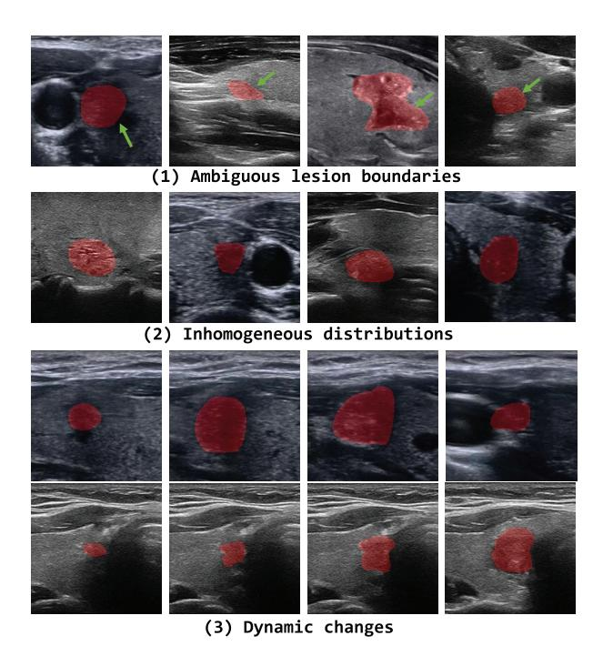
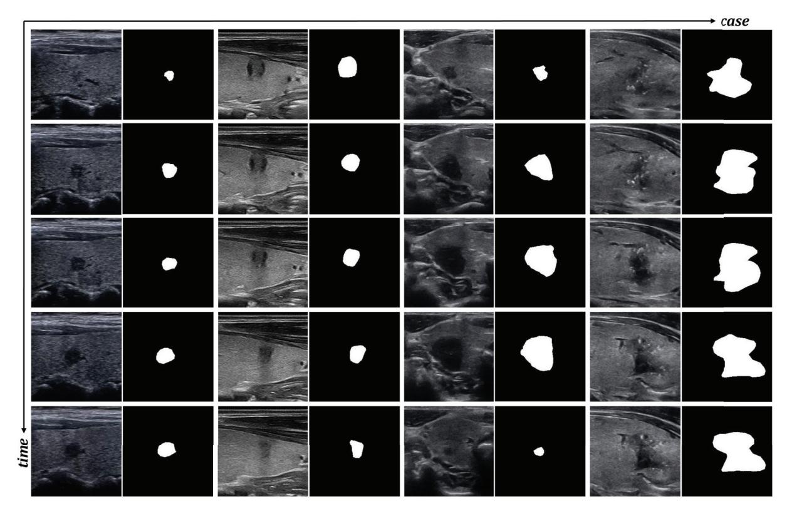
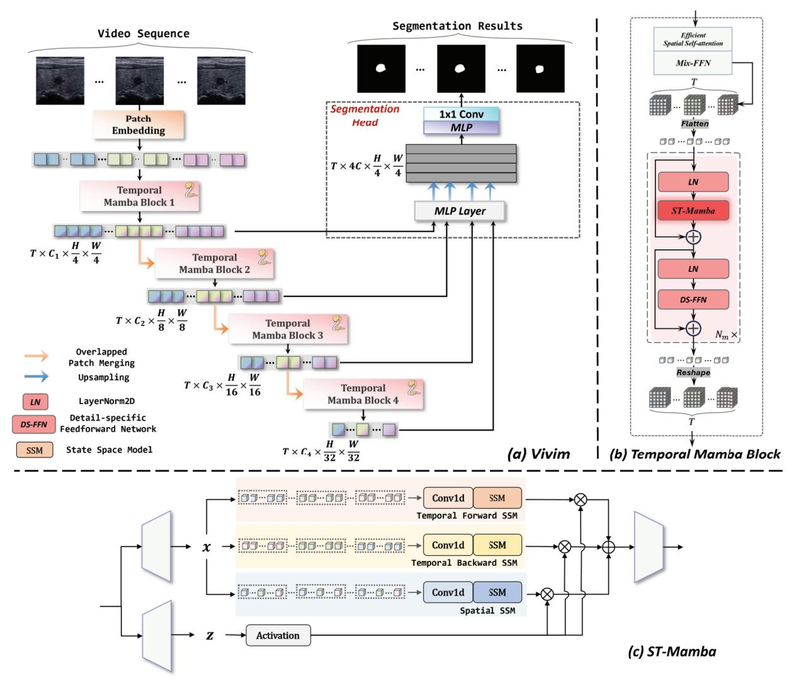
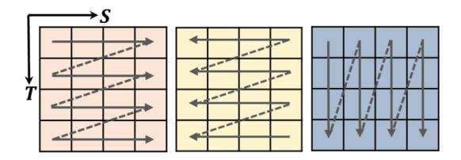
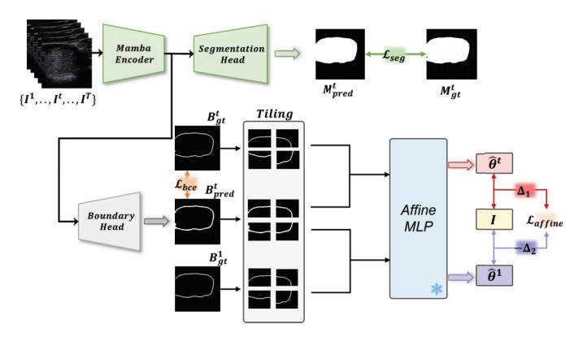
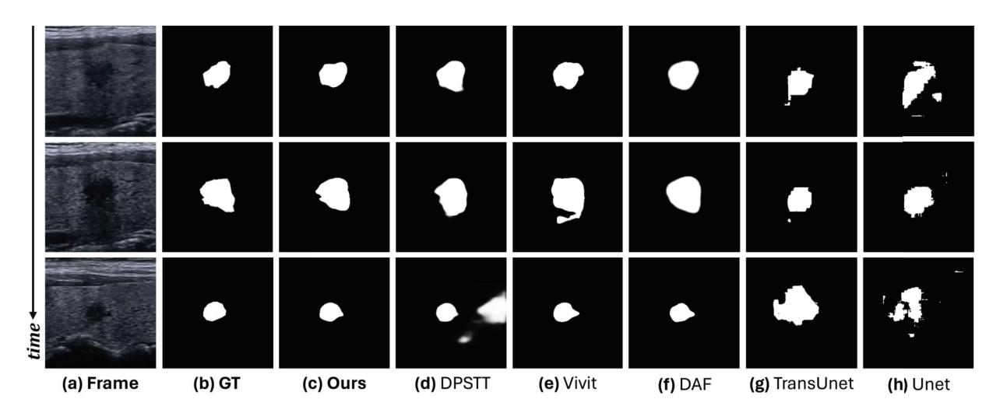
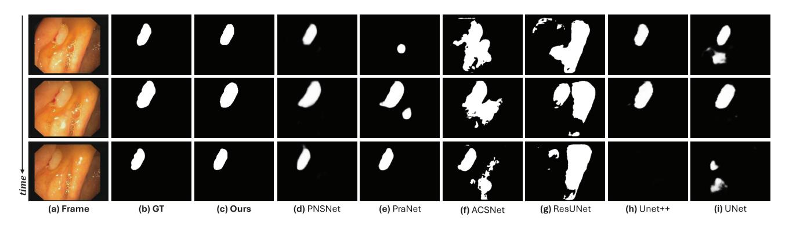
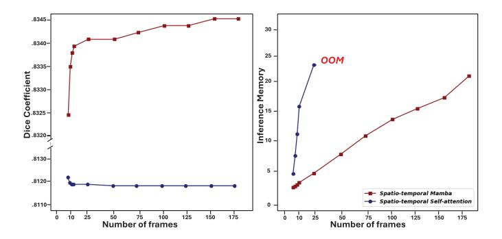
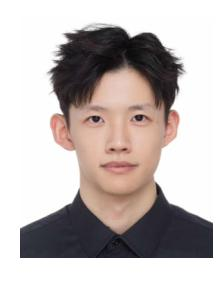
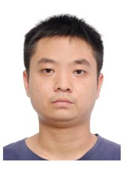

# Vivim: A Video Vision Mamba for Ultrasound Video Segmentation

Yijun Yang [,](https://orcid.org/0000-0003-4083-5144) Zhaohu Xing [,](https://orcid.org/0009-0002-2502-3578) *Graduate Student Member, IEEE*, Lequan Yu [,](https://orcid.org/0000-0002-9315-6527) *Member, IEEE*, Huazhu F[u](https://orcid.org/0000-0002-9702-5524) , *Senior Member, IEEE*, Chunwang Huan[g](https://orcid.org/0000-0003-2152-5298) , and Lei Zhu [,](https://orcid.org/0000-0003-3871-663X) *Member, IEEE*

*Abstract*—Ultrasound video segmentation gains increasing attention in clinical practice due to the redundant dynamic references in video frames. However, traditional convolutional neural networks have a limited receptive field and transformerbased networks are unsatisfactory in constructing long-term dependency from the perspective of computational complexity. This bottleneck poses a significant challenge when processing longer sequences in medical video analysis tasks using available devices with limited memory. Recently, state space models (SSMs), famous by Mamba, have exhibited linear complexity and impressive achievements in efficient long sequence modeling, which have developed deep neural networks by expanding the receptive field on many vision tasks significantly. Unfortunately, vanilla SSMs failed to simultaneously capture causal temporal cues and preserve non-casual spatial information. To this end, this paper presents a Video Vision Mamba-based framework, dubbed as *Vivim*, for ultrasound video segmentation tasks. Our Vivim can effectively compress the long-term spatiotemporal representation into sequences at varying scales with our designed Temporal Mamba Block. We also introduce an improved boundary-aware affine constraint across frames to enhance the discriminative ability of Vivim on ambiguous lesions. Extensive experiments

Received 24 November 2024; revised 23 March 2025; accepted 16 April 2025. Date of publication 22 April 2025; date of current version 6 October 2025. This work was supported in part by Guangdong Science and Technology Department under Grant 2024ZDZX2004; in part by Guangzhou Municipal Science and Technology Project under Grant 2024312139; in part by the Noncommunicable Chronic Diseases-National Science and Technology Major Project under Grant 2024ZD0525600; in part by Guangdong Provincial Key Laboratory of Integrated Communication, Sensing and Computation for Ubiquitous Internet of Things under Grant 2023B1212010007; and in part by Guangzhou Industrial Information and Intelligent Key Laboratory Project under Grant 2024A03J0628. The work of Huazhu Fu was supported by the Agency for Science, Technology and Research (A\*STAR) Central Research Fund ("Robust and Trustworthy AI system for Multimodality Healthcare"). This article was recommended by Associate Editor A. Liu. *(Corresponding authors: Lei Zhu; Chunwang Huang.)*

Yijun Yang and Zhaohu Xing are with the Robotics and Autonomous Systems Thrust, The Hong Kong University of Science and Technology (Guangzhou), Nansha, Guangzhou, Guangdong 511400, China (e-mail: yyang018@connect.hkust-gz.edu.cn; zxing565@connect.hkust-gz.edu.cn).

Lequan Yu is with the School of Computing and Data Science, The University of Hong Kong, Hong Kong, SAR, China (e-mail: lqyu@hku.hk).

Huazhu Fu is with the Institute of High Performance Computing (IHPC), Agency for Science, Technology and Research (A\*STAR), Singapore 138632 (e-mail: hzfu@ieee.org).

Chunwang Huang is with the Department of Ultrasound, Guangdong Provincial People's Hospital (Guangdong Academy of Medical Sciences), Southern Medical University, Guangzhou 510515, China (e-mail: huangchunwang@126.com).

Lei Zhu is with the Robotics and Autonomous Systems Thrust, The Hong Kong University of Science and Technology (Guangzhou), Guangzhou 510530, China, and also with the Department of Electronic and Computer Engineering, The Hong Kong University of Science and Technology, Hong Kong, SAR, China (e-mail: leizhu@ust.hk).

Digital Object Identifier 10.1109/TCSVT.2025.3563411

on thyroid segmentation in ultrasound videos, breast lesion segmentation in ultrasound videos, and polyp segmentation in colonoscopy videos demonstrate the effectiveness and efficiency of our Vivim, superior to existing methods. The code and dataset are available at: https://github.com/scott-yjyang/Vivim

*Index Terms*—Thyroid segmentation, breast lesion segmentation, polyp segmentation, state space model, ultrasound videos.

#### I. INTRODUCTION

A UTOMATIC detection and segmentation of lesions and tissues in ultrasound images and videos are essential for computer-aided clinical examination and treatment [\[1\],](#page-10-0) [\[2\],](#page-10-1) [\[3\],](#page-10-2) [\[4\],](#page-10-3) [\[5\],](#page-10-4) [\[6\].](#page-10-5) However, segmenting these medical objects is particularly challenging due to multiple inherent factors [\[7\],](#page-10-6) [\[8\],](#page-10-7) as illustrated in Fig. [1:](#page-1-0) (1) Lesion boundaries in ultrasound images are often ambiguous due to low contrast and speckle noise, making precise segmentation difficult; (2) The inhomogeneous distribution of lesions across patients further complicates generalization, as different ultrasound settings and anatomical variations cause significant variations in lesion appearance; (3) Additionally, dynamic changes across frames, introduced by probe movement and soft tissue deformation, create temporal inconsistencies that simple frame-wise segmentation cannot resolve. These challenges necessitate a robust approach that jointly considers spatiotemporal dependencies to improve segmentation accuracy. Ma et al. [\[9\]](#page-10-8) introduced a CNN-based deep learning framework for thyroid recognition in ultrasound images, which has limited performance due to the absence of contextual clues in videos. Although Zhao et al. [\[8\]](#page-10-7) proposed a deep learning model for ultrasound nodule segmentation that can reduce clinicians' need for manual annotations, the lack of temporal information often leads to highly uncertain outcomes. Ultrasound videos, essentially sequences of ultrasound images, offer a richer and more detailed context for locating ambiguous lesions and tissues. This additional information makes videobased segmentation better handle unexpected complexities by providing a continuous view, allowing for a more accurate and comprehensive analysis. Consequently, to consider more object context, expanding the deep model's receptive field in the spatio-temporal space is highly desired in medical video analysis. An effective segmentation model is required, which should explicitly tackle these challenges by tracking lesion structures across frames while preventing segmentation drift due to spatial distortions in ultrasound videos. Tradi-

Fig. 1. The Main Challenges in ultrasound video segmentation. The masks are marked in red. (a) Ambiguous lesion boundaries in ultrasound imaging. (b) Inhomogeneous distributions among patients. (c) Dynamic changes across frames.

tional convolutional neural networks [\[10\],](#page-10-9) [\[11\],](#page-10-10) [\[12\]](#page-10-11) often struggle to capture global information compared to recent transformer-based architectures. The transformer architecture, which utilizes the Multi-Head Self Attention (MSA) [\[13\]](#page-10-12) to extract global information, has attracted much attention from the community of generic video object segmentation [\[14\],](#page-10-13) [\[15\],](#page-10-14) [\[16\].](#page-10-15) Considering that neighboring frames offer beneficial hints to the segmentation, these methods usually introduce some elaborated modules on the self-attention mechanism to exploit the temporal information. For example, Li et al. [\[3\]](#page-10-2) proposed a joint video breast lesion detection and classification framework based on global-Local attention aggregation and multi-scale deformable self-attention. However, exploring the additional temporal dimension often leads to increased complexity and greater demands on resources, posing significant challenges for implementation due to the strict environmental conditions and inherently high-dimensional characteristics of ultrasound videos. *The incorporation of temporal selfattention modules can unintentionally trigger a quadratic increase in complexity relative to the time dimension, resulting in substantial computational challenges.* The marked rise in the number of tokens within lengthy video sequences introduces considerable computational strains when employing Multi-head Self-Attention (MSA) techniques for temporal information modeling [\[15\].](#page-10-14)

Very recently, to address the ill-posed issue concerning long sequence modeling, Mamba [\[17\],](#page-10-16) inspired by state space models (SSMs) [\[18\],](#page-10-17) has been developed. Its main idea is to efficiently capture long-range dependencies by implementing a selective scan mechanism for 1-D sequence interaction. Based on this, U-Mamba [\[19\]](#page-10-18) designed a hybrid CNN-SSM block, which is mainly composed of Mamba modules, to handle the long sequences in biomedical image segmentation tasks. Vision Mamba [\[20\]](#page-10-19) provided a new generic vision backbone with bidirectional Mamba blocks on image classification and semantic segmentation tasks. As suggested by them, relying on the self-attention module is not necessary to achieve efficient visual representation learning. It can be replaced by Mamba when exploring long-term temporal dependency in video scenarios in linear complexity. The crucial aspect of adapting the Vision Mamba model for video applications lies in the ability to concurrently capture causal temporal cues while maintaining the integrity of non-causal spatial information.

Motivated by this, we present an SSMs-based framework Vivim that integrates Mamba into the multi-level transformer architecture to exploit spatiotemporal information in videos with linear complexity. *To the best of our knowledge, this is the first work to incorporate SSMs into the task of ultrasound video segmentation, facilitating faster and greater performance.* In our Vivim, drawing inspiration from the architecture of modern transformer blocks, we designed a novel Temporal Mamba Block. A hierarchical encoder consisting of multiple Temporal Mamba Blocks is introduced to investigate the correlation between spatial and temporal dependency at various scales. As the structured state space sequence models with selective scan (S6) [\[17\]](#page-10-16) causally process input data, they can only capture information within the scanned portion of the data. This aligns S6 with NLP and video tasks involving temporal data but poses challenges when addressing non-causal data like 2D images within medical videos. To this end, the structured state space sequence model with spatiotemporal selective scan, ST-Mamba, is designed and incorporated into each scale of the model's encoder, replacing the self-attention or window-attention module to achieve efficient video visual representation learning. Ultrasound video segmentation poses unique challenges such as ambiguous lesion boundaries, dynamic tissue motion, and inhomogeneous echo patterns across patients. To address these issues, the Temporal Mamba Blocks model long-range bidirectional temporal dependencies efficiently, preserves spatial coherence, and enables robust feature fusion under noisy conditions. Its structured state-space formulation and spatio-temporal selective scan mechanism make it particularly well-suited for resolving temporal ambiguity and enhancing lesion boundary consistency in challenging ultrasound sequences. Finally, we employ an improved boundary-aware affine constraint to improve the discrimination of Vivim on ambiguous tissues in ultrasound videos at the training stage.

It is worth noting that *there is no public dataset with pixel-level annotated ultrasound videos for thyroid segmentation*, as it is expensive to delineate the boundaries of ambiguous lesions in low-contrast ultrasound videos in a frame-by-frame spirit. In this work, we contribute a thyroid segmentation dataset VTUS with 100 annotated transverse viewed and longitudinal viewed ultrasound videos and a total of 9342 frames with pixel-level ground truth to facilitate the benchmarking evaluation. Several examples are displayed in Fig. [2.](#page-2-0) We conduct extensive experiments on two ultrasound video segmentation tasks, *i.e.*, video thyroid segmentation and

Fig. 2. Several cases of our collected VTUS dataset. All videos are taken from patients with thyroid nodules. They are taken by ultrasound doctors with more than 10 years of clinical experience to ensure the image quality. These videos are cross-annotated by three experts with over three years of experience in thyroid diagnosis.

video breast lesion segmentation, and validations on polyp segmentation in colonoscopy videos. The superior results demonstrate the effectiveness, efficiency and versatility of our framework.

Our contributions can be summarized as follows:

- We develop an ultrasound video segmentation framework consisting of a Mamba-based encoder and a CNNbased decoder to obtain holistic understanding of medical videos and preserve local details, respectively. This is the first work to introduce state space models into ultrasound video scenarios.
- Instead of simply adapting Mamba to medical tasks, we design spatio-temporal selective scan to enhance the global perception capability in videos of our Temporal Mamba Block.
- We employ an improved boundary-aware constraint based on the optimization of the affine transformation to mitigate ambiguous boundary prediction of our model.
- We collect the first video ultrasound thyroid segmentation dataset with pixel-level annotation, which facilitates the benchmarking evaluation of ultrasound video segmentation methods. Our model achieves promising segmentation results on diverse modalities but maintains decent efficiency superior to Transformer-based methods.

# II. RELATED WORKS

# *A. Ultrasound Video Segmentation*

Recent approaches have introduced innovative hybrid transformer-based algorithms that fuse transformative and convolutional layer techniques for medical image segmentation (*e.g.*, breast lesion, polyp) [\[21\],](#page-10-20) [\[22\],](#page-10-21) [\[23\],](#page-10-22) [\[24\],](#page-10-23) [\[25\].](#page-10-24) For thyroid segmentation in ultrasound images, Ma et al. [\[9\]](#page-10-8) utilized the region proposal network (RPN) for initial deep feature extraction and incorporated the spatial pyramid RoIAlign as a segmentation head to capture global and local information in ultrasound images. Chi et al. [\[26\]](#page-10-25) developed a 2D Transformer-UNet for thyroid gland segmentation, combining high-level features from decoding layers with lower-level features from encoding layers using a multiscale cross-attention transformer module. These algorithms skillfully manage the representations derived from high-definition medical images, however, they grapple with computational difficulties owing to complexity issues. Additionally, the direct application of such image segmentation methods may inadvertently overlook critical temporal context, thereby inducing temporal inconsistencies. In order to address temporal modeling in video-level segmentation, the innovative method of Space-Time Memory Networks (STM) [\[27\]](#page-10-26) and its variants [\[16\],](#page-10-15) [\[28\]](#page-10-27) are introduced, employing a memory network to extract vital information from a time-based buffer composed of all previous video sequences. Building upon this methodology, DPSTT [\[29\]](#page-10-28) integrates a memory bank with decoupled transformers to track temporal lesion movement in medical ultrasound videos. However, DPSTT calls for substantial data augmentation to avoid overfitting and is marked by a sluggish processing speed, stressing some potential limitations. FLA-Net [\[30\]](#page-10-29) presents a frequency and location feature aggregation network with a large amount of memory occupancy for ultrasound video

Fig. 3. (a) The overview of the proposed Vivim for ultrasound video segmentation. The video sequence is first fed into patch embedding and multi-scale Temporal Mamba Blocks for encoding. Then, the feature sequences are aggregated to predict the segmentation results by a CNN-based segmentation head. (b) The fundamental building block of Vivim, namely Temporal Mamba Block. While Efficient Spatial Self-attention conducts initial spatial modeling, ST-Mamba explores spatiotemporal dependency in a linear complexity. (c) ST-Mamba incorporates spatiotemporal selective scan for long sequence modeling of video vision tasks in a multi-way spirit. z is used to produce gated weights, which adaptively optimizes the weighted combination of multi-way information.

breast lesion segmentation. MemSAM [\[31\]](#page-10-30) proposes a novel ultrasound video segmentation model by incorporating spacetime memory into SAM and carrying temporal cues. Thus, the challenge in ultrasound video segmentation revolves around efficiently harnessing the wealth of temporal data available.

#### *B. State Space Models*

Recently, State Space Models (SSMs) [\[18\]](#page-10-17) have demonstrated notable efficiency in utilizing state space transformations [\[32\]](#page-10-31) to manage long-term dependencies within language sequences. S4 [\[33\]](#page-10-32) introduces a structured statespace sequence model to exploit long-range dependencies with the benefit of linear complexity. Based on this, Mamba [\[17\]](#page-10-16) integrates efficient hardware design and a selection mechanism employing parallel scan (S6), thereby surpassing Transformers in processing extensive natural language sequences. Subsequently, S4ND [\[34\]](#page-10-33) explores SSMs' continuous-signal modeling of multi-dimensional data like images and videos. More recently, Vision Mamba [\[20\]](#page-10-19) and Vmamba [\[35\]](#page-10-34) pioneer generic vision tasks and outperformed transformerbased methods in effectiveness and efficiency, introducing bi-directional scan and cross-scan mechanisms to tackle the directional sensitivity challenge in SSMs. U-Mamba [\[19\]](#page-10-18) designs a hybrid CNN-SSM block, which is mainly composed of Mamba modules, to handle the long sequences in biomedical image segmentation tasks. Liu et al. [\[36\]](#page-10-35) leverages the advantages of ImageNet-based pre-training to advance SSMs-based performance on medical image segmentation. Wang et al. [\[37\]](#page-10-36) proposes a large kernel vision Mamba Ushape Network for medical image segmentation, excelling in locally spatial modeling of large Mamba kernel. To the best of our knowledge, SSMs have not yet been explored in medical video segmentation tasks.

# III. METHOD

# *A. Overview*

In this part, we elaborate on a Mamba-based solution Vivim for ultrasound video segmentation tasks. Our Vivim mainly

Fig. 4. Illustration of the spatiotemporal selective scan, including temporal forward scan, temporal backward scan and spatial scan.

Fig. 5. The overview of the training strategy. Specifically, our proposed patch-level boundary-aware affine constraint  $\mathcal{L}_{affine}$  is introduced to optimize Vivim jointly with the segmentation loss  $\mathcal{L}_{seg}$  and the boundary cross-entropy loss  $\mathcal{L}_{bce}$ . The pre-trained MLP for computing the affine transformation is frozen during training.

consists of two modules: A hierarchical encoder with the stacked Temporal Mamba Blocks to extract coarse and fine feature sequences at different scales, and a lightweight CNNbased segmentation head to fuse multi-level feature sequences and predict segmentation masks. Fig. 3 illustrates the flowchart of our proposed Vivim. Specifically, given a video clip with T frames, i.e.,  $\mathbf{V} = \{I^1, \dots, I^T\}$ , we first divide these frames into patches of size  $4 \times 4$  by overlapped patch embedding. We then feed the sequence of patches into our hierarchical Temporal Mamba Encoder to obtain multi-level spatiotemporal features with resolution  $\{1/4, 1/8, 1/16, 1/32\}$  of the original frame. Finally, we pass multi-level features to the CNN-based segmentation head to predict the segmentation results. The Boundary-aware Affine Constraint is deployed on the results only during training as shown in Fig. 5. Please refer to the following sections for details of our proposed module.

## B. Preliminaries: State Space Models

State Space Models (SSMs) are commonly considered as linear time-invariant systems, which map a 1-D function or sequence  $x(t) \in \mathbb{R} \mapsto y(t) \in \mathbb{R}$  through a hidden state  $h(t) \in \mathbb{R}^N$ . This system is typically formulated as linear ordinary differential equations (ODEs), which uses  $\mathbf{A} \in \mathbb{R}^{N \times N}$  as the evolution parameter and  $\mathbf{B} \in \mathbb{R}^{N \times 1}$ ,  $\mathbf{C} \in \mathbb{R}^{1 \times N}$  as the projection parameters.

$$h'(t) = \mathbf{A}h(t) + \mathbf{B}x(t), \ y(t) = \mathbf{C}h(t). \tag{1}$$

The discretization is introduced to primarily transform the ODE into a discrete function. This transformation is crucial to align the model with the sample rate of the underlying

signal embodied in the input data, enabling computationally efficient operations. The structured state space sequence models (S4) and Mamba are the classical discrete versions of the continuous system, which include a timescale parameter  $\Delta$  to transform the continuous parameters  $\overline{\bf A}$ ,  $\overline{\bf B}$  to discrete parameters  $\overline{\bf A}$ ,  $\overline{\bf B}$ . The commonly used method for transformation is zero-order hold (ZOH), which is defined as follows:

$$\overline{\mathbf{A}} = \exp(\Delta \mathbf{A}), \ \overline{\mathbf{B}} = (\Delta \mathbf{A})^{-1} (\exp(\Delta \mathbf{A}) - \mathbf{I}) \cdot \Delta \mathbf{B}.$$
 (2)

After the discretization of  $\overline{\mathbf{A}}$ ,  $\overline{\mathbf{B}}$ , the discretized version of Eq. (1) can be rewritten as:

$$h_t = \overline{\mathbf{A}} h_{t-1} + \overline{\mathbf{B}} x_t, \ y_t = \mathbf{C} h_t. \tag{3}$$

At last, the models compute output through a global convolution.

$$\overline{\mathbf{K}} = (\mathbf{C}\overline{\mathbf{B}}, \mathbf{C}\overline{\mathbf{A}}\overline{\mathbf{B}}, \dots, \mathbf{C}\overline{\mathbf{A}}^{M-1}\overline{\mathbf{B}}), \ \mathbf{y} = \mathbf{x} * \overline{\mathbf{K}},$$
 (4)

where M is the length of the input sequence  $\mathbf{x}$ , and  $\overline{\mathbf{K}} \in \mathbb{R}^M$  is a structured convolutional kernel.

#### C. Overall Architecture

- 1) Hierarchical Feature Representation: Multi-level features provide both high-resolution coarse features and low-resolution fine-grained features that significantly improve the segmentation results, especially for medical images. To this end, unlike Vivit [15], our encoder extracts multi-level multi-scale features given input video frames. Specifically, we perform patch merging frame-by-frame at the end of each Temporal Mamba Block, resulting in the *i*-th feature embedding  $\mathcal{F}_i$  with a resolution of  $\frac{H}{2i+1} \times \frac{W}{2i+1}$ .
- 2) Temporal Mamba Block: Exploring temporal information is critically important for medical video segmentation by providing dynamic appearance and motion cues. However, MSA in vanilla Transformer architectures has quadratic complexity concerning the number of tokens [13]. This complexity is pertinent for long feature sequences from videos, as the number of tokens increases linearly with the number of input frames. Motivated by this, we develop a more efficient block, Temporal Mamba Block, to simultaneously exploit spatial and temporal information by structured state space sequence models.

As illustrated in Fig. 3 (b), in the Temporal Mamba Block, an efficient spatial-only self-attention module is first introduced to provide the initial aggregation of spatial information followed by a Mix-FeedForwoard layer. We leverage the sequence reduction process introduced in [38] to improve its efficiency. For the *i*-level feature embedding  $\mathcal{F}_i \in \mathbb{R}^{T \times C_i \times H \times W}$  of the given video clip, we transpose the channel and temporal dimension, and flatten the spatiotemporal feature embedding into 1D long sequence  $h_i \in \mathbb{R}^{C_i \times THW}$ . Then, the flattened sequence  $h_i$  is fed into layers of a Spatio-Temporal Mamba module (ST-Mamba) and a Detail-Specific Feedforward (DSF). The ST-Mamba module establishes the intra- and inter-frame long-range dependencies while the DSF preserves fine-grained details by incorporating a depth-wise convolution with a kernel size of  $3 \times 3 \times 3$  into the feedforward

layer. The procedure in the stacked Mamba Layer can be defined as, where  $l \in [1, N_m]$ :

$$h^{l} = \text{ST} - \text{Mamba} \left( \text{LN} \left( h^{l-1} \right) \right) + h^{l-1},$$
  

$$h^{l} = \text{DSF} \left( \text{LN} \left( h^{l} \right) \right) + h^{l}.$$
 (5)

Finally, we return the output feature sequence to the original shape and employ overlapped patch merging to down-sampling the feature embedding.

3) Decoder: To predict the segmentation mask from the multi-level feature embeddings, we introduce a CNN-based segmentation head. While our hierarchical Temporal Mamba encoder has a large effective receptive field across spatial and temporal axes, the CNN-based segmentation head further refines the details of local regions. To be specific, the multi-level features  $\{\mathcal{F}_1, \mathcal{F}_2, \mathcal{F}_3, \mathcal{F}_4\}$  from the temporal mamba blocks are passed into an MLP layer to unify the channel dimension. These unified features are up-sampled to the same resolution and concatenated together. Third, a MLP layer is adopted to fuse the concatenated features  $\mathcal{F}$ . Finally, The fused feature goes through a  $1 \times 1$  convolutional layer to predict the segmentation mask  $\mathcal{M}$ . The segmentation loss  $\mathcal{L}_{seg}$  consisting of pixel-wise cross-entropy loss and IoU loss is applied during training.

#### D. Spatiotemporal Selective Scan

Despite the causal nature of S6 for temporal data, videos differ from texts in that they not only contain temporal redundant information but also accumulate non-causal 2D spatial information. To address this problem of adapting to non-causal data and fully exploring temporal information, we introduce ST-Mamba as shown in Fig. 3 (c), which incorporates spatiotemporal sequence modeling for video vision tasks.

Specifically, to explicitly explore the relationship among frames, we first unfold patches of each frame along rows and columns into sequences, and then concatenate the frame sequences to constitute the temporal-first sequence  $h_i^t \in$  $\mathbb{R}^{C_i \times T(HW)}$ . We parallelly proceed with scanning along the forward and backward directions to explore bidirectional temporal dependency. This approach allows the models to compensate for each other's receptive fields without significantly increasing computational complexity. Simultaneously, we stack patches along the temporal axis and construct the spatial-first sequence  $h_i^s \in \mathbb{R}^{C_i \times (HW)T}$ . We proceed with scanning to integrate information of each pixel from all frames. The spatiotemporal selective scan mechanism with three directions is also vividly demonstrated in Fig. 4. Our mechanism explicitly considers both single-frame spatial coherence and cross-frame coherence, and leverages parallel SSMs to establish the intra- and inter-frame long-range dependencies. The structured state space sequence models with spatiotemporal selective scan (ST-Mamba), serve as the core element to construct the Temporal Mamba block, which constitutes the fundamental building block of Vivim.

1) Computational-Efficiency: SSMs in ST-Mamba and selfattention in Transformer both provide a crucial solution to model spatiotemporal context adaptively. Given a video visual sequence  $\mathbf{K} \in \mathbb{R}^{1 \times T \times M \times D}$ , the computation complexity of a global self-attention and SSM are:

$$\Omega(\text{self-attention}) = 4(TM)D^2 + 2(TM)^2D, \tag{6}$$

$$\Omega(SSM) = 4(TM)(2D)N + (TM)(2D)N^2,$$
 (7)

where the default expansion ratio is 2, N is a fixed parameter and set to 16. As observed, self-attention is quadratic to the whole video sequence length (TM), and SSM is linear to that. Such computational efficiency makes ST-Mamba a better solution for long-term video applications. This is also validated by the experimental analysis on the efficiency of ST-Mamba in Sec. IV-E.

#### E. Boundary-Aware Affine Constraint

The network optimized only by the segmentation supervision tends to generate ambiguous and unstructured predictions, and overfit on training data. To mitigate these issues, we introduce a patch-level boundary-aware affine constraint inspired by InverseForm [39] to enforce the predicted boundary structure. Specifically, as illustrated in Fig. 5, we address this constraint task by optimizing the affine transformation between ground-truth boundaries and edges in feature maps toward identity transformation matrix. The ground truth edges within the patches are derived from applying the Sobel operator [40] on ground truth masks, while an auxiliary boundary head consisting of three convolutional layers processes the feature patches from the Mamba encoder to obtain the predicted edge. We calculate the affine transform matrix  $\hat{\theta}_i^t$  for the *i*-th patch between ground-truth edge  $B_{gt}^t$  and predicted edge  $B_{nred}^t$  of the target frame  $I^t$  in a video clip, by a pre-trained MLP. Simultaneously, we calculate another affine transform matrix  $\hat{\theta}_i^1$  for the *i*-th patch between ground-truth edge  $B_{gt}^1$  of  $I^1$  (the first frame of clip) and predicted edge  $B_{pred}^t$  of  $I^t$  in a video clip. This MLP is trained in advance with edge masks and not optimized during our method's training. We optimize the matrix  $\hat{\theta}_{i}^{t}$ , and adversarially optimize  $\hat{\theta}_{i}^{l}$  toward identity matrix

$$\mathcal{L}_{affine} = \frac{1}{N_p} \sum_{i=1}^{N_p} \left( \Delta_1 \cdot \left| \hat{\theta}_i^t - \mathbb{I} \right|_F - \Delta_2 \cdot \left| \hat{\theta}_i^1 - \mathbb{I} \right|_F \right), \quad (8)$$

where  $N_p$  denotes the number of patches and  $|\cdot|_F$  is Frobenius norm.  $\Delta_1$  and  $\Delta_2$  is two balancing hyper-parameters to control the effects of  $\hat{\theta}_i^t$  and  $\hat{\theta}_i^1$ , empirically set as 1.00 and 0.01. In this objective,  $B_{pred}^t$  is pushed toward  $B_{gt}^t$  and pulled away from  $B_{gt}^1$  to improve the target boundary and maintain the subtle inter-frame discrepancy in lesion structure.

We also employ the binary cross entropy loss  $\mathcal{L}_{bce}$  between the whole predicted boundary and corresponding ground truths of the target frame to optimize the boundary detection further. Finally, the overall loss to optimize during training is as follows, where the scaling parameters  $\lambda_1$ ,  $\lambda_2$  are both empirically set as 0.3:

$$\mathcal{L}_{total} = \mathcal{L}_{seg} + \lambda_1 \mathcal{L}_{affine} + \lambda_2 \mathcal{L}_{bce}. \tag{9}$$

#### IV. EXPERIMENTS

#### A. Dataset

We evaluate our Vivim on three medical video segmentation tasks, *i.e.*, video thyroid ultrasound segmentation, video breast lesion ultrasound segmentation and video polyp segmentation.

- 1) Video Thyroid Ultrasound Segmentation: We collect a video thyroid ultrasound segmentation dataset VTUS. VTUS comprises 100 video sequences, one video sequence per patient, and a total of 9342 frames with pixel-level ground truth. VTUS contains the transverse viewed and the longitudinal viewed B-mode ultrasound videos captured by Mindray resona8/TOSHIBA Aplio500 vendors. These videos are cross-annotated by three experts with over three years of experience in thyroid diagnosis. The number of frames in these videos vary from 31 to 196 for better diversity. The entire dataset is partitioned into training and test sets by 7:3, yielding a total of 70 training videos, 30 test videos.
- 2) Video Breast Lesion Ultrasound Segmentation: We conduct experiments on the BUV2022 dataset [29] consisting of 63 video sequences, with one video sequence per person, containing 4619 frames that have been annotated with pixel-level ground truth by experts. Following the approach outlined in [29], the video sequences with spatial resolutions ranging from  $580 \times 600$  to  $600 \times 800$  were further cropped to a spatial resolution of  $300 \times 200$ . We follow the official splits for training and testing.
- *3) Video Polyp Segmentation:* We adopt four widely used polyp datasets, including image-based Kvasir [44] and videobased CVC-300 [45], CVC-612 [46] and ASU-Mayo [47]. Following the same protocol as [48], we train our model on Kvasir, ASU-Mayo and the training sets of CVC-300 and CVC-612, and conduct three experiments on test datasets CVC-300-TV, CVC-612-V and CVC-612-T.

#### B. Implementation Details

The proposed framework was trained on one NVIDIA RTX 4090 GPU and implemented on the Pytorch platform. Our framework is empirically trained for 100 epochs in an end-to-end way and the Adam optimizer is applied. The initial learning rate is set to  $1\times 10^{-4}$  and decayed to  $1\times 10^{-6}$ . During training, we resize the video frames to  $256\times 256$ , and feed a batch of 4 video clips, each of which has 5 frames, into the network for each iteration. Efficient Spatial Self-attention and Mix-FFN in Temporal Mamba Block and the MLP modules in segmentation head adopted the pre-trained weights1 of SegFormer [38] to help recognize basic visual information. All parameters are further engaged when fine-tuning on ultrasound video segmentation.

### C. Comparison With Other Methods

1) Results on Thyroid and Breast Lesion Us Video: We employed four segmentation evaluation metrics, including Dice, Jaccard, Precision and Recall; for their precise definitions, please refer to [25]. We also report the inference speed

1https://huggingface.co/nvidia/segformer-b3-finetuned-ade-512-512

performance by computing the number of frames per second (FPS).

As shown in Tab. I, we quantitatively compare our method with many state-of-the-art methods on VTUS dataset and BUV2022 dataset. These methods including popular medical image segmentation methods (UNet [41], UNet++ [10], TransUNet [24], SETR [14], DAF [25]), generic video object segmentation methods (OSVOS [42], ViViT [15], STM [27], AFB-URR [16], RMem [43]), and ultrasound video segmentation methods (DPSTT [29], FLA-Net [30], MemSAM [31]). For the fairness of comparisons, we reproduce these methods following their publicly available codes. Note that we adopted Vision Transformer as the backbone of FLA-Net. We can observe that video-based methods tend to outperform imagebased methods as evidenced by their better performance. This suggests that the exploration of temporal information offers significant advantages for segmenting thyroid nodules and breast lesions in ultrasound videos. More importantly, among all image-based and video-based segmentation methods, our Vivim has achieved the highest performance across all scores by a considerable margin (e.g., 2.61%, 2.74% in Dice, Jaccard on VTUS, 1.01%, 0.86% in Dice, Jaccard on BUV2022 than the second-best method DPSTT). Our Vivim also has the best run-time among all video-based methods observed from FPS. This demonstrates that our solution can simultaneously learn spatial and temporal cues in an efficient way, and achieves significant improvements over those Transformer methods, such as SETR, ViViT, DPSTT, and MemSAM. As displayed in Fig. 6, we visualize the thyroid segmentation results on the selected frames. Our model can better locate and segment the target lesions with more accurate boundaries.

2) Polyp Video Segmentation: We adopt six metrics following [48], i.e., maximum Dice (maxDice), maximum specificity (maxSpe), maximum IoU (maxIoU), S-measure [53] ( $S_{\alpha}$ ), E-measure [54] ( $E_{\phi}$ ), and mean absolute error (MAE).

Based on [48], we compare our method with existing methods as summarized in Tab. II, including medical/polyp image segmentation methods (UNet [41], UNet++ [10], ResUNet [49], ACSNet [50], PraNet [51]), and medical video segmentation methods (PNS-Net [48], LDNet [52] and FLA-Net [30]). We conduct three experiments on CVC-300-TV, CVC-612-V and CVC-612-T to validate the model's performance. CVC-300-TV consists of both validation set and test set including six videos in total, while CVC-612-V and CVC-612-T each contain five videos. On CVC-300-TV, our Vivim achieves remarkable performance and outperforms all methods by a large margin (e.g., 2.7% in maxDice, 2.2% in maxIoU). On CVC-612-V and CVC-612-T, our Vivim consistently outperforms other SOTAs, especially 1.2% and 1.1% in maxDice, respectively. We also visualize the polyp segmentation results on the consecutive frames of CVC-612-T in Fig. 7. Our model demonstrates improved capability in locating and segmenting polyps with more precise boundaries.

#### D. Ablation Study

Extensive experiments are conducted on VTUS dataset to evaluate the effectiveness of our major components. To do so, we construct four baseline networks from our method. The

Fig. 6. Visual comparison on video ultrasound thyroid segmentation with several competitive image- and video-based methods. Consecutive results of one case are displayed.

TABLE I QUANTITATIVE COMPARISON WITH STATE-OF-THE-ART METHODS ON OUR VTUS DATASET (THYROID NODULE) AND THE BUV2022 DATASET (BREAST LESION). DICE, JACCARD, PRECISION AND RECALL ARE ADOPTED AS OUR METRICS. THE BEST SCORES ARE HIGHLIGHTED IN BOLD

| Methods        | Venue    | Туре  | VTUS   |         |           | BUV2022 |        |         |           | FPS    |       |
|----------------|----------|-------|--------|---------|-----------|---------|--------|---------|-----------|--------|-------|
| Wethous        |          |       | Dice   | Jaccard | Precision | Recall  | Dice   | Jaccard | Precision | Recall | 11.3  |
| UNet [41]      | MICCAI15 | image | 0.6662 | 0.5328  | 0.6703    | 0.7471  | 0.7303 | 0.6247  | 0.7946    | 0.7272 | 88.18 |
| UNet++ [10]    | DLMIA18  | image | 0.7656 | 0.6486  | 0.7441    | 0.8496  | 0.7179 | 0.6124  | 0.8280    | 0.6884 | 40.90 |
| TransUNet [24] | arXiv21  | image | 0.7461 | 0.6250  | 0.7468    | 0.8321  | 0.6547 | 0.5358  | 0.7167    | 0.6682 | 65.10 |
| SETR [14]      | CVPR21   | image | 0.7288 | 0.6010  | 0.7399    | 0.8089  | 0.6649 | 0.5480  | 0.7533    | 0.6643 | 21.61 |
| DAF [25]       | MICCAI18 | image | 0.7716 | 0.6583  | 0.7046    | 0.8599  | 0.7890 | 0.6954  | 0.7992    | 0.7979 | 47.62 |
| OSVOS [42]     | CVPR17   | video | 0.7769 | 0.6754  | 0.7895    | 0.8241  | 0.7098 | 0.5674  | 0.7778    | 0.6404 | 27.25 |
| ViViT [15]     | ICCV21   | video | 0.7610 | 0.6459  | 0.7789    | 0.8252  | 0.6739 | 0.5446  | 0.7554    | 0.6683 | 24.33 |
| STM [27]       | ICCV19   | video | 0.7898 | 0.6897  | 0.8112    | 0.8251  | 0.7862 | 0.6858  | 0.8201    | 0.7910 | 23.17 |
| AFB-URR [16]   | NIPS20   | video | 0.7930 | 0.6957  | 0.7764    | 0.8429  | 0.8018 | 0.7034  | 0.8008    | 0.8591 | 11.84 |
| DPSTT [29]     | MICCAI22 | video | 0.8063 | 0.7117  | 0.8238    | 0.8352  | 0.8255 | 0.7364  | 0.8389    | 0.8455 | 30.50 |
| FLA-Net [30]   | MICCAI23 | video | 0.8042 | 0.7075  | 0.8121    | 0.8276  | 0.8232 | 0.7315  | 0.8334    | 0.8422 | 31.22 |
| RMem [43]      | CVPR24   | video | 0.7804 | 0.6775  | 0.7821    | 0.8298  | 0.7912 | 0.6901  | 0.8024    | 0.8221 | 29.54 |
| MemSAM [31]    | CVPR24   | video | 0.7922 | 0.7101  | 0.8010    | 0.8232  | 0.8149 | 0.7092  | 0.8214    | 0.8192 | 10.42 |
| Our method     |          | video | 0.8324 | 0.7391  | 0.8363    | 0.8711  | 0.8356 | 0.7450  | 0.8357    | 0.8869 | 35.33 |

Fig. 7. Qualitative results on the selected frames of CVC-612-T. Our Vivim can better locate and segment polyps with more accurate boundaries than several competitive image- and video-based methods.

first baseline (denoted as "basic") is to remove all Mamba layers and boundary-aware affine constraint from our network. It means that "basic" equals the vanilla SegFormer [\[38\].](#page-10-37) Then, we introduce ST-Mamba layers with temporal forward SSM (*T f* ) into "basic" to construct another baseline network "C1", and further equip ST-Mamba with temporal backward SSM (*T b* ) to build a baseline network "C2". Based on "C2", spatial SSM (*S*) is incorporated into the ST-Mamba to construct "C3".

|        |                       | UNet        | UNet++   | ResUNet  | ACSNet      | PraNet      | PNS-Net     | LDNet       | FLA-Net     | Vivim  |
|--------|-----------------------|-------------|----------|----------|-------------|-------------|-------------|-------------|-------------|--------|
|        | Metrics               | MICCAI [41] | TMI [10] | ISM [49] | MICCAI [50] | MICCAI [51] | MICCAI [48] | MICCAI [52] | MICCAI [30] | (Ours) |
| >      | maxDice↑              | 0.639       | 0.649    | 0.535    | 0.738       | 0.739       | 0.840       | 0.835       | 0.874       | 0.901  |
| Ξ.     | maxSpe↑               | 0.963       | 0.944    | 0.852    | 0.987       | 0.993       | 0.996       | 0.994       | 0.996       | 0.997  |
| 300    | maxIoU↑               | 0.525       | 0.539    | 0.412    | 0.632       | 0.645       | 0.745       | 0.741       | 0.789       | 0.831  |
| - 3    | $S_{\alpha} \uparrow$ | 0.793       | 0.796    | 0.703    | 0.837       | 0.833       | 0.909       | 0.898       | 0.907       | 0.928  |
| $\geq$ | $E_{\phi} \uparrow$   | 0.826       | 0.831    | 0.718    | 0.871       | 0.852       | 0.921       | 0.910       | 0.969       | 0.958  |
| 0      | $MAE \downarrow$      | 0.027       | 0.024    | 0.052    | 0.016       | 0.016       | 0.013       | 0.015       | 0.010       | 0.008  |
|        | maxDice↑              | 0.725       | 0.684    | 0.752    | 0.804       | 0.869       | 0.873       | 0.870       | 0.885       | 0.897  |
| 2-7    | maxSpe↑               | 0.971       | 0.952    | 0.939    | 0.929       | 0.983       | 0.991       | 0.987       | 0.992       | 0.996  |
| 19     | maxIoU↑               | 0.610       | 0.570    | 0.648    | 0.712       | 0.799       | 0.800       | 0.799       | 0.814       | 0.829  |
| ن      | $S_{\alpha} \uparrow$ | 0.826       | 0.805    | 0.829    | 0.847       | 0.915       | 0.923       | 0.918       | 0.920       | 0.940  |
| 5      | $E_{\phi} \uparrow$   | 0.855       | 0.830    | 0.877    | 0.887       | 0.936       | 0.944       | 0.941       | 0.963       | 0.971  |
| _      | $MAE \downarrow$      | 0.023       | 0.025    | 0.023    | 0.054       | 0.013       | 0.012       | 0.013       | 0.012       | 0.010  |
|        | maxDice†              | 0.729       | 0.740    | 0.617    | 0.782       | 0.852       | 0.860       | 0.857       | 0.861       | 0.872  |
| 2-1    | maxSpe↑               | 0.971       | 0.975    | 0.950    | 0.975       | 0.986       | 0.992       | 0.988       | 0.993       | 0.995  |
| 61     | maxIoU↑               | 0.635       | 0.635    | 0.514    | 0.700       | 0.786       | 0.795       | 0.791       | 0.795       | 0.810  |
| ن      | $S_{\alpha} \uparrow$ | 0.810       | 0.800    | 0.727    | 0.838       | 0.886       | 0.903       | 0.892       | 0.904       | 0.915  |
| 5      | $E_{\phi} \uparrow$   | 0.836       | 0.817    | 0.758    | 0.864       | 0.904       | 0.903       | 0.903       | 0.904       | 0.921  |
| _      | $MAE \perp$           | 0.058       | 0.059    | 0.084    | 0.053       | 0.038       | 0.038       | 0.037       | 0.036       | 0.033  |

TABLE II QUANTITATIVE RESULTS ON THREE VIDEO POLYP DATASETS. THE BEST SCORES ARE HIGHLIGHTED IN bold.↑ INDICATES THE HIGHER THE SCORE THE BETTER, AND VICE VERSA

TABLE III

ABLATION STUDY OF OUR VIVIM DESIGN ON VTUS DATASET. IN ST-MAMBA, *T f* DENOTES TEMPORAL FORWARD SSM, *T b* DENOTES TEMPORAL BACKWARD SSM, *S* DENOTES SPATIAL SSM, WHILE BAC DENOTES BOUNDARY-AWARE AFFINE CONSTRAINT

|       | ST-Mamba |              |          | BAC      | VTUS   |          |            |                     |  |  |
|-------|----------|--------------|----------|----------|--------|----------|------------|---------------------|--|--|
|       | $T^f$    | $T^b$        | S        | DAC      | Dice↑  | Jaccard† | Precision↑ | Recall ↑ |  |  |
| basic | -        | _            | _        | _        | 0.8144 | 0.7188   | 0.8040     | 0.8572              |  |  |
| C1    | ✓        | -            | _        | _        | 0.8159 | 0.7216   | 0.8170     | 0.8704              |  |  |
| C2    | ✓        | $\checkmark$ | _        | _        | 0.8213 | 0.7264   | 0.8239     | 0.8670              |  |  |
| C3    | ✓        | $\checkmark$ | <b>√</b> | _        | 0.8259 | 0.7310   | 0.8255     | 0.8753              |  |  |
| C4    | _        | -            | ✓        | _        | 0.8188 | 0.7221   | 0.8191     | 0.8698              |  |  |
| Ours  | <b>V</b> | <b>√</b>     | <b>√</b> | <b>√</b> | 0.8324 | 0.7391   | 0.8363     | 0.8711              |  |  |

Hence, "C3" is equal to removing the boundary-aware affine constraint from the training of our network. We also construct "C4", which introduces ST-Mamba layers with only spatial SSM (*S*) into "basic".

Table [III](#page-8-2) reports the results of our method and four baseline networks. While "basic" performs competitively due to the pre-trained SegFormer weights on ADE20K, our proposed modules significantly advance its effectiveness. Compared to "basic", "C1" has a great improvement across all metrics, which indicates that the vanilla SSM helps explore temporal dependency, thereby improving the segmentation performance in videos. By comparing "C4" and "basic" models, the spatial scan brings the improvement of 0.0044, 0.0033, 0.0151, 0.0126 in Dice, Jaccard, Precision and Recall, demonstrating the effectiveness of introducing Mamba module with only spatial scan. On the other hand, the better Dice and Jaccard results of "C2" over "C1" demonstrate that introducing our bidirectional temporal SSMs can critically benefit the cross-frame coherence. Furthermore, by adapting SSMs to non-causal information, "C3" advances "C2" with a significant margin of 0.46% in Dice and 0.83% in Recall. Finally, our method outperforms "C3" in terms of Dice, Jaccard and Precision, which indicates that the boundary-aware affine constraint can further help to enhance the thyroid segmentation results.

## *E. Analysis on E*ffi*ciency of St-Mamba*

We validate the high efficiency of the proposed ST-Mamba by two ablation studies presented in Tab. [IV](#page-9-0) and Fig. [8.](#page-8-3)

Fig. 8. ST-Mamba performs better in effectiveness and efficiency when addressing long sequence modeling. (a) More reference frames can help improve the segmentation performance of ST-Mamba, but it is not applicable for spatio-temporal self-attention. (b) Vivim has a lighter memory burden than traditional attention-based methods when increasing the sequence length.

In Tab. [IV,](#page-9-0) we compare against several core modules for the modeling of spatio-temporal dependency, *i.e.*, vanilla self-attention [\[13\],](#page-10-12) window self-attention [\[55\]](#page-11-16) and factorized self-attention [\[15\].](#page-10-14) We replace ST-Mamba in our full Vivim with the three core modules to construct three variants M1, M2, and M3, respectively. We assessed the efficiency of these models using a single 48G A6000, considering Training Memory (TM), Inference Memory (IM), and Run-time as key metrics. M1, incorporating 3D global self-attention to capture spatial and temporal information simultaneously, faces challenges due to the memory constraints when processing a video clip of 32 frames at a resolution of 256×256. In contrast, M2 and M3 compromise on the receptive field to ensure that spatio-temporal modeling can be conducted within the available memory capacity. Instead, our approach introduces an efficient global modeling module based on Mamba, leading to superior performance in terms of training memory, inference memory, and average run-time when compared to the other model variants.

Fig. [8](#page-8-3) displays the Dice coefficient and memory costs with an increasing number of frames in one video clip at the inference stage. We evaluate M1 and our method, *i.e.*, spatiotemporal self-attention and spatio-temporal Mamba, to verify the efficiency of our model. As observed, M1 tends to maintain and even degrade the segmentation performance when

#### TABLE IV

ABLATION STUDY FOR DIFFERENT ATTENTION MODULES. WE FEED A VIDEO CLIP OF 32 FRAMES WITH 256P INTO THE THREE MODEL VARIANTS AND OUR METHOD. "TM" DENOTES TRAINING MEMORY, "IM" DENOTES INFERENCE MEMORY, AND "OOM" REPRESENTS OUT-OF-MEMORY. "IS GLOBAL" DESCRIBES WHETHER THE CORE MODULES ARE GLOBAL MODELING ONES

| Methods    | Core Module                               | Input Size          | TM (M) | IM (M) | Run-time (s) | Is Global |
|------------|-------------------------------------------|---------------------|--------|--------|--------------|-----------|
| M1         | Spatio-temporal self-attention            | $32 \times 256^2$   | OOM    | -      | -            | <b>√</b>  |
| M2         | Spatio-temporal Window self-attention     | $32 \times 256^{2}$ | 25,861 | 7,795  | 0.142        | X         |
| M3         | Spatio-temporal Factorized self-attention | $32 \times 256^{2}$ | 29,110 | 9,288  | 0.156        | X         |
| Our method | Spatio-temporal Mamba                     | $32 \times 256^2$   | 19,216 | 5,112  | 0.121        | <b>√</b>  |

referring to more neighboring frames. Instead, our method obtains an about 0.2% improvement in Dice coefficient. Furthermore, increasing the number of frames introduces an explosive growth in memory costs for M1. Our method can infer a video clip of over 150 frames using a single RTX4090. This provides a great foundation for longer medical video segmentation within the limited memory capacity.

#### V. DISCUSSION

#### *A. Novelty of Our Design*

Our hybrid architecture Vivim is designed around the diagnostic process of radiologists that obtain the holistic understanding by ST-Mamba, and preserve local details by CNN-based decoder aggregating multiscale features and boundary constraint. Although convolutional neural networks (CNNs) and Transformers have achieved impressive performance for many ultrasound video segmentation tasks [\[29\],](#page-10-28) [\[30\],](#page-10-29) there remains significant potential for enhancements in both efficiency and effectiveness. A critical challenge limiting the broader application of CNNs and Transformers in medical video analysis is the trade-off between receptive field and computational complexity. This issue arises from the inherently local processing nature of CNNs and the high computational complexity associated with Transformers. State Space Models (SSMs), *e.g.*, Mamba, offer a more efficient technique for global dependency modeling compared to Transformers, facilitating more dynamic references within ultrasound videos. Ultrasound experts typically acquire the complete appearance of target tissues by utilizing both transverse and longitudinal views, which are captured by high-frame-rate devices. This leads to the requirement of long sequence modeling in ultrasound videos. Unlike the self-attention mechanism in Transformers [\[13\],](#page-10-12) [\[15\],](#page-10-14) which scales quadratically with video sequence length, the computational complexity of SSMs scales linearly. This linear scalability makes SSMs well-suited for spatio-temporal joint modeling, allowing them to operate within the constraints of limited memory and computational resources, a feat challenging for Transformers, especially with longer video sequences.

The causal nature of SSMs is particularly well-aligned with tasks in Natural Language Processing (NLP) and video processing, where understanding the context in textual and temporal data is crucial [\[17\].](#page-10-16) A key challenge in adapting the Mamba model for ultrasound video tasks lies in designing selective scan directions that effectively preserve non-causal spatial details of lesions and tissues while exploring temporal dependencies. Therefore, our approach goes beyond a straightforward application of Mamba; we establish a baseline that combines Transformers for spatial modeling with SSMs for spatio-temporal modeling. We introduce a tri-directional scan mechanism that simultaneously operates along temporal forward, temporal backward, and spatial forward directions, carefully balancing cross-frame coherence with single-frame spatial integrity.

#### *B. Beyond Ultrasound*

this approach holds broader implications for the medical imaging community. (1) Cross-Modality Generalization: Our experiments focus on ultrasound videos, and also validate the framework on polyp segmentation in colonoscopy videos. Thus, the proposed method can be readily extended to other medical imaging domains, such as 3D CT, cardiac MRI, and endoscopy surgical videos, where dynamic or sequential data exhibit similar challenges of inconsistent boundaries and complex motion. By preserving both temporal consistency and spatial coherence, Vivim could enable more reliable tracking and segmentation across various procedures that demand high accuracy. (2) Real-time Clinical Impact: The reduced memory footprint and computational efficiency of Vivim align with the growing demand for real-time diagnostics on portable devices. Future hardware optimizations may enable edge deployments, particularly in resource-limited settings, accelerating point-ofcare applications.

## *C. Future Work*

(1) Further Reducing Computational Complexity: While Vivim's Temporal Mamba Block already surpasses quadraticcomplexity Transformers, further exploration of the selective scan mechanism and fully SSM-based architectures could achieve additional complexity reductions. (2) Robustness Enhancement: Integrating self-supervised learning and large-scale pre-training may improve performance under diverse clinical protocols and unseen pathologies, facilitating multicenter applicability. (3) Annotation-Efficient Learning: Addressing label scarcity through semi-supervised or weakly-supervised paradigms could expand Vivim's utility in real-world scenarios where full annotations are impractical. (4) Clinical Knowledge Integration: Future iterations may incorporate anatomical priors or clinical metadata to refine segmentation accuracy, bridging technical innovations with domain-specific expertise.

# VI. CONCLUSION

In this paper, we present a Mamba-based framework Vivim to address the challenges of ultrasound video segmentation, especially in modeling long-range temporal dependencies due to the inherent locality of CNNs and the high computational complexity of the self-attention mechanism. The main idea of Vivim is to introduce the structured state space models with spatiotemporal selective scan, ST-Mamba, into the standard hierarchical Transformer architecture. This facilitates the exploration of single-frame spatial coherence and crossframe coherence in a computationally cheaper way than using the self-attention mechanism. An improved boundary-aware constraint at the training stage is proposed to mitigate the ambiguous prediction of our model. We also contribute a video thyroid ultrasound segmentation dataset VTUS with 100 videos and 9342 annotated frames. Experimental results on our collected VTUS dataset, ultrasound breast lesion videos and polyp colonoscopy videos reveal that Vivim outperforms state-of-the-art segmentation networks. Ablation studies also validate the superior efficiency of ST-Mamba to other spatiotemporal Transformer-based methods.

The proposed framework demonstrates broader potential in medical imaging beyond ultrasound. Its efficient SSMbased architecture could be adapted to dynamic modalities such as cardiac MRI and surgical videos, where precise motion tracking is essential, while the reduced computational demands align with real-time deployment on portable diagnostic devices. Future work may focus on further optimizing the selective scan mechanism for better efficiency, integrating selfsupervised learning to handle diverse clinical scenarios, and leveraging anatomical priors to enhance segmentation accuracy in annotation-limited settings.

## REFERENCES

- [\[1\]](#page-0-0) D. Avola, L. Cinque, A. Fagioli, S. Filetti, G. Grani, and E. Rodola,` "Multimodal feature fusion and knowledge-driven learning via experts consult for thyroid nodule classification," *IEEE Trans. Circuits Syst. Video Technol.*, vol. 32, no. 5, pp. 2527–2534, Apr. 2021.
- [\[2\]](#page-0-1) E. Karami, M. S. Shehata, and A. Smith, "Adaptive polar active contour for segmentation and tracking in ultrasound videos," *IEEE Trans. Circuits Syst. Video Technol.*, vol. 29, no. 4, pp. 1209–1222, Apr. 2019.
- [\[3\]](#page-0-2) M. Li et al., "Joint lesion detection and classification of breast ultrasound video via a clinical knowledge-aware framework," *IEEE Trans. Circuits Syst. Video Technol.*, vol. 35, no. 1, pp. 45–61, Jan. 2025.
- [\[4\]](#page-0-3) Q. Huang, Y. Huang, Y. Luo, F. Yuan, and X. Li, "Segmentation of breast ultrasound image with semantic classification of superpixels," *Med. Image Anal.*, vol. 61, Apr. 2020, Art. no. 101657.
- [\[5\]](#page-0-4) R. T. Lucassen, "Deep learning for detection and localization of B-lines in lung ultrasound," *IEEE J. Biomed. Health Informat.*, vol. 27, no. 9, pp. 4352–4361, Sep. 2023.
- [\[6\]](#page-0-5) B. Pu et al., "HFSCCD: A hybrid neural network for fetal standard cardiac cycle detection in ultrasound videos," *IEEE J. Biomed. Health Informat.*, vol. 28, no. 5, pp. 2943–2954, May 2024.
- [\[7\]](#page-0-6) Z. Lin, J. Lin, L. Zhu, H. Fu, J. Qin, and L. Wang, "A new dataset and a baseline model for breast lesion detection in ultrasound videos," in *Proc. MICCAI*. Cham, Switzerland: Springer, Jan. 2022, pp. 614–623.
- [\[8\]](#page-0-7) X. Zhao et al., "Ultrasound nodule segmentation using asymmetric learning with simple clinical annotation," *IEEE Trans. Circuits Syst. Video Technol.*, vol. 34, no. 10, pp. 9010–9023, Oct. 2024.
- [\[9\]](#page-0-8) L. Ma, G. Tan, H. Luo, Q. Liao, S. Li, and K. Li, "A novel deep learning framework for automatic recognition of thyroid gland and tissues of neck in ultrasound image," *IEEE Trans. Circuits Syst. Video Technol.*, vol. 32, no. 9, pp. 6113–6124, Sep. 2022.
- [\[10\]](#page-1-1) Z. Zhou, M. Siddiquee, N. Tajbakhsh, and J. Liang, "UNet++: A nested U-net architecture for medical image segmentation," in *Proc. Int. Workshop Deep Learn. Med. Image Anal.*Cham, Switzerland: Springer, vol. 11045, 2018, pp. 3–11.
- [\[11\]](#page-1-2) K. He, X. Zhang, S. Ren, and J. Sun, "Deep residual learning for image recognition," in *Proc. IEEE Conf. Comput. Vis. Pattern Recognit. (CVPR)*, Jun. 2016, pp. 770–778.

- [\[12\]](#page-1-3) K. He, G. Gkioxari, P. Dollar, and R. Girshick, "Mask R-CNN," in ´ *Proc. IEEE Int. Conf. Comput. Vis. (ICCV)*, Oct. 2017, pp. 2961–2969.
- [\[13\]](#page-1-4) A. Vaswani et al., "Attention is all you need," in *Proc. Adv. Neural Inf. Process. Syst.*, vol. 30, Jun. 2017, pp. 5998–6008.
- [\[14\]](#page-1-5) S. Zheng et al., "Rethinking semantic segmentation from a sequenceto-sequence perspective with transformers," in *Proc. IEEE*/*CVF Conf. Comput. Vis. Pattern Recognit. (CVPR)*, Jun. 2021, pp. 6881–6890.
- [\[15\]](#page-1-6) A. Arnab, M. Dehghani, G. Heigold, C. Sun, M. Lucic, and C. Schmid, "ViViT: A video vision transformer," in *Proc. IEEE*/*CVF Int. Conf. Comput. Vis. (ICCV)*, Oct. 2021, pp. 6836–6846.
- [\[16\]](#page-1-7) Y. Liang, X. Li, N. Jafari, and Q. Chen, "Video object segmentation with adaptive feature bank and uncertain-region refinement," in *Proc. 34th Int. Conf. Neural Inf. Process. Syst.*, vol. 33, Dec. 2020, pp. 3430–3441.
- [\[17\]](#page-1-8) A. Gu and T. Dao, "Mamba: Linear-time sequence modeling with selective state spaces," 2023, *arXiv:2312.00752*.
- [\[18\]](#page-1-9) R. E. Kalman, "A new approach to linear filtering and prediction problems," *J. Basic Eng.*, vol. 82, no. 1, pp. 35–45, Mar. 1960.
- [\[19\]](#page-1-10) J. Ma, F. Li, and B. Wang, "U-mamba: Enhancing long-range dependency for biomedical image segmentation," 2024, *arXiv:2401.04722*.
- [\[20\]](#page-1-11) L. Zhu, B. Liao, Q. Zhang, X. Wang, W. Liu, and X. Wang, "Vision mamba: Efficient visual representation learning with bidirectional state space model," 2024, *arXiv:2401.09417*.
- [\[21\]](#page-2-1) P. Qin, K. Wu, Y. Hu, J. Zeng, and X. Chai, "Diagnosis of benign and malignant thyroid nodules using combined conventional ultrasound and ultrasound elasticity imaging," *IEEE J. Biomed. Health Informat.*, vol. 24, no. 4, pp. 1028–1036, Apr. 2020.
- [\[22\]](#page-2-2) Y. He, V. Nath, D. Yang, Y. Tang, A. Myronenko, and D. Xu, "SwinUNETR-v2: Stronger Swin transformers with stagewise convolutions for 3D medical image segmentation," in *Proc. Int. Conf. Med. Image Comput. Comput.-Assist. Intervent.*Cham, Switzerland: Springer, Jan. 2023, pp. 416–426.
- [\[23\]](#page-2-3) A. Hatamizadeh et al., "UNETR: Transformers for 3D medical image segmentation," in *Proc. IEEE*/*CVF Winter Conf. Appl. Comput. Vis. (WACV)*, Jan. 2022, pp. 574–584.
- [\[24\]](#page-2-4) J. Chen et al., "TransUNet: Transformers make strong encoders for medical image segmentation," 2021, *arXiv:2102.04306*.
- [\[25\]](#page-2-5) Y. Wang et al., "Deep attentional features for prostate segmentation in ultrasound," in *Proc. 21st Int. Conf. Med. Image Comput. Comput. Assist. Intervent. (MICCAI)*, Granada, Spain. Cham, Switzerland: Springer, Sep. 2018, pp. 523–530.
- [\[26\]](#page-2-6) J. Chi, Z. Li, Z. Sun, X. Yu, and H. Wang, "Hybrid transformer UNet for thyroid segmentation from ultrasound scans," *Comput. Biol. Med.*, vol. 153, Feb. 2023, Art. no. 106453.
- [\[27\]](#page-2-7) S. W. Oh, J.-Y. Lee, N. Xu, and S. J. Kim, "Video object segmentation using space-time memory networks," in *Proc. IEEE*/*CVF Int. Conf. Comput. Vis. (ICCV)*, Oct. 2019, pp. 9226–9235.
- [\[28\]](#page-2-8) H. K. Cheng, Y. Tai, and C. Tang, "Rethinking space-time networks with improved memory coverage for efficient video object segmentation," in *Proc. Adv. Neural Inf. Process. Syst.*, Jan. 2021, pp. 11781–11794.
- [\[29\]](#page-2-9) J. Li et al., "Rethinking breast lesion segmentation in ultrasound: A new video dataset and a baseline network," in *Proc. MICCAI*. Cham, Switzerland: Springer, Jan. 2022, pp. 391–400.
- [\[30\]](#page-2-10) J. Lin et al., "Shifting more attention to breast lesion segmentation in ultrasound videos," in *Proc. Int. Conf. Med. Image Comput. Comput.- Assist. Intervent.*Cham, Switzerland: Springer, Jan. 2023, pp. 497–507.
- [\[31\]](#page-3-1) X. Deng, H. Wu, R. Zeng, and J. Qin, "MemSAM: Taming segment anything model for echocardiography video segmentation," in *Proc. IEEE*/*CVF Conf. Comput. Vis. Pattern Recognit. (CVPR)*, Jun. 2024, pp. 9622–9631.
- [\[32\]](#page-3-2) A. Gu et al., "Combining recurrent, convolutional, and continuous-time models with linear state space layers," in *Proc. Adv. Neural Inf. Process. Syst.*, vol. 34, 2021, pp. 572–585.
- [\[33\]](#page-3-3) A. Gu, K. Goel, and C. Re, "E ´ fficiently modeling long sequences with structured state spaces," 2021, *arXiv:2111.00396*.
- [\[34\]](#page-3-4) E. Nguyen et al., "S4ND: Modeling images and videos as multidimensional signals with state spaces," in *Proc. Adv. Neural Inf. Process. Syst.*, vol. 35, 2022, pp. 2846–2861.
- [\[35\]](#page-3-5) Y. Liu et al., "VMamba: Visual state space model," 2024, *arXiv:2401.10166*.
- [\[36\]](#page-3-6) J. Liu et al., "Swin-UMamba: Mamba-based UNet with ImageNet-based pretraining," in *Proc. Int. Conf. Med. Image Comput. Comput.-Assist. Intervent.*Cham, Switzerland: Springer, Feb. 2024, pp. 615–625.
- [\[37\]](#page-3-7) J. Wang, J. Chen, D. Z. Chen, and J. Wu, "LKM-UNet: Large kernel vision mamba UNet for medical image segmentation," in *Proc. Int. Conf. Med. Image Comput. Comput.-Assist. Intervent.*Cham, Switzerland: Springer, Jan. 2024, pp. 360–370.

- [\[38\]](#page-4-3) E. Xie et al., "SegFormer: Simple and efficient design for semantic segmentation with transformers," in *Proc. Adv. Neural Inf. Process. Sys. (NIPS)*, vol. 34, Dec. 2021, pp. 12077–12090.
- [\[39\]](#page-5-0) S. Borse, Y. Wang, Y. Zhang, and F. Porikli, "InverseForm: A loss function for structured boundary-aware segmentation," in *Proc. IEEE*/*CVF Conf. Comput. Vis. Pattern Recognit.*, Jun. 2021, pp. 5901–5911.
- [\[40\]](#page-5-1) J. Canny, "A computational approach to edge detection," *IEEE Trans. Pattern Anal. Mach. Intell.*, vol. PAMI-8, no. 6, pp. 679–698, Nov. 1986.
- [\[41\]](#page-6-1) O. Ronneberger, P. Fischer, and T. Brox, "U-Net: Convolutional networks for biomedical image segmentation," in *Proc. 18th Int. Conf. Med. Image Comput. Comput.-Assist. Intervent.*, vol. 9351. Cham, Switzerland: Springer, 2015, pp. 234–241.
- [\[42\]](#page-6-2) F. Perazzi, A. Khoreva, R. Benenson, B. Schiele, and A. Sorkine-Hornung, "Learning video object segmentation from static images," in *Proc. IEEE Conf. Comput. Vis. Pattern Recognit. (CVPR)*, Jul. 2017, pp. 3491–3500.
- [\[43\]](#page-6-3) J. Zhou, Z. Pang, and Y.-X. Wang, "RMem: Restricted memory banks improve video object segmentation," in *Proc. IEEE*/*CVF Conf. Comput. Vis. Pattern Recognit. (CVPR)*, Jun. 2024, pp. 18602–18611.
- [\[44\]](#page-6-4) D. Jha et al., "Kvasir-SEG: A segmented polyp dataset," in *Proc. Int. Conf. Multimedia Modeling*, Daejeon, South Korea. Cham, Switzerland: Springer, Jan. 2020, pp. 451–462.
- [\[45\]](#page-6-5) J. Bernal, J. Sanchez, and F. Vilari no, "Towards automatic polyp ´ detection with a polyp appearance model," *Pattern Recognit.*, vol. 45, no. 9, pp. 3166–3182, Sep. 2012.
- [\[46\]](#page-6-6) J. Bernal, F. J. Sanchez, G. Fern ´ andez-Esparrach, D. Gil, C. Rodr ´ ´ıguez, and F. Vilari no, "WM-DOVA maps for accurate polyp highlighting in colonoscopy: Validation vs. saliency maps from physicians," *Computerized Med. Imag. Graph.*, vol. 43, pp. 99–111, Jul. 2015.
- [\[47\]](#page-6-7) N. Tajbakhsh, S. R. Gurudu, and J. Liang, "Automated polyp detection in colonoscopy videos using shape and context information," *IEEE Trans. Med. Imag.*, vol. 35, no. 2, pp. 630–644, Feb. 2016.
- [\[48\]](#page-6-8) G.-P. Ji et al., "Progressively normalized self-attention network for video polyp segmentation," in *Proc. Int. Conf. Med. Image Comput. Comput.- Assist. Intervent.*Cham, Switzerland: Springer, 2021, pp. 142–152.
- [\[49\]](#page-6-9) D. Jha et al., "ResUNet++: An advanced architecture for medical image segmentation," in *Proc. IEEE Int. Symp. Multimedia (ISM)*, Dec. 2019, pp. 225–2255.
- [\[50\]](#page-6-10) R. Zhang, G. Li, Z. Li, S. Cui, D. Qian, and Y. Yu, "Adaptive context selection for polyp segmentation," in *Proc. Int. Conf. Med. Image Comput. Comput.-Assist. Intervent.*Cham, Switzerland: Springer, 2020, pp. 253–262.
- [\[51\]](#page-6-11) D.-P. Fan et al., "PraNet: Parallel reverse attention network for polyp segmentation," in *Proc. Int. Conf. Med. Image Comput. Comput.-Assist. Intervent.*Cham, Switzerland: Springer, 2020, pp. 263–273.
- [\[52\]](#page-6-12) R. Zhang et al., "Lesion-aware dynamic kernel for polyp segmentation," in *Proc. Int. Conf. Med. Image Comput. Comput.-Assist. Intervent.*Cham, Switzerland: Springer, 2022, pp. 99–109.
- [\[53\]](#page-6-13) D.-P. Fan, M.-M. Cheng, Y. Liu, T. Li, and A. Borji, "Structure-measure: A new way to evaluate foreground maps," in *Proc. IEEE Int. Conf. Comput. Vis. (ICCV)*, Oct. 2017, pp. 4548–4557.
- [\[54\]](#page-6-14) D.-P. Fan, G.-P. Ji, X. Qin, and M.-M. Cheng, "Cognitive vision inspired object segmentation metric and loss function," *Scientia Sinica Informationis*, vol. 6, no. 6, 2021.
- [\[55\]](#page-8-4) Z. Liu et al., "Video Swin transformer," in *Proc. IEEE*/*CVF Conf. Comput. Vis. Pattern Recognit. (CVPR)*, Jun. 2022, pp. 3202–3211.

Zhaohu Xing (Graduate Student Member, IEEE) received the bachelor's degree from Shandong Normal University and the master's degree from Tianjin University. He is currently pursuing the Ph.D. degree with The Hong Kong University of Science and Technology (Guangzhou), under the supervision of Prof. Lei Zhu. His research interests include medical image analysis.

Lequan Yu (Member, IEEE) received the B.Eng. degree from the Department of Computer Science and Technology, Zhejiang University, Hangzhou, China, in 2015, and the Ph.D. degree from the Department of Computer Science and Engineering, The Chinese University of Hong Kong, Hong Kong, in 2019. He conducted his post-doctoral training at Stanford University from 2019 to 2021. He is currently an Assistant Professor with the Department of Statistics and Actuarial Science, The University of Hong Kong. His research interests include medical

image analysis, computer vision, machine learning, and AI in healthcare.

Huazhu Fu (Senior Member, IEEE) received the Ph.D. degree from Tianjin University, Tianjin, China, in 2013. He was a Research Fellow with Nanyang Technological University (NTU), Singapore, from 2013 to 2015, a Research Scientist with the Institute for Infocomm Research (I2R), Agency for Science, Technology and Research (A\*STAR), Singapore, from 2015 to 2018, and a Senior Scientist with the Inception Institute of Artificial Intelligence (IIAI), United Arab Emirates, from 2018 to 2021. He is currently a Senior Scientist with

the Institute of High Performance Computing (IHPC), A\*STAR. His research interests include computer vision, AI in healthcare, and trustworthy AI.

Chunwang Huang received the M.D. degree from Southern Medical University in 2020. He was a Post-Doctoral Fellow at Thomas Jefferson University. His research interests include medical image diagnosis, analysis, processing, and deep learning.

Yijun Yang received the bachelor's degree in artificial intelligence from Shandong University. He is currently pursuing the Ph.D. degree from The Hong Kong University of Science and Technology (Guangzhou), under the supervision of Prof. Lei Zhu and Dr. Huazhu Fu. His research interests include medical image analysis, low-level vision, and aiming to design generalizable deep learning algorithms for computer vision applications.

Lei Zhu (Member, IEEE) received the Ph.D. degree from the Department of Computer Science and Engineering, The Chinese University of Hong Kong, in 2017. He was a Post-Doctoral Researcher at the Department of Applied Mathematics and Theoretical Physics, University of Cambridge. He is currently an Assistant Professor with the Robotics and Autonomous Systems Thrust, The Hong Kong University of Science and Technology (Guangzhou), and an affiliated Assistant Professor with the Department of Electonic and Computer Engineering, The

Hong Kong University of Science and Technology. His research interests include computer vision, image restoration, image enhancement, image and video processing, medical AI, and deep learning.