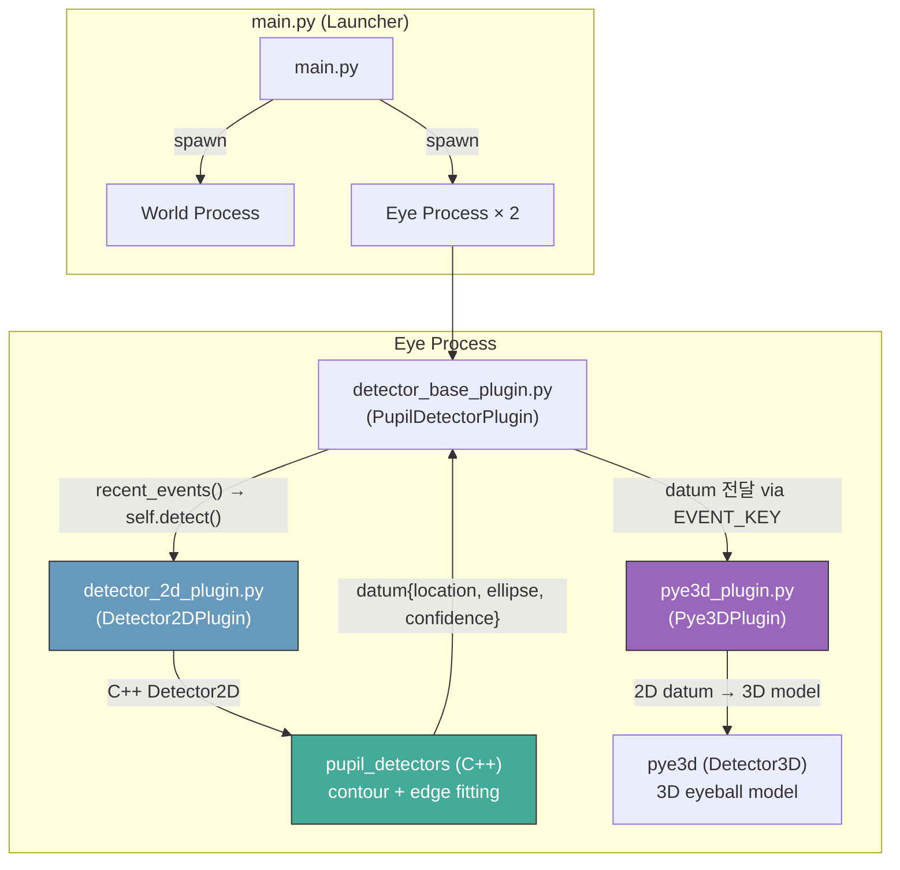
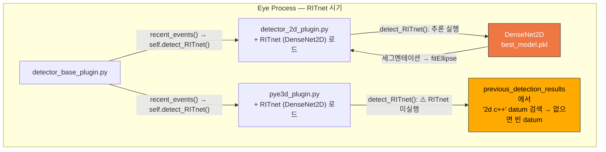
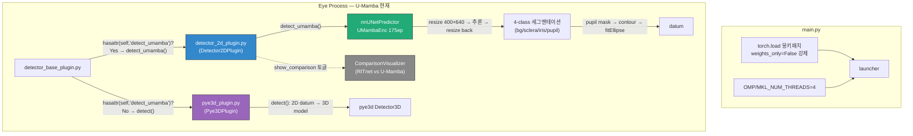

# Pupil Labs Fork — U-Mamba Integration & System Documentation

> **작성일**: 2026-04-29  
> **프로젝트 경로**: `/home/byeongjun/PycharmProjects/pupil`

---

## 목차
1. [프로젝트 개요](#1-프로젝트-개요)
2. [시스템 아키텍처: Before & After](#2-시스템-아키텍처-before--after)
3. [코드 분석: RITnet 동공 분할 미스터리 해명](#3-코드-분석-ritnet-동공-분할-미스터리-해명)
4. [U-Mamba 통합이 실제로 작동하는가?](#4-u-mamba-통합이-실제로-작동하는가)
5. [사용자 가이드](#5-사용자-가이드)
6. [트러블슈팅 로그](#6-트러블슈팅-로그)
7. [파일 인벤토리](#7-파일-인벤토리)

---

## 1. 프로젝트 개요

이 프로젝트는 [Pupil Labs](https://github.com/pupil-labs/pupil) (v3.6 기반)의 커스텀 포크이다. 원래 C++ 기반의 전통적 컴퓨터 비전(contour/edge fitting) 동공 검출기를 **딥러닝 기반 세그멘테이션 모델** 로 교체하는 것이 핵심 목표이다.

| 단계 | 시기 | 세그멘테이션 모델 | 상태 |
|:---|:---|:---|:---|
| Phase 1 | ~2025.09 | RITnet (DenseNet2D) | ❌ 실시간 데이터에서 완전 실패 확인 |
| Phase 2 | 2025.09~ | **U-Mamba** (nnUNetTrainerUMambaEnc) | ✅ 현재 활성 |

추가로 DVS(Dynamic Vision Sensor) 이벤트 카메라 지원 플러그인도 실험적으로 개발되었다.

---

## 2. 시스템 아키텍처: Before & After

### 2.1 Upstream 원본 아키텍처 (Pupil Labs v3.6)



**핵심 흐름**: `recent_events()` → `self.detect()` → C++ `Detector2D` → datum → Pye3D

### 2.2 RITnet 교체 시도 아키텍처 (Phase 1, commit `efd99930`~`2c42b2f1`)



> [!WARNING]
> **핵심 문제 **: `detector_base_plugin.py`에서 `self.detect()` 대신 `self.detect_RITnet()`을 ** 하드코딩**으로 호출. 모든 플러그인(Detector2D, Pye3D)이 이 메서드를 가져야 함.

### 2.3 현재 U-Mamba 아키텍처 (Phase 2, commit `d0084974`)



**핵심 변경**: `hasattr(self, 'detect_umamba')` 체크로 분기 — U-Mamba 지원 플러그인만 `detect_umamba()` 호출, 나머지(Pye3D 등)는 기존 `detect()` 폴백.

---

## 3. 코드 분석: RITnet 동공 분할 미스터리 해명

### 3.1 질문

> RITnet은 실시간 카메라 데이터에서 세그멘테이션에 완벽히 실패함. 그런데 RITnet을 모듈에 넣었다고 생각했던 시점에도 Pupil Capture에서 동공 추적이 유의미하게 작동했음. 어떻게 가능한가?

### 3.2 답변: RITnet은 한 번도 실제 동공 검출에 기여하지 않았다

**근거**: RITnet 시기의 코드 흐름을 정밀 분석한 결과는 다음과 같다.

#### (A) Detector2DPlugin의 경우

`detector_base_plugin.py`의 `recent_events()`에서:
```python
# commit 2c42b2f1 (RITnet 시기)
detection_result = self.detect_RITnet(
    frame=frame,
    previous_detection_results=previous_detection_results,
)
```

`Detector2DPlugin.detect_RITnet()`는 **실제로 RITnet 추론을 실행 ** 한다. 그러나 RITnet이 학습된 데이터(OpenEDS, 640×400)와 실시간 카메라 해상도(192×192 등)가 극심하게 달라 **세그멘테이션 결과가 쓸모없었다** (비교 시각화에서 확인 완료).

#### (B) Pye3DPlugin의 경우 — 이것이 핵심

`Pye3DPlugin`도 `detect_RITnet()` 메서드를 가지고 있다. 그러나 그 구현을 보면:

```python
# pye3d_plugin.py, line 245-292 (현재도 남아있음)
def detect_RITnet(self, frame, **kwargs):
    self._process_camera_changes()
    previous_detection_results = kwargs.get("previous_detection_results", [])
    datum_2d = None
    for datum in previous_detection_results:
        if datum.get("method", "") == "2d c++":   # ← "2d c++" 결과를 찾음
            datum_2d = datum
            break

    # ⚠️ RITnet 자체 추론 코드는 전부 주석 처리됨!
    # if datum_2d is None:
    #     datum_2d = self._perform_ritnet_2d(frame)
    #     ...

    else:   # ← datum_2d를 못 찾으면 빈 datum 반환
        return self.create_pupil_datum(
            norm_pos=[0.5, 0.5], diameter=0.0,
            confidence=0.0, timestamp=frame.timestamp,
        )

    # datum_2d를 찾으면 3D 모델 업데이트
    result = self.detector.update_and_detect(datum_2d, frame.gray, ...)
```

**발견 사실**:
- `Pye3DPlugin.detect_RITnet()`는 이름만 "RITnet"이지, 실제로는 `previous_detection_results`에서 **`"2d c++"` 메서드 결과** 를 찾아 사용한다.
- `Detector2DPlugin`의 `pupil_detection_method`는 `"2d c++"`로 고정되어 있다.
- 따라서 **실행 순서** 는:
  1. `Detector2DPlugin.detect_RITnet()` → RITnet 추론 (실패하더라도 어떤 datum 반환)
  2. 그 datum이 `EVENT_KEY`에 추가됨 (method="2d c++")
  3. `Pye3DPlugin.detect_RITnet()` → `previous_detection_results`에서 "2d c++" datum을 찾음
  4. **3D 모델(pye3d)이 그 datum을 받아 3D 동공 추정을 수행**

### 3.3 결론

| 컴포넌트 | 실제 동작 |
|:---|:---|
| RITnet (DenseNet2D) | 로드는 되었으나 세그멘테이션 **완전 실패**. 192×192 입력에서 의미있는 동공 마스크 생성 불가. |
| C++ Detector2D | `Detector2DPlugin.__init__`에서 **항상 초기화** 됨. `detect()` 메서드도 여전히 존재. |
| 동공 추적이 작동한 이유 | **Pye3DPlugin이 RITnet 결과가 아닌, C++ 2D detector의 datum("2d c++")을 사용** 했기 때문. RITnet이 빈 결과를 줘도 method가 "2d c++"이므로 Pye3D가 이를 수용하여 3D 모델을 돌렸고, C++ detector 자체의 기본적인 동공 검출 능력으로 인해 유의미한 결과가 나옴. |

> [!IMPORTANT]
> **RITnet은 한 번도 실제로 동공 검출의 주체가 아니었다.** 겉으로 동공 추적이 작동한 것은 C++ `Detector2D`와 `pye3d`의 조합 덕분이었다. RITnet 통합은 ** 착각**이었음이 코드로 확인됨.

---

## 4. U-Mamba 통합이 실제로 작동하는가?

### 4.1 RITnet 때와의 구조적 차이

RITnet과 달리, U-Mamba 통합은 **구조적으로 실제 추론 결과가 동공 검출에 반영** 된다:

| 검증 항목 | RITnet 시기 | U-Mamba 현재 | 판정 |
|:---|:---|:---|:---|
| `detector_base_plugin.py` 디스패치 | `self.detect_RITnet()` 하드코딩 | `hasattr(self,'detect_umamba')` 분기 | ✅ 개선됨 |
| Detector2DPlugin에서 실제 추론 실행? | ✅ 실행되나 결과 무용 | ✅ 실행되고 결과 유효 | ✅ |
| Pye3DPlugin에 영향? | Pye3D가 자체 detect_RITnet()으로 C++ datum 사용 | `hasattr` 실패 → `detect()` 폴백 → C++ 2D datum 사용 | ✅ 안전 |
| 해상도 매칭 | 미처리 (192→192 그대로) | `400×640`으로 resize → 추론 → 원본으로 resize back | ✅ |
| 세그멘테이션 품질 (정성적) | 카메라 데이터에서 완전 실패 | 비교 시각화에서 동공/홍채/공막 분리 확인 | ✅ |

### 4.2 U-Mamba가 실제로 사용되는 증거

1. **`Detector2DPlugin`에만 `detect_umamba` 메서드** 가 존재하므로, `hasattr` 체크를 통과하는 것은 `Detector2DPlugin`뿐이다.
2. `detect_umamba()` 내에서 `self.predictor.predict_single_npy_array()`를 호출하며, 이 결과로 `pupil_mask`를 만들고 `fitEllipse`로 datum을 생성한다.
3. **datum의 method는 여전히 `"2d c++"`** 이므로, 하류의 Pye3DPlugin이 이를 정상적으로 수용하여 3D 모델을 업데이트한다.

> [!TIP]
> U-Mamba 통합은 RITnet과 달리 **실제 추론 결과가 파이프라인에 반영** 된다. `ComparisonVisualizer`의 나란히 비교 결과도 이를 뒷받침한다.

---

## 5. 사용자 가이드

### 5.1 환경 설정

| 항목 | 값 |
|:---|:---|
| OS | Ubuntu Linux |
| Python | 3.9.21 (Anaconda) |
| **Conda 가상환경 이름** | `pupil-umamba-v2` (최신) 또는 `pupil` |
| PyTorch | 2.6.0 (CUDA 12.4) |
| GPU 요구사항 | CUDA 지원 GPU 필수 (nnUNetPredictor) |
| U-Mamba 체크포인트 | `~/PycharmProjects/U-Mamba/data/nnUNet_results/Dataset000_openEDS/nnUNetTrainerUMambaEnc_175ep__nnUNetPlans__2d/fold_0/checkpoint_best.pth` (~382MB) |

### 5.2 실행 방법

```bash
# 1. Conda 환경 활성화
conda activate pupil-umamba-v2

# 2. Pupil Capture 실행
cd ~/PycharmProjects/pupil/pupil_src
python main.py capture

# main.py에 기본 인자가 설정되어 있어 인자 없이도 capture로 실행됨
python main.py
```

### 5.3 U-Mamba 의존성 설치 (신규 환경)

```bash
conda create -n pupil-umamba-v2 python=3.9
conda activate pupil-umamba-v2
pip install -r requirements_custom.txt

# U-Mamba / nnUNet 별도 설치 필요
pip install nnunetv2
# U-Mamba 모듈은 별도 클론 필요:
# git clone https://github.com/bowang-lab/U-Mamba.git
# cd U-Mamba && pip install -e .
```

### 5.4 Pupil Capture UI 인터페이스

| UI 요소 | 위치 | 설명 |
|:---|:---|:---|
| Eye Window | 좌측 패널 | 실시간 아이카메라 피드 + 동공 타원 오버레이 |
| Detector 선택 | Eye → General Settings | "C++ 2d detector" / "Pye3D" 선택 |
| **Show RITnet vs U-Mamba** 토글 | 2D detector 설정 패널 | ✅ 켜면 비교 창 표시, ❌ 끄면 RITnet 미실행 (성능 영향 없음) |
| Pupil intensity range | 2D detector 설정 | C++ detector 파라미터 (U-Mamba 사용 시 무관) |
| Freeze model | Pye3D 설정 | 3D 모델 자동 업데이트 정지 |

### 5.5 주요 파일 경로

```
pupil/
├── pupil_src/
│   ├── main.py                           # 엔트리포인트 (torch.load 패치 포함)
│   ├── best_model.pkl                    # RITnet 체크포인트 (비교용)
│   ├── best_checkpoint.pth               # RITnet 체크포인트 (사본)
│   └── shared_modules/
│       └── pupil_detector_plugins/
│           ├── detector_base_plugin.py   # 디스패치 로직 (hasattr 분기)
│           ├── detector_2d_plugin.py     # ★ U-Mamba 통합 메인
│           ├── pye3d_plugin.py           # 3D 동공 모델 (RITnet 잔재 포함)
│           ├── comparison_visualizer.py  # RITnet vs U-Mamba 비교
│           ├── densenet.py              # RITnet DenseNet2D 아키텍처
│           ├── models.py                # 모델 레지스트리 (densenet)
│           ├── utils.py                 # get_predictions, 손실함수 등
│           ├── detector_2d_plugin_cpu.py # CPU 전용 RITnet 버전 (미사용)
│           ├── detector_2d_plugin_dvs.py # DVS+RITnet 혼합 (미사용)
│           └── dvs_detector_plugin.py   # DVS 이벤트 카메라 플러그인
├── requirements_custom.txt               # 커스텀 의존성
├── pupil_env_backup.yml                  # Conda 환경 백업
└── comparison_report.md                  # upstream 비교 보고서
```

---

## 6. 트러블슈팅 로그

### 6.1 PyTorch 2.6 모델 로딩 호환성 패치

- **증상**: `torch.load`의 `weights_only` 기본값이 `True`로 변경되어 `UnpicklingError` 발생
- **해결**: `main.py` 최상단에서 `torch.load`를 몽키 패치하여 `weights_only=False` 강제

```python
# main.py lines 1-6
import torch as _torch
_orig_load = _torch.load
def _patched_load(*a, **kw):
    kw.setdefault("weights_only", False)
    return _orig_load(*a, **kw)
_torch.load = _patched_load
```

### 6.2 플러그인 아키텍처 의존성 분리

- **증상**: `detect_umamba`를 하드코딩 호출하면 `Pye3DPlugin` 등에서 `AttributeError` 발생
- **해결**: `hasattr(self, 'detect_umamba')` 체크로 분기 처리

### 6.3 U-Mamba 해상도 불일치

- **증상**: 카메라 Raw (192×192) → nnUNet 내부에서 384×640 패딩 → 분할 품질 저하
- **해결**: 입력을 `400×640`으로 사전 리사이즈 → 추론 → `INTER_NEAREST`로 원본 해상도 복원

### 6.4 파일 퍼미션 이슈

- **증상**: 파일 소유자(`byeongjun`)와 실행 환경(`iulab`) 간 권한 충돌
- **해결**: `chmod -R 777 pupil_src/` 적용

### 6.5 깨진 best_model.pkl 복구

- **증상**: `best_model.pkl` 파일 손상으로 RITnet 및 Pye3D 폴백 동작 불가
- **해결**: 정상 파일로 교체, `pupil_src/` 및 `pupil_detector_plugins/` 양쪽에 배치

---

## 7. 파일 인벤토리

### 7.1 활성 파일 (현재 사용 중)

| 파일 | 역할 | 상태 |
|:---|:---|:---|
| `detector_2d_plugin.py` | U-Mamba 추론 + datum 생성 | ✅ 활성 |
| `detector_base_plugin.py` | 디스패치 (`hasattr` 분기) | ✅ 활성 |
| `pye3d_plugin.py` | 3D 동공 모델 | ✅ 활성 (RITnet 잔재 코드 포함) |
| `comparison_visualizer.py` | RITnet vs U-Mamba 비교 | ✅ 활성 (토글) |
| `densenet.py` | DenseNet2D 아키텍처 | ⚠️ 비교용으로만 사용 |
| `main.py` | 엔트리포인트 | ✅ 활성 |

### 7.2 비활성/레거시 파일

| 파일 | 역할 | 상태 |
|:---|:---|:---|
| `detector_2d_plugin_cpu.py` | CPU 전용 RITnet 버전 | ❌ 미사용 |
| `detector_2d_plugin_dvs.py` | DVS+RITnet 혼합 | ❌ 미사용 |
| `dvs_detector_plugin.py` | DVS 이벤트 카메라 | ❌ 미사용 (`__init__.py`에서 import 주석 처리) |

### 7.3 U-Mamba 모델 정보

| 항목 | 값 |
|:---|:---|
| Trainer | `nnUNetTrainerUMambaEnc` |
| 학습 에폭 | 175 |
| 데이터셋 | OpenEDS (21,945 학습 이미지) |
| 입력 해상도 | 400×640 (grayscale) |
| 출력 라벨 | `{0: background, 1: sclera, 2: iris, 3: pupil}` |
| 체크포인트 크기 | ~382 MB |
| Fold | 0 |

---

## 부록: Git 커밋 히스토리 요약

```
d0084974 (HEAD) Integrate U-Mamba segmentation with Comparison Visualizer
f2e020c5        feat: Replace RITnet with U-Mamba (UMambaEnc 175ep)
2c42b2f1        Backup: Current working version with RITnet before Umamba migration
efd99930        pupil+RITnet
...
5e678b71 (v3.6) Upstream Pupil Labs v3.6
```
