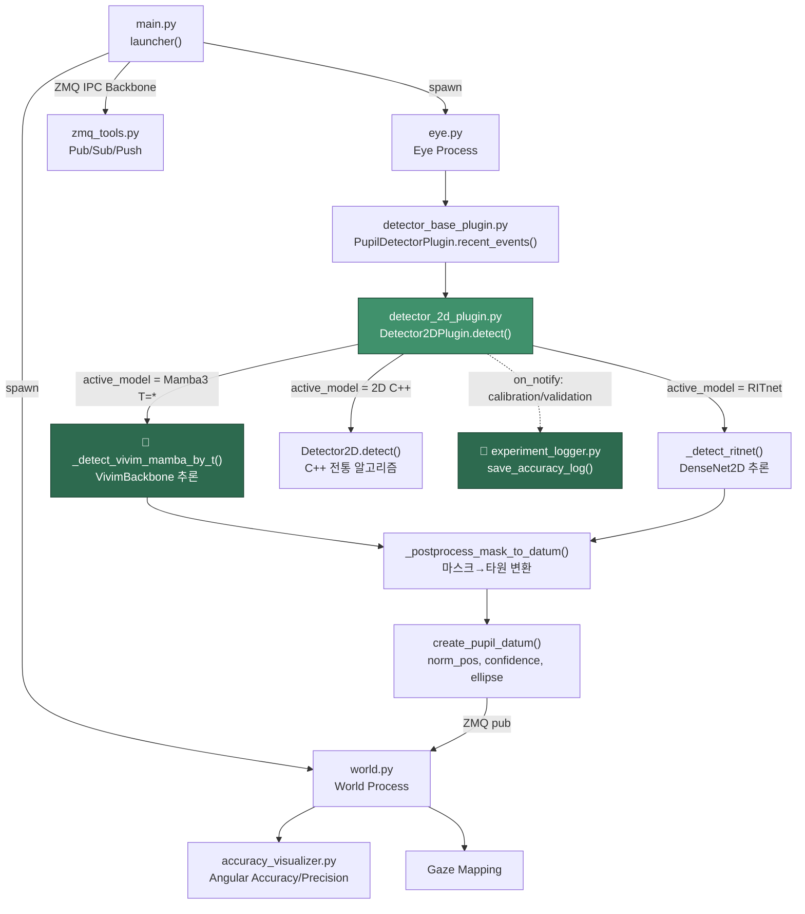
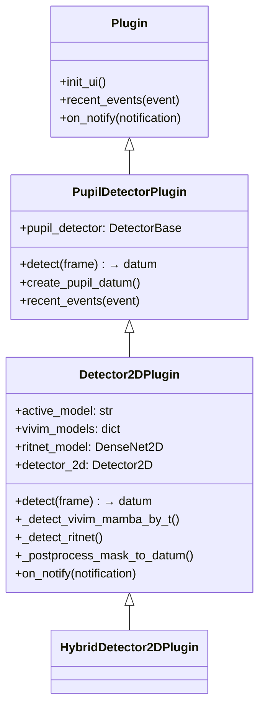
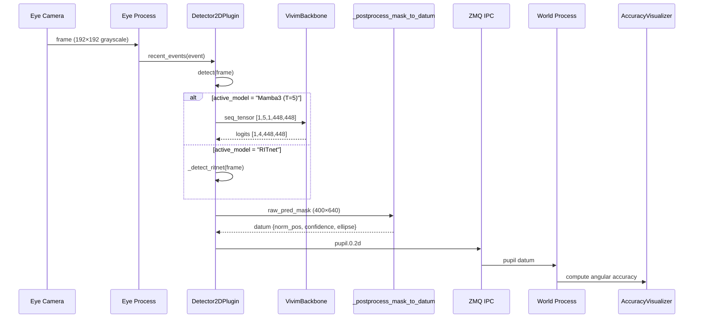

# Pupil + Vivim-Mamba3 통합 코드 리뷰
> **리뷰 대상**: Pupil Labs Eye Tracking Platform (커스텀 포크)
> **분석 시점**: [`main.py`](file:///home/byeongjun/PycharmProjects/pupil/pupil_src/main.py) (런처/IPC 엔트리포인트) → [`detector_2d_plugin.py`](file:///home/byeongjun/PycharmProjects/pupil/pupil_src/shared_modules/pupil_detector_plugins/detector_2d_plugin.py) (Vivim-Mamba3 추론 플러그인)
> **날짜**: 2026-08-18

---

## 1. 레포지토리 트리 구조

실행 흐름과 직접 관련된 파일에 `★` 표시, Vivim-Mamba3 커스텀 코드에 `🔧` 표시를 달았습니다.

```
pupil/
├── pupil_src/
│   ├── ★ main.py                          (510 lines)  # 메인 런처 · IPC Backbone · 프로세스 오케스트레이터
│   ├── best_model.pkl                                   # RITnet 사전학습 가중치
│   ├── best_checkpoint.pth                              # nnUNet 체크포인트
│   ├── gpu_checker.py                                   # GPU 가용성 확인 유틸
│   │
│   ├── launchables/                                     # ── 멀티프로세스 진입점 ──
│   │   ├── __init__.py
│   │   ├── ★ eye.py                       (935 lines)  # Eye 프로세스 (카메라 → 동공 검출 루프)
│   │   ├── ★ world.py                     (939 lines)  # World 프로세스 (씬 카메라 · Gaze Mapping)
│   │   ├── player.py                                    # 녹화 재생기
│   │   ├── service.py                                   # 헤드리스 서비스 모드
│   │   └── marker_detectors.py                          # 원형 마커 검출기
│   │
│   └── shared_modules/                                  # ── 공유 모듈 라이브러리 ──
│       ├── plugin.py                                    # Plugin 베이스 클래스
│       ├── methods.py                                   # normalize() 등 유틸
│       ├── ★ accuracy_visualizer.py       (625 lines)  # Angular Accuracy/Precision 계산
│       ├── zmq_tools.py                                 # ZMQ IPC 메시징 래퍼
│       ├── launchable_args.py                           # CLI 인자 파서
│       ├── version_utils.py                             # 버전 관리
│       ├── os_utils.py                                  # Prevent_Idle_Sleep 등
│       ├── process_affinity.py                          # CPU 어피니티 설정
│       │
│       ├── calibration_choreography/                    # ── 캘리브레이션 시스템 ──
│       │   ├── __init__.py
│       │   ├── base_plugin.py
│       │   ├── screen_marker_plugin.py
│       │   ├── single_marker_plugin.py
│       │   ├── natural_feature_plugin.py
│       │   ├── hmd_plugin.py
│       │   ├── controller/
│       │   └── mixin/
│       │
│       ├── gaze_mapping/                                # Gaze Mapping 파이프라인
│       ├── video_capture/                               # 카메라 백엔드 (UVC, NDSI, File 등)
│       ├── gl_utils/                                    # OpenGL 유틸리티
│       │
│       └── pupil_detector_plugins/                      # ══ 동공 검출 플러그인 (핵심) ══
│           ├── ★ __init__.py              (71 lines)   # 플러그인 레지스트리 · available_detector_plugins()
│           ├── ★ detector_base_plugin.py  (298 lines)  # PupilDetectorPlugin ABC · recent_events()
│           ├── 🔧★ detector_2d_plugin.py  (738 lines)  # Detector2DPlugin: Mamba3/RITnet/C++ 통합 검출기
│           ├── detector_2d_hybrid_plugin.py (400 lines) # HybridDetector2DPlugin (RITnet+DVS)
│           ├── detector_2d_plugin_cpu.py                # CPU-only 변형
│           ├── detector_2d_plugin_dvs.py                # DVS 전용 변형
│           ├── hybrid_runtime.py          (686 lines)  # DVS 고속 BinaRep 런타임
│           ├── pye3d_plugin.py            (350 lines)  # 3D 동공 검출기 (Pye3D)
│           │
│           ├── 🔧 models.py               (14 lines)   # model_dict: DenseNet2D(RITnet) 레지스트리
│           ├── 🔧 densenet.py             (147 lines)  # DenseNet2D (RITnet 아키텍처)
│           ├── 🔧 utils.py                (230 lines)  # Loss함수 · mIoU · get_predictions()
│           ├── 🔧 experiment_logger.py    (50 lines)   # 실험 정확도 로그 저장
│           ├── visualizer_2d.py           (92 lines)   # OpenGL 타원 시각화
│           ├── color_scheme.py            (58 lines)   # 컬러 스킴 (2D/3D 타원 색상)
│           ├── CheckEllipse.py            (15 lines)   # 타원 신뢰도 기하학 계산
│           ├── draw_ellipse.py                          # 타원 피팅 유틸
│           ├── dvs_detector_plugin.py                   # DVS 단독 검출기
│           ├── dvs_metrics.py                           # DVS 메트릭 계산
│           ├── dvs_models/                              # TDTracker 모델
│           ├── deepvog/                                 # DeepVOG 통합 (선택)
│           ├── edgaze/                                  # EdGaze 통합 (선택)
│           └── visualizer_pye3d/                        # 3D 시각화
│
├── recordings/                                          # 캘리브레이션/검증 로그 출력 디렉토리
├── capture_settings/                                    # Pupil Capture 유저 설정
├── benchmarks/                                          # 벤치마크 스크립트
├── tests/                                               # 테스트 모음
├── docs/                                                # 문서
├── requirements.txt                                     # 기본 의존성
├── requirements_custom.txt                              # 커스텀 의존성 (torch, mamba 등)
├── performance_report.md                                # 성능 리포트
└── comparison_report.md                                 # 모델 비교 리포트
```

---

## 2. 아키텍처 흐름도



---

## 3. `main.py` — 런처 / IPC 오케스트레이터

### 3.1 전체 구조 요약

| 섹션 | 라인 | 역할 |
|------|------|------|
| 환경 변수 & 패치 | [L1-31](file:///home/byeongjun/PycharmProjects/pupil/pupil_src/main.py#L1-L31) | `OMP/MKL` 스레드 제한, `EphemeralLogTee` (stdout/stderr → 파일), `torch.load` weights_only 패치 |
| CLI 파싱 | [L33-66](file:///home/byeongjun/PycharmProjects/pupil/pupil_src/main.py#L33-L66) | `PupilArgParser`, 기본 앱 = `capture` |
| 디렉토리 설정 | [L83-112](file:///home/byeongjun/PycharmProjects/pupil/pupil_src/main.py#L83-L112) | `user_dir`, `plugin_dir` 생성 |
| IPC Backbone | [L260-312](file:///home/byeongjun/PycharmProjects/pupil/pupil_src/main.py#L260-L312) | ZMQ `XSUB↔XPUB` 프록시, `PULL→PUB` 브릿지, 로그 수신 스레드, 지연 알림 프록시 |
| 이벤트 루프 | [L329-381](file:///home/byeongjun/PycharmProjects/pupil/pupil_src/main.py#L329-L381) | 1초 폴링 → `process_notification()` 디스패치 |
| 프로세스 팩토리 | [L383-503](file:///home/byeongjun/PycharmProjects/pupil/pupil_src/main.py#L383-L503) | 알림 subject별 `Process` 스폰 (eye, world, player, service 등) |

### 3.2 리뷰 포인트

#### ✅ 잘 된 부분

- **`EphemeralLogTee`**: stdout/stderr를 파일로 미러링하여 `on_notify`에서 로그 파싱이 가능함 — Vivim-Mamba3 실험 로그 추출의 핵심 인프라
- **`torch.load` monkeypatch** ([L27-31](file:///home/byeongjun/PycharmProjects/pupil/pupil_src/main.py#L27-L31)): `weights_only=False` 기본값 설정으로 Mamba3 체크포인트 로딩 호환성 확보
- **`OMP_NUM_THREADS=4`**: CUDA와 CPU 코어 경합 방지를 위한 적절한 제한

#### ⚠️ 개선 제안

> [!WARNING]
> **프로세스 종료 관리 부족**: [L379-380](file:///home/byeongjun/PycharmProjects/pupil/pupil_src/main.py#L379-L380)에서 `p.join()`은 timeout 없이 무한 대기합니다. Mamba3 모델이 CUDA에서 hang 상태에 빠지면 런처 전체가 교착됩니다.

```diff
 for p in active_children():
-    p.join()
+    p.join(timeout=10.0)
+    if p.is_alive():
+        logging.warning(f"Force-killing {p.name}")
+        p.kill()
```

> [!NOTE]
> **`EphemeralLogTee.write()`에서 예외 처리 없음**: 디스크 풀(full) 상태에서 `self.file.write(data)`가 `IOError`를 발생시키면 stdout 자체가 깨집니다. `try/except` 래핑을 권장합니다.

---

## 4. `detector_2d_plugin.py` — Vivim-Mamba3 통합 검출기

### 4.1 클래스 계층



### 4.2 `__init__` — 모델 초기화

[L102-133](file:///home/byeongjun/PycharmProjects/pupil/pupil_src/shared_modules/pupil_detector_plugins/detector_2d_plugin.py#L102-L133):

```python
self.vivim_models = {}
self._vivim_queues = {t: collections.deque(maxlen=t) for t in [3, 5, 7, 9, 11]}
self._init_nnunet_models()   # Vivim-Mamba3 T=3,5,7,9,11 로딩
self._init_ritnet_model()     # RITnet(DenseNet2D) 폴백
```

**5개의 Mamba3 변형을 동시에 GPU 메모리에 적재합니다.** 각 `VivimBackbone`이 약 ~50MB라면 총 ~250MB GPU 메모리를 점유합니다.

### 4.3 `detect()` — 모델 라우팅 디스패처

[L213-266](file:///home/byeongjun/PycharmProjects/pupil/pupil_src/shared_modules/pupil_detector_plugins/detector_2d_plugin.py#L213-L266)에서 `active_model` 문자열 파싱으로 분기합니다:

| `active_model` 값 | 경로 | 설명 |
|---|---|---|
| `"Mamba3 (T=3)"` ~ `"Mamba3 (T=11)"` | `_detect_vivim_mamba_by_t()` | Vivim-Mamba3 시계열 추론 |
| `"RITnet"` | `_detect_ritnet()` | DenseNet2D 단일 프레임 추론 |
| `"2D C++"` | `detector_2d.detect()` | C++ 전통 알고리즘 (Pupil Labs 원본) |

### 4.4 `_detect_vivim_mamba_by_t()` — 핵심 Mamba3 추론 경로

[L358-420](file:///home/byeongjun/PycharmProjects/pupil/pupil_src/shared_modules/pupil_detector_plugins/detector_2d_plugin.py#L358-L420):

**전처리 파이프라인:**
```
frame.gray (192×192 or 400×640)
  → uint8 → optional flip_v/flip_h
  → Z-Score 정규화 (동적 mean/std)
  → 400×400 crop/resize
  → 448×448 패딩 (24px 각 방향)
  → deque에 push (maxlen=T)
  → [1, T, 1, 448, 448] 텐서 스택
```

**추론:**
```python
with torch.inference_mode():
    logits = model(seq_tensor.float())  # VivimBackbone forward
```

**후처리:**
```
448×448 argmax → 24px unpad → 400×400
  → 640×400 canvas에 중앙 배치
  → _postprocess_mask_to_datum()
```

### 4.5 `_postprocess_mask_to_datum()` — 마스크 → 타원 변환

[L422-513](file:///home/byeongjun/PycharmProjects/pupil/pupil_src/shared_modules/pupil_detector_plugins/detector_2d_plugin.py#L422-L513):

이 함수는 세그멘테이션 마스크를 Pupil Core가 소비할 수 있는 `datum` 딕셔너리로 변환합니다:

```
pred_mask
  → Letterbox unpad (필요시)
  → 동공 클래스(id=3) 바이너리 마스크
  → GaussianBlur(5,5) + 이진화 (anti-aliasing)
  → findContours → 최대 면적 컨투어
  → cv2.fitEllipse()
  → 반 깜빡임 거부 (aspect_ratio < 0.65)
  → confidence = √(area_ratio × aspect_ratio)
  → EMA 시간 평활화 (α=0.4) + 점프 거부 (40px 임계)
  → datum{norm_pos, diameter, confidence, ellipse}
```

### 4.6 `on_notify()` — 캘리브레이션/검증 정확도 자동 로깅

[L644-737](file:///home/byeongjun/PycharmProjects/pupil/pupil_src/shared_modules/pupil_detector_plugins/detector_2d_plugin.py#L644-L737):

`calibration.successful` 또는 `validation.stopped` 알림 수신 시:
1. 0.5초 대기 후 `pupil_capture.log`를 역순 스캔
2. Angular Accuracy/Precision/RMSE 값을 정규식으로 추출
3. [`experiment_logger.save_accuracy_log()`](file:///home/byeongjun/PycharmProjects/pupil/pupil_src/shared_modules/pupil_detector_plugins/experiment_logger.py)로 `recordings/` 디렉토리에 개별 로그 저장

---

## 5. 핵심 의존 모듈 리뷰

### 5.1 [`detector_base_plugin.py`](file:///home/byeongjun/PycharmProjects/pupil/pupil_src/shared_modules/pupil_detector_plugins/detector_base_plugin.py)

- **`recent_events()`** ([L108-144](file:///home/byeongjun/PycharmProjects/pupil/pupil_src/shared_modules/pupil_detector_plugins/detector_base_plugin.py#L108-L144)): 매 프레임마다 `detect()` 호출 → `event[EVENT_KEY]`에 결과 추가. 즉, **Mamba3 추론이 eye 프로세스의 메인 루프에서 동기적으로 실행됩니다.**
- **`create_pupil_datum()`** ([L63-78](file:///home/byeongjun/PycharmProjects/pupil/pupil_src/shared_modules/pupil_detector_plugins/detector_base_plugin.py#L63-L78)): `active_model` 문자열을 `method` 필드에 주입 — 커스텀 패치

### 5.2 [`models.py`](file:///home/byeongjun/PycharmProjects/pupil/pupil_src/shared_modules/pupil_detector_plugins/models.py) & [`densenet.py`](file:///home/byeongjun/PycharmProjects/pupil/pupil_src/shared_modules/pupil_detector_plugins/densenet.py)

- `model_dict['densenet']`은 `DenseNet2D(dropout=True, prob=0.2)` 팩토리 — RITnet 폴백 아키텍처
- DenseNet2D: 5-down / 4-up U-Net 구조, `channel_size=32`, 입력 1ch 그레이스케일 → 4ch 세그멘테이션 (Background/Sclera/Iris/Pupil)

### 5.3 [`experiment_logger.py`](file:///home/byeongjun/PycharmProjects/pupil/pupil_src/shared_modules/pupil_detector_plugins/experiment_logger.py)

```
recordings/
├── Mamba3_T=5_calibration_20260810_164834.log
├── Mamba3_T=5_test_20260810_165012.log
├── RITnet_calibration_20260810_164834.log
└── ...
```

모델명, 실험 타입, Angular Accuracy/Precision, RMSE, PyTorch/CUDA 정보를 기록합니다.

### 5.4 [`__init__.py`](file:///home/byeongjun/PycharmProjects/pupil/pupil_src/shared_modules/pupil_detector_plugins/__init__.py)

`available_detector_plugins()` ([L37-70](file:///home/byeongjun/PycharmProjects/pupil/pupil_src/shared_modules/pupil_detector_plugins/__init__.py#L37-L70)):
- 기본: `[Detector2DPlugin]`
- `PUPIL_HYBRID_ENABLED=1`: `[HybridDetector2DPlugin]`
- `Pye3DPlugin`은 항상 추가 시도

---

## 6. Vivim-Mamba3 모델 통합 아키텍처

### 6.1 외부 의존성

```python
# detector_2d_plugin.py L60-72
NNUNET_DIR = os.path.expanduser("~/PycharmProjects/nnUNet")
NNUNET_LEGACY_DIR = os.path.expanduser("~/PycharmProjects/nnUNet_legacy")
NNUNET_AGENT_DIR = os.path.join(NNUNET_DIR, "agent")

# sys.path에 동적 삽입
for p in [NNUNET_LEGACY_DIR, NNUNET_DIR, NNUNET_AGENT_DIR]:
    if os.path.exists(p) and p not in sys.path:
        sys.path.insert(0, p)
```

**`VivimBackbone`**은 `~/PycharmProjects/nnUNet/agent/models/vivim_backbone.py`에서 임포트됩니다. Pupil 레포 외부에 위치한 nnUNet 프로젝트에 대한 하드코딩된 경로 의존성입니다.

### 6.2 체크포인트 경로 구조

```python
# L138-144
self.vivim_ckpts = {
    3:  ".../Dataset600_OpenEDS2019/nnUNetTrainer_Vivim__nnUNetPlans__2d/fold_1/checkpoint_best.pth",
    5:  ".../Dataset600_OpenEDS2019/nnUNetTrainer_Vivim_T5__nnUNetPlans__2d/fold_1/checkpoint_best.pth",
    7:  ".../fold_1_T7/checkpoint_best.pth",
    9:  ".../fold_1_T9/checkpoint_best.pth",
    11: ".../fold_1_T11/checkpoint_best.pth",
}
```

> [!IMPORTANT]
> T=3과 T=7/9/11은 같은 trainer(`nnUNetTrainer_Vivim`)의 다른 fold 디렉토리를 사용하지만, T=5는 별도 trainer(`nnUNetTrainer_Vivim_T5`)를 사용합니다. 이 불일치가 의도적인 것인지 확인이 필요합니다.

### 6.3 입력 전처리 상세

| 단계 | Mamba3 (`_detect_vivim_mamba_by_t`) | RITnet (`_detect_ritnet`) |
|------|------|------|
| 정규화 | Z-Score (동적 mean/std) | 감마 교정(γ=0.8) + CLAHE + `Normalize([0.5],[0.5])` |
| 리사이즈 | 400×400 → 448×448 (24px 패드) | 원본 크기 유지 |
| 시퀀스 | deque 기반 T-프레임 스택 | 단일 프레임 |
| 텐서 형상 | `[1, T, 1, 448, 448]` | `[1, 1, H, W]` |

---

## 7. 정량적 코드 통계

| 모듈 | 라인 수 | 복잡도 |
|------|---------|--------|
| [`main.py`](file:///home/byeongjun/PycharmProjects/pupil/pupil_src/main.py) | 510 | 중간 — 프로세스 스폰, IPC 설정 |
| [`detector_2d_plugin.py`](file:///home/byeongjun/PycharmProjects/pupil/pupil_src/shared_modules/pupil_detector_plugins/detector_2d_plugin.py) | 738 | **높음** — 3가지 검출 경로, 전처리, 후처리, 로그 파싱 |
| [`detector_base_plugin.py`](file:///home/byeongjun/PycharmProjects/pupil/pupil_src/shared_modules/pupil_detector_plugins/detector_base_plugin.py) | 298 | 중간 — ABC + 이벤트 디스패치 |
| [`eye.py`](file:///home/byeongjun/PycharmProjects/pupil/pupil_src/launchables/eye.py) | 935 | 높음 — 카메라 루프, 녹화, UI |
| [`densenet.py`](file:///home/byeongjun/PycharmProjects/pupil/pupil_src/shared_modules/pupil_detector_plugins/densenet.py) | 147 | 낮음 — 순수 모델 정의 |
| [`utils.py`](file:///home/byeongjun/PycharmProjects/pupil/pupil_src/shared_modules/pupil_detector_plugins/utils.py) | 230 | 낮음 — Loss/Metric 유틸 |
| [`experiment_logger.py`](file:///home/byeongjun/PycharmProjects/pupil/pupil_src/shared_modules/pupil_detector_plugins/experiment_logger.py) | 50 | 낮음 — 파일 기록 |

---

## 8. 개선 제안 요약

### 8.1 아키텍처 개선

> [!TIP]
> **Lazy 모델 로딩**: 5개 Mamba3 변형을 전부 초기화하는 대신, `active_model` 변경 시에만 해당 T 값의 모델을 로드하면 GPU 메모리를 ~80% 절약할 수 있습니다.

```python
def _get_or_load_vivim(self, t_val):
    if t_val not in self.vivim_models:
        # 기존 모델 언로드
        for k in list(self.vivim_models.keys()):
            del self.vivim_models[k]
        torch.cuda.empty_cache()
        # 새 모델 로드
        self._load_single_vivim(t_val)
    return self.vivim_models.get(t_val)
```

### 8.2 코드 품질 개선

| 이슈 | 위치 | 제안 |
|------|------|------|
| `_empty_datum()` 중복 정의 | [L268](file:///home/byeongjun/PycharmProjects/pupil/pupil_src/shared_modules/pupil_detector_plugins/detector_2d_plugin.py#L268), [L553](file:///home/byeongjun/PycharmProjects/pupil/pupil_src/shared_modules/pupil_detector_plugins/detector_2d_plugin.py#L553) | 두 번 정의됨 — 두 번째가 첫 번째를 오버라이드. 하나 삭제 |
| 하드코딩된 경로 | [L61-63](file:///home/byeongjun/PycharmProjects/pupil/pupil_src/shared_modules/pupil_detector_plugins/detector_2d_plugin.py#L61-L63) | 환경 변수 `NNUNET_DIR`로 대체 |
| 매직 넘버 | 24px 패딩, 40px 점프 임계, 0.65 aspect ratio 등 | 상수로 추출하여 클래스 레벨에 정의 |
| `on_notify()`의 로그 파싱 | [L644-731](file:///home/byeongjun/PycharmProjects/pupil/pupil_src/shared_modules/pupil_detector_plugins/detector_2d_plugin.py#L644-L731) | 90줄의 로그 파싱 코드 — 별도 함수/모듈로 분리 |
| `numpy._core` 호환 패치 | [L69-72](file:///home/byeongjun/PycharmProjects/pupil/pupil_src/shared_modules/pupil_detector_plugins/detector_2d_plugin.py#L69-L72) | numpy 2.x 호환 패치이나, 주석 필요 |
| PyTorch dtype 패치 | [L17-21](file:///home/byeongjun/PycharmProjects/pupil/pupil_src/shared_modules/pupil_detector_plugins/detector_2d_plugin.py#L17-L21) | `float4_e2m1fn_x2`, `float8_e8m0fnu` — Mamba의 의존성 문제. 버전 범위 주석 추가 |

### 8.3 성능 개선

> [!TIP]
> **AMP 누락**: `_detect_vivim_mamba_by_t()`에서 `torch.cuda.amp.autocast()`가 사용되지 않습니다. `_detect_temporal_unet()`과 `_detect_nnunet_2d()`에는 적용되어 있으므로 일관성을 위해 추가하면 추론 시간을 20-30% 단축할 수 있습니다.

```diff
 with torch.inference_mode():
+    with torch.cuda.amp.autocast(enabled=self._use_amp):
         logits = model(seq_tensor.float())
```

### 8.4 견고성 개선

> [!WARNING]
> **`on_notify()`에서의 스레드 안전성**: [L731](file:///home/byeongjun/PycharmProjects/pupil/pupil_src/shared_modules/pupil_detector_plugins/detector_2d_plugin.py#L731)에서 `daemon=True` 스레드가 `self.g_pool`과 `self.active_model`에 접근합니다. Eye 프로세스 종료 시 `g_pool`이 소멸되면 `AttributeError`가 발생할 수 있습니다. weak reference 또는 값 캡처를 권장합니다.

---

## 9. 데이터 흐름 요약



---

## 10. 결론

이 포크는 Pupil Labs의 원본 C++ 2D 검출기를 **Vivim-Mamba3 기반 시계열 동공 세그멘테이션**으로 대체한 연구 플랫폼입니다. 핵심 설계 결정은:

1. **플러그인 아키텍처 활용**: Pupil의 `Plugin` 시스템을 통해 원본 코드 최소 변경으로 Mamba3를 통합
2. **다중 시간 윈도우 실험**: T=3,5,7,9,11 변형을 UI 드롭다운으로 실시간 전환
3. **엔드투엔드 실험 파이프라인**: 캘리브레이션/검증 → 정확도 자동 로깅까지 일관된 흐름

주요 기술 부채는 **하드코딩된 외부 경로**, **동시 모델 적재로 인한 메모리 낭비**, **`_empty_datum` 중복 정의**, 그리고 **AMP 미적용으로 인한 추론 속도 저하**입니다. 위 개선 제안들을 적용하면 연구 효율과 코드 유지보수성이 크게 향상될 것입니다.
