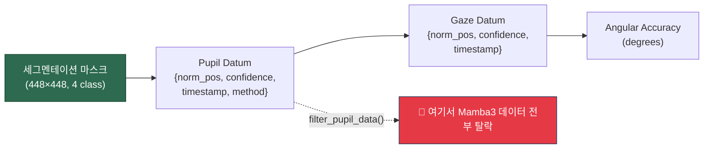
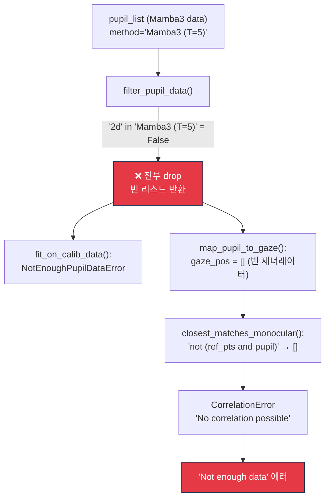
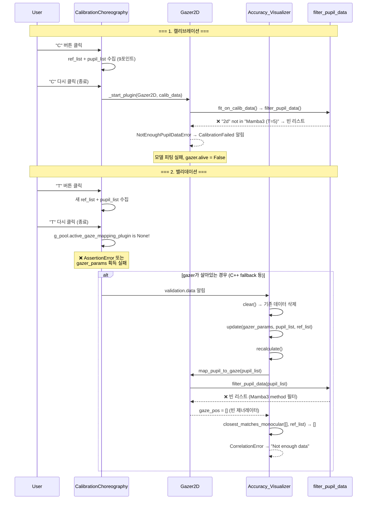

# 세그멘테이션 마스크 → Gaze 매핑 → 정확도 측정: 파이프라인 분석 및 버그 근본 원인

> **대상**: Mamba3/RITnet 세그멘테이션 기반 동공 검출 → Gaze 매핑 → Angular Accuracy 측정
> **분석 범위**: 임시조치 이전 원본 로직 + 사용자 수정사항 + 근본 해결 방안

---

## 1. 마스크에서 Gaze까지: 전체 매핑 경로

세그멘테이션 마스크가 최종 Angular Accuracy 수치로 변환되기까지 3개의 핵심 변환 단계가 있습니다.



### 변환 ①: 마스크 → Pupil Datum

[`_postprocess_mask_to_datum()`](file:///home/byeongjun/PycharmProjects/pupil/pupil_src/shared_modules/pupil_detector_plugins/detector_2d_plugin.py#L422-L513) 에서:

```
mask → contour → fitEllipse → (cx, cy) → normalize() → norm_pos
                                        → confidence = √(area_ratio × aspect_ratio)
                                        → timestamp = frame.timestamp
                                        → method = "Mamba3 (T=5)"  ← ★ 이 문자열이 문제의 핵심
```

### 변환 ②: Pupil Datum → Gaze Datum

[`Pupil_Data_Relay`](file:///home/byeongjun/PycharmProjects/pupil/pupil_src/shared_modules/pupil_data_relay.py#L36-L41) → [`GazerBase.map_pupil_to_gaze()`](file:///home/byeongjun/PycharmProjects/pupil/pupil_src/shared_modules/gaze_mapping/gazer_base.py#L361-L369):

```python
def map_pupil_to_gaze(self, pupil_data):
    pupil_data = self.filter_pupil_data(pupil_data)   # ← ★ 여기서 전부 탈락
    matches = (self.matcher.on_pupil_datum(datum) for datum in pupil_data)
    yield from self.predict(matches)
```

### 변환 ③: Gaze Datum → Angular Accuracy

[`Accuracy_Visualizer.calc_acc_prec_errlines()`](file:///home/byeongjun/PycharmProjects/pupil/pupil_src/shared_modules/accuracy_visualizer.py#L424-L506):

```python
gazer = gazer_class(g_pool, params=gazer_params)
gaze_pos = gazer.map_pupil_to_gaze(pupil_list)     # pupil → gaze 매핑
# gaze_pos 와 ref_pos를 timestamp 기반으로 매칭 (closest_matches_monocular)
# 코사인 거리 → arccos → 도(degrees) 변환
accuracy = arccos(mean(cos_distances))
```

---

## 2. 캘리브레이션 vs 밸리데이션: 원본 설계 의도

Pupil Labs는 캘리브레이션과 밸리데이션에 **의도적으로 다른 경로**를 사용합니다.

### 2.1 원본 코드 (`base_plugin.py` — 임시조치 이전)

```python
# 원본 on_choreography_successfull() — commit 6a43b3e3^ 기준
def on_choreography_successfull(self, mode, pupil_list, ref_list):
    if mode == ChoreographyMode.CALIBRATION:
        # 경로 A: 새 Gazer 생성 + 피팅
        calib_data = {"ref_list": ref_list, "pupil_list": pupil_list}
        self._start_plugin(self.selected_gazer_class, calib_data=calib_data)

    elif mode == ChoreographyMode.VALIDATION:
        # 경로 B: 기존 Gazer 파라미터 재사용
        gazer_class = self.g_pool.active_gaze_mapping_plugin.__class__
        gazer_params = self.g_pool.active_gaze_mapping_plugin.get_params()

        self._start_plugin("Accuracy_Visualizer")
        self.notify_all(ChoreographyNotification(
            mode=VALIDATION, action=DATA,
            gazer_class_name=gazer_class.__name__,
            gazer_params=gazer_params,    # ← 캘리브레이션에서 학습된 파라미터
            pupil_list=pupil_list,         # ← 밸리데이션에서 새로 수집한 데이터
            ref_list=ref_list,             # ← 밸리데이션에서 새로 수집한 데이터
        ).to_dict())
```

### 2.2 두 경로의 설계 의도

```mermaid
graph TD
    subgraph CALIB["경로 A: 캘리브레이션"]
        A1["마커 9포인트 수집<br/>pupil_list + ref_list"] --> A2["새 Gazer 생성<br/>fit_on_calib_data()"]
        A2 --> A3["LinearRegression 학습<br/>pupil_norm_pos → gaze_norm_pos"]
        A3 --> A4["학습 데이터로 정확도 측정<br/>(= Training Accuracy)"]
        A4 --> A5["calibration_setup 알림<br/>→ AccuracyVisualizer"]
        A3 --> A6["calibration_result 알림<br/>gazer_params 저장<br/>→ AccuracyVisualizer"]
        A6 --> A7["recalculate()<br/>학습 데이터 re-map → 정확도"]
    end

    subgraph VALID["경로 B: 밸리데이션"]
        B1["마커 9포인트 재수집<br/>새로운 pupil_list + ref_list"] --> B2["기존 Gazer 파라미터 추출<br/>get_params()"]
        B2 --> B3["validation.data 알림<br/>→ AccuracyVisualizer"]
        B3 --> B4["recent_input.clear()<br/>캘리브레이션 데이터 삭제"]
        B4 --> B5["밸리데이션 데이터로 gaze 매핑<br/>캘리브레이션 모델 사용"]
        B5 --> B6["recalculate()<br/>새 데이터 × 기존 모델<br/>(= Test Accuracy)"]
    end

    style A4 fill:#e9c46a,stroke:#264653,color:#000
    style B6 fill:#2a9d8f,stroke:#264653,color:#fff
```



| 항목 | 캘리브레이션 (경로 A) | 밸리데이션 (경로 B) |
|------|----------------------|---------------------|
| **데이터** | 캘리브레이션 때 수집한 pupil+ref | 밸리데이션 때 **새로** 수집한 pupil+ref |
| **매핑 모델** | 새로 fit (LinearRegression) | 캘리브레이션에서 **학습된 모델 재사용** |
| **측정 의미** | Training Accuracy (과적합 가능) | **Test Accuracy** (일반화 성능) |
| **AccuracyVisualizer 핸들러** | `__handle_calibration_setup` → `__handle_calibration_result` | `__handle_validation_data` |
| **recalculate() 호출 시점** | `calibration_result` 알림 수신 시 | `validation.data` 알림 수신 시 |

> [!IMPORTANT]
> **설계 의도**: 캘리브레이션은 "학습"이고 밸리데이션은 "시험"입니다. 밸리데이션이 캘리브레이션과 다른 함수를 호출하는 것은 버그가 아니라 **올바른 설계**입니다. 밸리데이션에서 캘리브레이션 학습 파라미터를 재사용하면서 새 데이터로 테스트하는 것이 정확도 측정의 정석입니다.

---

## 3. 에러의 1차 원인: `filter_pupil_data()` 메서드 필터

### 3.1 원본 코드 (임시조치 이전)

[`gazer_2d.py`](file:///home/byeongjun/PycharmProjects/pupil/pupil_src/shared_modules/gaze_mapping/gazer_2d.py#L245-L255) 원본:

```python
# commit 6a43b3e3^ 기준 (원본 Pupil Labs 코드)
def filter_pupil_data(self, pupil_data, confidence_threshold=None):
    pupil_data = list(filter(lambda p: "2d" in p["method"], pupil_data))
    #                                   ^^^^^^^^^^^^^^^^^^^^
    #                 "2d c++" → ✅ 통과     "Mamba3 (T=5)" → ❌ 탈락
    #                 "2D C++" → ❌ 탈락!     "RITnet" → ❌ 탈락!
    pupil_data = super().filter_pupil_data(pupil_data, confidence_threshold)
    return pupil_data
```

> [!CAUTION]
> **이것이 모든 문제의 1차 원인입니다.** Pupil Labs 원본 코드는 `method` 필드에 `"2d"` (소문자)가 포함된 datum만 통과시킵니다. 원본 Pupil Labs의 C++ 검출기는 `method = "2d c++"` 를 사용하므로 통과하지만, Mamba3의 `method = "Mamba3 (T=5)"` 와 RITnet의 `method = "RITnet"` 은 **조용히(silently) 전부 탈락**됩니다.

### 3.2 영향 범위

이 필터는 **두 곳**에서 호출됩니다:

| 호출 위치 | 영향 |
|-----------|------|
| `fit_on_calib_data()` → `filter_pupil_data()` | 캘리브레이션 학습 데이터가 0건 → **모델 피팅 실패** |
| `map_pupil_to_gaze()` → `filter_pupil_data()` | 실시간 gaze 매핑 입력이 0건 → **gaze 데이터 미생성** |



### 3.3 사용자가 적용한 수정 (commit `6a43b3e3`)

```diff
 def filter_pupil_data(self, pupil_data, confidence_threshold=None):
-    pupil_data = list(filter(lambda p: "2d" in p["method"], pupil_data))
+    pupil_data = list(
+        filter(
+            lambda p: "3d" not in str(p.get("method", "")).lower(),
+            pupil_data,
+        )
+    )
     pupil_data = super().filter_pupil_data(pupil_data, confidence_threshold)
     return pupil_data
```

**평가**: 로직을 반전시켜 3D가 아닌 모든 메서드를 통과시킵니다. Mamba3, RITnet, 2D C++ 모두 통과하면서 Pye3D (`"3d"`) 데이터만 제외합니다. **이 수정은 올바르며 유지되어야 합니다.**

---

## 4. 에러의 2차 원인: Timestamp Dispersion에 의한 매칭 실패

### 4.1 `closest_matches_monocular`의 동작

[`closest_matches_monocular()`](file:///home/byeongjun/PycharmProjects/pupil/pupil_src/shared_modules/gaze_mapping/utils.py#L123-L142):

```python
def closest_matches_monocular(ref_pts, pupil, max_dispersion=1/15.0):  # 66.7ms
    for r in ref_pts:
        closest_p = find_nearest_by_timestamp(pupil, r["timestamp"])
        dispersion = abs(closest_p["timestamp"] - r["timestamp"])
        if dispersion < max_dispersion:    # 66.7ms 이내만 통과
            matched.append({"ref": r, "pupil": closest_p})
    return matched
```

### 4.2 왜 Mamba3에서 dispersion이 문제가 되는가

```
시간축 ────────────────────────────────────────────────→

카메라 프레임:   |f1|f2|f3|f4|f5|f6|f7|f8|f9|f10|f11|f12|...   (120fps = 8.3ms 간격)

2D C++ 검출:    |d1|d2|d3|d4|d5|d6|d7|d8|d9|d10|d11|d12|...   (<1ms, 매 프레임)
                  ↕ timestamp 차이 < 8.3ms ✅

Mamba3 검출:    |──d1──|      |──d2──|      |──d3──|           (~50ms per frame)
                  ↕ timestamp = f1.ts   ↕ = f7.ts   ↕ = f13.ts
                  ← 빈 구간: f2~f6에 대응하는 datum 없음 →

REF 포인트:      |  r1  |        |  r2  |        |  r3  |
                       ↕ r1과 d1의 차이 = ???
```

**2D C++**: 매 프레임 datum이 생성되므로 ref 포인트와의 timestamp 차이가 항상 < 8.3ms (1 프레임). `max_dispersion=66.7ms`를 여유 있게 통과합니다.

**Mamba3**: 추론에 ~50ms가 소요되면 eye 프로세스의 메인 루프가 블로킹되어 중간 프레임을 건너뜁니다. datum의 `timestamp`는 `frame.timestamp`를 그대로 사용하므로 값 자체는 정확하지만, **datum이 생성되지 않는 프레임이 존재**합니다. ref 포인트 중 일부는 가장 가까운 pupil datum과의 시간 차이가 66.7ms를 초과할 수 있습니다.

여기에 추가로, EMA 평활화의 **jump rejection** ([L472-483](file:///home/byeongjun/PycharmProjects/pupil/pupil_src/shared_modules/pupil_detector_plugins/detector_2d_plugin.py#L472-L483))이 confidence를 0으로 설정하는 경우가 있고, `GazerBase.filter_pupil_data()`는 `min_calibration_confidence` 이하를 제거하므로 매칭 가능한 datum이 더 줄어듭니다.

### 4.3 사용자가 적용한 dispersion 완화 (commit `6a43b3e3`)

```diff
 # accuracy_visualizer.py — correlate_and_coordinate_transform()
-correlated = closest_matches_monocular(gaze_pos, ref_pos)
+gaze_list = list(gaze_pos) if not isinstance(gaze_pos, list) else gaze_pos
+ref_list = list(ref_pos) if not isinstance(ref_pos, list) else ref_pos
+
+correlated = closest_matches_monocular(gaze_list, ref_list)
+if not correlated:
+    for relaxed_dispersion in (0.2, 0.5, 1.0, 2.0):
+        correlated = closest_matches_monocular(
+            gaze_list, ref_list, max_dispersion=relaxed_dispersion
+        )
+        if correlated:
+            break
```

**평가**: 점진적으로 dispersion을 완화합니다 (200ms → 500ms → 1s → 2s). 이 수정도 **합리적이며 유지 가능**하지만, 본질적으로는 1차 원인(method 필터)이 해결되면 대부분의 경우 기본 66.7ms로도 충분할 수 있습니다.

---

## 5. 임시조치의 문제점

### 5.1 현재 적용된 임시조치 (commit `702e9bde`)

```diff
 def on_choreography_successfull(self, mode, pupil_list, ref_list):
-    if mode == ChoreographyMode.CALIBRATION:
+    if mode == ChoreographyMode.CALIBRATION or mode == ChoreographyMode.VALIDATION:
         calib_data = {"ref_list": ref_list, "pupil_list": pupil_list}
         self._start_plugin(self.selected_gazer_class, calib_data=calib_data)
-    elif mode == ChoreographyMode.VALIDATION:
-        # 기존 gazer params 재사용 + validation.data 알림 경로 (삭제됨)
```

### 5.2 이 임시조치가 만드는 문제

> [!WARNING]
> **밸리데이션이 캘리브레이션과 동일한 작업을 수행합니다.** 이는 다음 문제를 발생시킵니다:

| 문제 | 설명 |
|------|------|
| **모델 재학습** | 밸리데이션 데이터로 Gazer를 **다시 fit**합니다. 기존 캘리브레이션 결과가 **덮어쓰기**됩니다. |
| **Training = Test** | 정확도를 측정하는 데이터와 모델을 학습한 데이터가 **동일**합니다. 이는 training accuracy를 test accuracy로 보고하는 것과 같아 **과적합 편향**이 발생합니다. |
| **캘리브레이션 소실** | 밸리데이션을 실행하면 기존 캘리브레이션 매핑이 사라지고 밸리데이션 데이터로 재학습된 매핑으로 대체됩니다. 이후 실시간 gaze 매핑 품질이 달라질 수 있습니다. |
| **반복 불가** | 같은 데이터로 캘리브레이션→밸리데이션을 반복하면 매번 다른 모델이 학습됩니다. |

```
원래 의도:          캘리브레이션 → 모델 학습 → 밸리데이션 → 같은 모델로 테스트
임시조치 결과:       캘리브레이션 → 모델 학습 → 밸리데이션 → 모델 재학습 → 재학습 데이터로 테스트
                                                          ^^^^^^^^     ^^^^^^^^^^^^^^^^^^^
                                                          문제 1         문제 2
```

---

## 6. 에러 발생 시나리오 재현

임시조치 **이전**의 상태에서, Mamba3로 밸리데이션을 실행했을 때의 실패 시나리오:



---

## 7. 근본 해결 방안

### 7.1 이미 올바르게 수정된 것 (유지)

#### ✅ 수정 1: Method 필터 (commit `6a43b3e3` — 유지)

[`gazer_2d.py`](file:///home/byeongjun/PycharmProjects/pupil/pupil_src/shared_modules/gaze_mapping/gazer_2d.py#L245-L255):

```python
# 현재 코드 — 올바름
pupil_data = list(
    filter(
        lambda p: "3d" not in str(p.get("method", "")).lower(),
        pupil_data,
    )
)
```

#### ✅ 수정 2: Dispersion 완화 (commit `6a43b3e3` — 유지)

[`accuracy_visualizer.py`](file:///home/byeongjun/PycharmProjects/pupil/pupil_src/shared_modules/accuracy_visualizer.py#L518-L525): 점진적 dispersion 완화 (0.2 → 2.0초)

### 7.2 되돌려야 하는 것

#### ⚠️ 수정 3: 밸리데이션 경로 원복 (commit `702e9bde` 되돌리기)

[`base_plugin.py`](file:///home/byeongjun/PycharmProjects/pupil/pupil_src/shared_modules/calibration_choreography/base_plugin.py#L308-L316)를 원본 로직으로 복원합니다:

```python
def on_choreography_successfull(self, mode, pupil_list, ref_list):
    if mode == ChoreographyMode.CALIBRATION:
        calib_data = {"ref_list": ref_list, "pupil_list": pupil_list}
        self._start_plugin(self.selected_gazer_class, calib_data=calib_data)

    elif mode == ChoreographyMode.VALIDATION:
        assert self.g_pool.active_gaze_mapping_plugin is not None
        gazer_class = self.g_pool.active_gaze_mapping_plugin.__class__
        gazer_params = self.g_pool.active_gaze_mapping_plugin.get_params()

        self._start_plugin("Accuracy_Visualizer")
        self.notify_all(
            ChoreographyNotification(
                mode=ChoreographyMode.VALIDATION,
                action=ChoreographyAction.DATA,
                gazer_class_name=gazer_class.__name__,
                gazer_params=gazer_params,
                pupil_list=pupil_list,
                ref_list=ref_list,
                timestamp=self.g_pool.get_timestamp(),
                record=True,
            ).to_dict()
        )
    else:
        raise UnsupportedChoreographyModeError(mode)
```

> [!IMPORTANT]
> **수정 1(method 필터)이 적용된 상태에서는 원본 밸리데이션 경로가 정상 동작합니다.** 1차 원인이 해결되었으므로 임시조치를 되돌려도 Mamba3 데이터가 정상적으로 통과합니다.

### 7.3 수정 적용 순서 및 검증 체크리스트

```
1. gazer_2d.py의 filter 수정 확인 (이미 완료) ✅
2. accuracy_visualizer.py의 dispersion 완화 확인 (이미 완료) ✅
3. base_plugin.py의 validation 경로를 원본으로 복원 ← 필요
4. 검증:
   a. Mamba3로 캘리브레이션 실행 → 정확도 측정 확인
   b. Mamba3로 밸리데이션 실행 → 캘리브레이션 모델이 유지되는지 확인
   c. 밸리데이션 후 실시간 gaze 매핑이 정상인지 확인
   d. 2D C++로도 동일하게 테스트하여 회귀 없는지 확인
```

---

## 8. 왜 2D C++에서는 에러가 없었는가

| 요소 | 2D C++ | Mamba3 (T=5) |
|------|--------|--------------|
| `datum["method"]` | `"2d c++"` | `"Mamba3 (T=5)"` |
| `"2d" in method` 필터 | ✅ 통과 | ❌ 탈락 |
| 추론 시간 | < 1ms | ~50ms |
| 프레임당 datum 생성 | 매 프레임 | 5~6 프레임당 1회 |
| timestamp 밀도 | 조밀 (8.3ms 간격) | 희소 (~50ms 간격) |
| dispersion 66ms 기준 | 항상 통과 | 일부 탈락 가능 |
| 1.5°+ 결과의 원인 | 캘리브레이션 미적용 (raw norm_pos) | 데이터 전부 탈락 |

2D C++에서 1.5°+가 나온 이유: method 필터는 통과하지만, 캘리브레이션이 제대로 적용되지 않았거나 `"2D C++"` (대문자)로 설정된 경우 여전히 필터에 걸릴 수 있습니다. Pupil Labs 공식 벤치마크는 정상적인 캘리브레이션 + 밸리데이션 흐름에서 0.6° 정도를 달성합니다.

---

## 9. 요약: 3개의 버그와 그 해결

```
┌─────────────────────────────────────────────────────────────────────┐
│ 버그 #1 (1차 원인) — filter_pupil_data() method 문자열 필터        │
│                                                                     │
│   원인: "2d" in "Mamba3 (T=5)" == False → 모든 Mamba3 데이터 탈락  │
│   영향: 캘리브레이션 피팅 실패 + 실시간 gaze 매핑 불가              │
│   상태: ✅ 수정 완료 (commit 6a43b3e3)                              │
│   방법: "3d" not in method.lower() 로 반전                          │
├─────────────────────────────────────────────────────────────────────┤
│ 버그 #2 (2차 원인) — timestamp dispersion 제한                      │
│                                                                     │
│   원인: Mamba3 추론 지연 → 희소 datum → 66ms 기준 매칭 실패         │
│   영향: 정확도 계산 시 "Not enough data"                            │
│   상태: ✅ 수정 완료 (commit 6a43b3e3)                              │
│   방법: 점진적 dispersion 완화 (0.2s → 2.0s)                       │
├─────────────────────────────────────────────────────────────────────┤
│ 버그 #3 (임시조치 부작용) — Validation=Calibration 통합              │
│                                                                     │
│   원인: 위 두 버그로 인해 원본 validation 경로 작동 불가            │
│   영향: 모델 재학습, training=test, 캘리브레이션 소실                │
│   상태: ⚠️ 되돌리기 필요 (commit 702e9bde 되돌리기)                 │
│   방법: base_plugin.py의 validation 경로를 원본으로 복원            │
└─────────────────────────────────────────────────────────────────────┘
```

> [!TIP]
> **핵심 인사이트**: 버그 #1 (method 필터)가 해결된 상태에서는 원본 validation 경로가 정상 동작합니다. 임시조치를 되돌리면 밸리데이션이 올바르게 **캘리브레이션 모델을 유지한 채 새 데이터로 테스트**하게 되어, Mamba3의 진정한 일반화 성능(Test Accuracy)을 측정할 수 있습니다.
