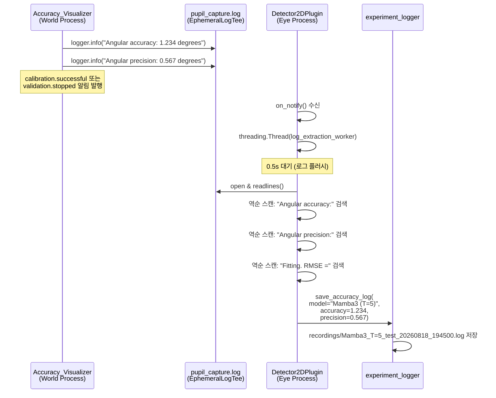

# Vivim-Mamba3 세그멘테이션 실행 지점 및 이후 데이터 흐름

> **핵심 질문**: Mamba3 모듈을 실제로 호출하여 세그멘테이션을 수행하는 코드는 어디인가?
> **답**: [`detector_2d_plugin.py`](file:///home/byeongjun/PycharmProjects/pupil/pupil_src/shared_modules/pupil_detector_plugins/detector_2d_plugin.py) → [`_detect_vivim_mamba_by_t()`](file:///home/byeongjun/PycharmProjects/pupil/pupil_src/shared_modules/pupil_detector_plugins/detector_2d_plugin.py#L358-L420) **Line 399**에서 `VivimBackbone.forward()`를 호출합니다.

---

## 1. 세그멘테이션 호출 지점 정확한 위치

### 1.1 호출 체인

```
eye.py ─ 메인 루프
  └─ detector_base_plugin.py : recent_events()      ← 매 프레임 트리거
       └─ detector_2d_plugin.py : detect()           ← 모델 라우팅
            └─ _detect_vivim_mamba_by_t()            ← 전처리 + 모델 호출
                 └─ VivimBackbone.forward()          ← ★ 세그멘테이션 실행 ★
```

### 1.2 실제 세그멘테이션 실행 코드

[`detector_2d_plugin.py` L398-404](file:///home/byeongjun/PycharmProjects/pupil/pupil_src/shared_modules/pupil_detector_plugins/detector_2d_plugin.py#L398-L404):

```python
with torch.inference_mode():
    logits = model(seq_tensor.float())          # ★ VivimBackbone.forward() ★

    if isinstance(logits, (list, tuple)):
        logits = logits[0]

    pred_mask_448 = logits.argmax(dim=1).squeeze(0).cpu().numpy().astype(np.uint8)
```

여기서 `model`은 `self.vivim_models[t_val]`로, [`VivimBackbone`](file:///home/byeongjun/PycharmProjects/pupil/pupil_src/shared_modules/pupil_detector_plugins/vivim/vivim_backbone.py) 인스턴스입니다.

### 1.3 VivimBackbone 내부에서 실제 Mamba3 SSM 실행

```
VivimBackbone.forward(x)                              # x: [B, T, 1, 448, 448] (T=7)
  ├─ 2D Encoder (enc1→enc2→enc3→bottleneck)           # 프레임별 특성 추출
  ├─ TemporalMambaBlock.forward(b_seq)                 # b_seq: [B, T, 256, 56, 56]
  │    ├─ reshape → [B*H*W, T, C]                     # 공간 위치별 시간 시퀀스
  │    ├─ LayerNorm
  │    ├─ MambaLayer.forward()                         # ★ Mamba3 SSM Selective Scan ★
  │    │    └─ mamba_ssm.modules.mamba3.Mamba3()       # 공식 Mamba-3 구현체
  │    ├─ Linear projection + residual
  │    └─ reshape → [B, T, C, H, W]
  └─ 2D Decoder (up3→dec3→up2→dec2→up1→dec1→final)   # 마지막 프레임 특성만 디코딩
      └─ final_cls: Conv2d(32→4)                       # 4클래스 세그멘테이션 logits
```

**관련 파일 위치:**

| 파일 | 경로 | 역할 |
|------|------|------|
| `VivimBackbone` | [`pupil_src/shared_modules/pupil_detector_plugins/vivim/vivim_backbone.py`](file:///home/byeongjun/PycharmProjects/pupil/pupil_src/shared_modules/pupil_detector_plugins/vivim/vivim_backbone.py) | 2D UNet + Temporal Mamba 통합 |
| `TemporalMambaBlock` | [`pupil_src/shared_modules/pupil_detector_plugins/vivim/temporal_mamba.py`](file:///home/byeongjun/PycharmProjects/pupil/pupil_src/shared_modules/pupil_detector_plugins/vivim/temporal_mamba.py) | 공간→시간축 변환 + Mamba 적용 |
| `MambaLayer` | [`pupil_src/shared_modules/pupil_detector_plugins/vivim/mamba_block.py`](file:///home/byeongjun/PycharmProjects/pupil/pupil_src/shared_modules/pupil_detector_plugins/vivim/mamba_block.py) | `mamba_ssm.Mamba3` 래퍼 |

---

## 2. 세그멘테이션 이후 전체 데이터 흐름

세그멘테이션 output인 `logits: [1, 4, 448, 448]`가 생성된 이후, 최종 정확도 기록까지 **7단계**를 거칩니다.

```mermaid
graph TD
    A["🧠 VivimBackbone.forward()<br/><b>logits [1,4,448,448]</b>"] --> B

    subgraph STAGE1["Stage 1: Logits → Mask"]
        B["argmax(dim=1)<br/>pred_mask_448 [448,448] uint8"]
        B --> C["Unpad 24px<br/>pred_mask_400 [400,400]"]
        C --> D["400×640 Canvas<br/>full_canvas[:, 120:520] = mask"]
    end

    D --> E

    subgraph STAGE2["Stage 2: Mask → Ellipse"]
        E["_postprocess_mask_to_datum()"]
        E --> F["Letterbox Unpad<br/>→ resize to orig (192×192)"]
        F --> G["Pupil Class 추출<br/>pred_mask == 3 → binary"]
        G --> H["GaussianBlur + Threshold<br/>Anti-aliasing"]
        H --> I["findContours<br/>→ 최대 면적 컨투어"]
        I --> J["cv2.fitEllipse()<br/>(cx,cy), (MA,ma), angle"]
    end

    J --> K

    subgraph STAGE3["Stage 3: 필터링 & 평활화"]
        K["Blink / Noise 거부<br/>aspect_ratio < 0.20 or area < 15.0 → reject"]
        K --> L["Jump Rejection (40px)<br/>dist > 40px (<5 frames: conf=0.0)"]
        L --> M["EMA 시간 평활화 (α=0.4)<br/>cx_new = 0.4*cx + 0.6*cx_prev"]
    end

    M --> N

    subgraph STAGE4["Stage 4: Datum 생성"]
        N["normalize(location, frame_size)<br/>→ norm_pos (0~1)"]
        N --> O["create_pupil_datum()<br/>datum dict 생성"]
    end

    O --> P

    subgraph STAGE5["Stage 5: IPC 전송"]
        P["eye.py: pupil_socket.send(datum)<br/>ZMQ PUB → IPC Backbone"]
        P --> Q["Pupil_Data_Relay.recent_events()<br/>World Process에서 수신"]
    end

    Q --> R

    subgraph STAGE6["Stage 6: Gaze Mapping"]
        R["gazer.map_pupil_to_gaze()<br/>pupil datum → gaze datum"]
        R --> S["gaze_pub.send(gaze_datum)<br/>ZMQ PUB"]
    end

    S --> T

    subgraph STAGE7["Stage 7: 정확도 계산"]
        T["Accuracy_Visualizer.recalculate()"]
        T --> U["calc_acc_prec_errlines()<br/>Angular Accuracy / Precision (Threshold 1.2°)"]
        U --> V["logger.info()<br/>'Angular accuracy: X.XXX degrees'"]
    end

    V --> W

    subgraph STAGE8["Stage 8: 실험 로그 저장 & 5-Stack 요약"]
        W["on_notify: calibration.successful / validation.stopped"]
        W --> X["log_extraction_worker()<br/>pupil_capture.log 역순 파싱"]
        X --> Y["experiment_logger.save_accuracy_log()<br/>recordings/*.log 저장 & 5-Stack 요약"]
    end

    style A fill:#2d6a4f,stroke:#1b4332,color:#fff
    style B fill:#40916c,stroke:#1b4332,color:#fff
    style J fill:#52b788,stroke:#1b4332,color:#fff
    style O fill:#74c69d,stroke:#1b4332,color:#fff
    style P fill:#264653,stroke:#2a9d8f,color:#fff
    style R fill:#264653,stroke:#2a9d8f,color:#fff
    style T fill:#e76f51,stroke:#264653,color:#fff
    style Y fill:#e9c46a,stroke:#264653,color:#000
```



---

## 3. 각 단계 상세 해설

### Stage 1: Logits → Prediction Mask

**위치**: [`detector_2d_plugin.py` L404-410](file:///home/byeongjun/PycharmProjects/pupil/pupil_src/shared_modules/pupil_detector_plugins/detector_2d_plugin.py#L404-L410)

| 단계 | 텐서 형상 | 설명 |
|------|-----------|------|
| `logits` | `[1, 4, 448, 448]` | 4클래스(BG/Sclera/Iris/Pupil) logits |
| `argmax(dim=1)` | `[1, 448, 448]` | 클래스 인덱스 맵 (0~3) |
| `.squeeze(0).cpu().numpy()` | `(448, 448)` uint8 | GPU → CPU 전송 |
| `[24:424, 24:424]` | `(400, 400)` | 24px 패딩 제거 |
| Canvas 배치 | `(400, 640)` | 400×400을 640×400 캔버스 중앙에 배치 |

```python
pred_mask_448 = logits.argmax(dim=1).squeeze(0).cpu().numpy().astype(np.uint8)
pred_mask_400 = pred_mask_448[24:424, 24:424]      # unpad
full_canvas = np.zeros((400, 640), dtype=np.uint8)
full_canvas[:, 120:520] = pred_mask_400             # center-place
```

### Stage 2: Mask → Ellipse 추출

**위치**: [`_postprocess_mask_to_datum()`](file:///home/byeongjun/PycharmProjects/pupil/pupil_src/shared_modules/pupil_detector_plugins/detector_2d_plugin.py#L422-L513)

```python
# Letterbox → 원본 해상도 복원
mask_400 = raw_pred_mask[:, 120:520]
pred_mask = cv2.resize(mask_400, (orig_w, orig_h), interpolation=cv2.INTER_NEAREST)

# 동공 바이너리 마스크
pupil_mask = np.zeros_like(pred_mask, dtype=np.uint8)
pupil_mask[pred_mask == 3] = 255   # PUPIL_CLASS_ID = 3

# Anti-aliasing
pupil_mask = cv2.GaussianBlur(pupil_mask, (5, 5), 0)
_, pupil_mask = cv2.threshold(pupil_mask, 127, 255, cv2.THRESH_BINARY)

# 컨투어 → 타원
contours, _ = cv2.findContours(pupil_mask, cv2.RETR_LIST, cv2.CHAIN_APPROX_NONE)
best_contour = max(contours, key=cv2.contourArea)
ellipse = cv2.fitEllipse(best_contour)
(cx, cy), (MA, ma), angle_deg = ellipse
```

**데이터 변환**: `(400,640) uint8 mask` → `(cx, cy, MA, ma, angle_deg)` 5개의 실수값

### Stage 3: 필터링 & 시간 평활화

**위치**: [`detector_2d_plugin.py` L462-491](file:///home/byeongjun/PycharmProjects/pupil/pupil_src/shared_modules/pupil_detector_plugins/detector_2d_plugin.py#L462-L491)

```
┌─ Blink / Noise 거부 ──────────────────────────┐
│  aspect_ratio = min(MA,ma)/max(MA,ma)          │
│  if aspect_ratio < 0.20 or area < 15.0:       │
│      → 빈 datum 반환                          │
│  (눈 감김 및 심한 왜곡 마스크 검출 방지)      │
└────────────────────────────────────────────────┘
         │ pass
         ▼
┌─ Confidence 설정 & Jump Rejection ─────────────┐
│  confidence = 1.0 (유효 타원 검출)             │
│                                                │
│  Jump Rejection:                               │
│    dist > 40px → consecutive_jumps++           │
│    if jumps < 5 → confidence=0, 이전 좌표 유지 │
│    if jumps ≥ 5 → 새 위치 수용 (실제 Saccade)  │
└────────────────────────────────────────────────┘
         │
         ▼
┌─ 시간 평활화 (EMA) ───────────────────────────┐
│  α = 0.4                                       │
│  cx_new = 0.4·cx + 0.6·cx_prev                │
│  cy_new = 0.4·cy + 0.6·cy_prev                │
└────────────────────────────────────────────────┘
```

### Stage 4: Pupil Datum 생성

**위치**: [`detector_2d_plugin.py` L493-513](file:///home/byeongjun/PycharmProjects/pupil/pupil_src/shared_modules/pupil_detector_plugins/detector_2d_plugin.py#L493-L513) + [`detector_base_plugin.py` L63-78](file:///home/byeongjun/PycharmProjects/pupil/pupil_src/shared_modules/pupil_detector_plugins/detector_base_plugin.py#L63-L78)

최종 `datum` 딕셔너리 구조:

```python
datum = {
    "id": 0,                          # eye_id (0 or 1)
    "topic": "pupil.0.2d",            # ZMQ 토픽
    "method": "Mamba3 (T=5)",         # 사용된 모델명
    "norm_pos": (0.52, 0.48),         # 정규화 좌표 (0~1), y-flip 적용
    "diameter": 45.2,                 # 장축 길이 (px)
    "confidence": 0.87,               # 검출 신뢰도 (0~1)
    "timestamp": 1723945601.234,      # 프레임 타임스탬프
    "ellipse": {
        "axes": (45.2, 42.1),         # (장축, 단축) px
        "angle": 12.3,                # 회전각 (degrees)
        "center": (96.5, 89.2),       # 타원 중심 (px)
    },
}
```

> [!NOTE]
> `norm_pos`는 [`methods.normalize()`](file:///home/byeongjun/PycharmProjects/pupil/pupil_src/shared_modules/methods.py)로 계산됩니다. `flip_y=True`이므로 y축이 반전되어 (0,0)이 좌하단, (1,1)이 우상단이 됩니다.

### Stage 5: IPC 전송 (Eye → World)

**위치**: [`eye.py` L804-806](file:///home/byeongjun/PycharmProjects/pupil/pupil_src/launchables/eye.py#L804-L806)

```python
# Eye Process 메인 루프 (eye.py)
for result in event.get(EVENT_KEY, ()):
    if not result.pop("_published_externally", False):
        pupil_socket.send(result)  # ZMQ PUB → IPC Backbone
```

전송 경로:
```
Eye Process                    IPC Backbone                World Process
pupil_socket ──PUB──→ XSUB ═══ XPUB ──→ pupil_sub (Pupil_Data_Relay)
  (zmq_tools.             (zmq.proxy)        (zmq_tools.
   Msg_Streamer)                              Msg_Receiver)
```

### Stage 6: Pupil → Gaze 매핑

**위치**: [`pupil_data_relay.py` L29-44](file:///home/byeongjun/PycharmProjects/pupil/pupil_src/shared_modules/pupil_data_relay.py#L29-L44)

```python
# World Process (Pupil_Data_Relay 플러그인)
def recent_events(self, events):
    while self.pupil_sub.new_data:
        topic, pupil_datum = self.pupil_sub.recv()
        recent_pupil_data.append(pupil_datum)

        gazer = self.g_pool.active_gaze_mapping_plugin
        for gaze_datum in gazer.map_pupil_to_gaze([pupil_datum]):
            self.gaze_pub.send(gaze_datum)        # gaze 결과 다시 IPC에 발행
            recent_gaze_data.append(gaze_datum)

    events["pupil"] = recent_pupil_data
    events["gaze"] = recent_gaze_data
```

[`GazerBase.map_pupil_to_gaze()`](file:///home/byeongjun/PycharmProjects/pupil/pupil_src/shared_modules/gaze_mapping/gazer_base.py#L361-L369)는 `datum["norm_pos"]`를 입력으로 받아 캘리브레이션 시 학습된 매핑 함수를 적용하여 `gaze_datum`을 생성합니다:

```python
def map_pupil_to_gaze(self, pupil_data):
    pupil_data = self.filter_pupil_data(pupil_data)     # confidence 기반 필터
    matches = (self.matcher.on_pupil_datum(datum) for datum in pupil_data)
    yield from self.predict(matches)                     # 캘리브레이션된 모델로 예측
```

> [!IMPORTANT]
> **`confidence`가 여기서 게이트 역할을 합니다.** `filter_pupil_data()`가 confidence가 낮은 datum을 필터링하므로, Stage 3에서 계산된 confidence 값이 직접적으로 gaze mapping 품질에 영향을 줍니다.

### Stage 7: Angular Accuracy/Precision 계산

**위치**: [`accuracy_visualizer.py`](file:///home/byeongjun/PycharmProjects/pupil/pupil_src/shared_modules/accuracy_visualizer.py)

캘리브레이션/검증 완료 시 [`Accuracy_Visualizer.recalculate()`](file:///home/byeongjun/PycharmProjects/pupil/pupil_src/shared_modules/accuracy_visualizer.py#L371-L422)가 실행됩니다:

```python
def recalculate(self):
    results = self.calc_acc_prec_errlines(
        gazer_class, g_pool, gazer_params,
        pupil_list, ref_list, intrinsics, outlier_threshold
    )
    logger.info(f"Angular accuracy: {results.accuracy.result:.3f} degrees")
    logger.info(f"Angular precision: {results.precision.result:.3f} degrees")
```

**정확도 계산 수식** ([L449-470](file:///home/byeongjun/PycharmProjects/pupil/pupil_src/shared_modules/accuracy_visualizer.py#L449-L470)):

```
Accuracy = arccos(mean(cos_distances))   (degrees)

  cos_distance = gaze_vector · ref_vector    (둘 다 단위 벡터)
  outlier 제거: cos_distance > cos(threshold)  (기본 outlier_threshold = 1.2°)
```

```
Precision = RMS(arccos(successive_cos_distances))   (degrees)

  successive_cos_distance = gaze[t] · gaze[t+1]
  필터: 연속 reference 포인트가 0.5° 이내인 경우만
```

### Stage 8: 실험 로그 저장 (피드백 루프)

**위치**: [`detector_2d_plugin.py` on_notify()](file:///home/byeongjun/PycharmProjects/pupil/pupil_src/shared_modules/pupil_detector_plugins/detector_2d_plugin.py#L644-L731)



**로그 파싱 패턴** — `pupil_capture.log`를 역순 스캔하면서 다음 패턴을 찾습니다:

| 검색 패턴 | 추출 대상 |
|-----------|-----------|
| `"accuracy_visualizer: Angular accuracy:"` | `accuracy_val` (float, degrees) |
| `"accuracy_visualizer: Angular precision:"` | `precision_val` (float, degrees) |
| `"Fitting. RMSE ="` | `rmse_val` (string, "X.XX px") |
| `"Starting  Calibration"` / `"Starting  Validation"` | 스캔 중단점 (이전 세션 데이터 방지) |

---

## 4. 데이터 형태 변환 요약표

전체 흐름에서 데이터가 어떻게 변환되는지 한눈에 볼 수 있습니다:

| Stage | 입력 | 출력 | 차원/타입 변환 |
|-------|------|------|----------------|
| **Mamba3 추론** | `[1,T,1,448,448]` float32 | `[1,4,448,448]` float32 | 시간축 소거, 4클래스 생성 |
| **Argmax** | `[1,4,448,448]` float32 | `(448,448)` uint8 | 채널→인덱스, GPU→CPU |
| **Unpad+Canvas** | `(448,448)` uint8 | `(400,640)` uint8 | 24px 제거, 캔버스 배치 |
| **Letterbox 복원** | `(400,640)` uint8 | `(192,192)` uint8 | 원본 해상도로 리사이즈 |
| **동공 추출** | `(192,192)` uint8 | `(192,192)` binary | class==3 필터, Gaussian+Thresh |
| **타원 피팅** | binary mask | `(cx,cy,MA,ma,angle)` | contour → fitEllipse |
| **필터링** | 타원 파라미터 | 필터된 파라미터 + confidence | blink 거부, EMA, jump reject |
| **Datum 생성** | 필터된 파라미터 | `datum dict` | normalize, flip_y, topic 부여 |
| **IPC 전송** | `datum dict` | ZMQ multipart message | msgpack 직렬화 |
| **Gaze Mapping** | `pupil_datum` | `gaze_datum` | 캘리브레이션 모델 적용 |
| **정확도 계산** | `gaze_datum[]` + `ref_pos[]` | `(accuracy°, precision°)` | 코사인 거리 → arccos → 도 |
| **로그 저장** | `(accuracy, precision, rmse)` | `.log` 파일 | 텍스트 직렬화 |

---

## 5. 프로세스 경계 다이어그램

```
┌──────────────────── Eye Process (eye0) ────────────────────┐
│                                                             │
│  Camera Frame                                               │
│       │                                                     │
│       ▼                                                     │
│  PupilDetectorPlugin.recent_events(event)                   │
│       │                                                     │
│       ▼                                                     │
│  Detector2DPlugin.detect(frame)                             │
│       │                                                     │
│       ├─ [Mamba3] _detect_vivim_mamba_by_t()               │
│       │      ├─ 전처리 (Z-score, pad, deque)               │
│       │      ├─ ★ VivimBackbone.forward() ← GPU 추론      │
│       │      └─ _postprocess_mask_to_datum()               │
│       │              ├─ 마스크 → 타원                       │
│       │              ├─ 필터링 & EMA                        │
│       │              └─ create_pupil_datum()                │
│       │                                                     │
│       └─ datum dict                                         │
│              │                                              │
│              ▼                                              │
│  pupil_socket.send(datum)  ─────── ZMQ PUB ──────────┐     │
│                                                       │     │
│  on_notify("calibration.successful")                  │     │
│       └─ log_extraction_worker() (Thread)             │     │
│              └─ experiment_logger.save_accuracy_log()  │     │
│                                                       │     │
└───────────────────────────────────────────────────────┼─────┘
                                                        │
                    ┌────── ZMQ IPC Backbone ──────┐    │
                    │  XSUB ═══════════ XPUB       │◀───┘
                    └──────────────────────────────┘
                                                   │
                                                   ▼
┌─────────────────── World Process ──────────────────────────┐
│                                                             │
│  Pupil_Data_Relay.recent_events()                           │
│       │                                                     │
│       ├─ pupil_sub.recv() → pupil_datum                    │
│       │                                                     │
│       ▼                                                     │
│  GazerBase.map_pupil_to_gaze([pupil_datum])                │
│       │                                                     │
│       ├─ filter_pupil_data() (confidence gate)              │
│       ├─ matcher.on_pupil_datum()                           │
│       └─ predict(matches) → gaze_datum                     │
│              │                                              │
│              ▼                                              │
│  gaze_pub.send(gaze_datum) → IPC                           │
│                                                             │
│  events["pupil"] = [...pupil_data]                         │
│  events["gaze"]  = [...gaze_data]                          │
│       │                                                     │
│       ▼                                                     │
│  Accuracy_Visualizer (캘리브레이션/검증 시)                  │
│       ├─ on_notify("calibration.result") → recalculate()   │
│       ├─ calc_acc_prec_errlines()                           │
│       │      ├─ gaze ↔ ref 상관 분석                        │
│       │      ├─ 코사인 거리 → Angular Accuracy (°)          │
│       │      └─ RMS 연속 거리 → Angular Precision (°)       │
│       └─ logger.info("Angular accuracy: X.XXX degrees")    │
│                                                             │
└─────────────────────────────────────────────────────────────┘
```

---

## 6. 핵심 인사이트

> [!IMPORTANT]
> **Mamba3의 세그멘테이션 품질이 최종 Angular Accuracy에 직접 영향을 미치는 경로:**
>
> 1. 세그멘테이션 마스크 품질 → 타원 피팅 정확도 → `norm_pos` 정밀도
> 2. `norm_pos` 정밀도 → Gaze Mapping 입력 품질
> 3. Gaze Mapping 출력 → Angular Accuracy 계산
>
> 따라서 **Mamba3의 시간적 맥락(T 프레임)이 세그멘테이션 경계를 얼마나 안정화하느냐**가 최종 시선추적 정확도의 핵심 결정 요인입니다.

> [!TIP]
> **confidence 값의 이중 역할**: Stage 3에서 계산된 confidence는 (1) Gaze Mapping에서 필터 게이트로 사용되고, (2) OpenGL 시각화에서 타원 투명도를 결정합니다. 따라서 confidence 임계값 조정이 정확도와 반응성 사이의 트레이드오프를 제어합니다.
