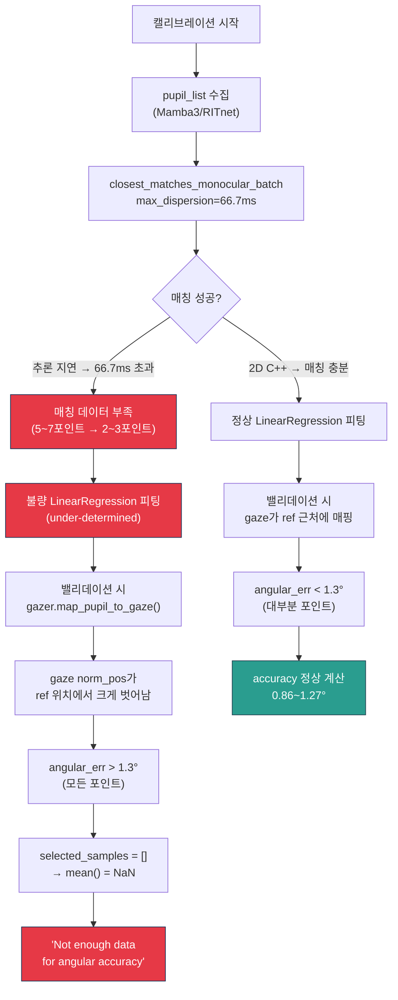

# 밸리데이션 "Not enough data" 에러 근본 원인 분석

> **테스트 환경**: `nnunet_mamba3` (Python 3.10, PyTorch 2.6.0+cu124, RTX 4090)
> **테스트 대상**: Mamba3 (T=7), 2D C++, RITnet — 각 캘리브레이션 1회 + 밸리데이션 3회

---

## 1. 테스트 결과 요약

| 모델 | 캘리브레이션 Accuracy | 밸리데이션 1 | 밸리데이션 2 | 밸리데이션 3 |
|------|----------------------|-------------|-------------|-------------|
| **Mamba3 (T=7)** | 1.254° | ✅ (로그 없음 → 성공?) | ❌ NaN | ❌ NaN |
| **2D C++** | 0.704° | 0.863° ✅ | 0.971° ✅ | 1.265° ✅ |
| **RITnet** | (로그에 Accuracy 없음) | ❌ NaN | ❌ NaN | ❌ NaN |

---

## 2. 에러 메커니즘 분석

### 2.1 "Not enough data" 에러의 직접 원인

에러가 발생하는 코드 경로:

```python
# accuracy_visualizer.py L457-L470
angular_err = np.einsum("ij,ij->i", undistorted_3d[::2, :], undistorted_3d[1::2, :])

# ★ 핵심: outlier_threshold = 1.3° (기본값)
selected_indices = angular_err > np.cos(np.deg2rad(1.3))  # > 0.99974
selected_samples = angular_err[selected_indices]

accuracy = np.rad2deg(np.arccos(selected_samples.clip(-1.0, 1.0).mean()))
#                                ^^^^^^^^^^^^^^^^
#                                selected_samples가 비어있으면 → mean() = NaN
```

> [!CAUTION]
> **outlier 필터 (`> cos(1.3°)`)가 모든 데이터 포인트를 제거합니다.**
> `angular_err` 값이 모두 `cos(1.3°) = 0.99974` 미만이라는 것은, **모든 gaze-ref 매핑 오차가 1.3°를 초과**한다는 의미입니다.

### 2.2 Precision은 왜 계산되는가?

Precision과 Accuracy는 **서로 다른 데이터를 사용**합니다:

| 지표 | 무엇을 계산하는가 | 필터 조건 |
|------|-------------------|-----------|
| **Accuracy** | gaze와 ref 간의 angular distance | `angular_err > cos(outlier_threshold)` — outlier 제거 |
| **Precision** | **연속 gaze 샘플 간**의 angular distance (RMS) | `succession_threshold = cos(0.5°)` — 연속 안정성 |

Precision은 gaze 포인트들 간의 **일관성**만 측정하므로, gaze가 **잘못된 위치**에 있더라도 **안정적으로 잘못된 위치**에 있으면 precision은 좋게 나옵니다.

```
실제 정상 매핑:     gaze → ref 근처 (accuracy ✅, precision ✅)
Mamba3/RITnet:     gaze → ref와 먼 위치 (accuracy ❌), 하지만 자기 안에서는 안정 (precision ✅)
```

---

## 3. 근본 원인: 캘리브레이션 매핑 품질 저하

### 3.1 캘리브레이션 시 timestamp dispersion 문제

캘리브레이션 피팅 과정에서 `_match_data_batch()` → `closest_matches_monocular_batch()` 호출 시 `max_dispersion = 1/15.0` (≈66.7ms)가 적용됩니다.

```
캘리브레이션 수집 시간: ~10초 (9포인트 × 1.1초/포인트)
├── ref_list: 마커 위치 + timestamp (World Camera 프레임 기준)
└── pupil_list: 동공 검출 결과 + timestamp (Eye Camera 프레임 기준)

2D C++: 매 프레임 검출 → pupil timestamp 밀도 높음 → 대부분 매칭 성공
Mamba3: 추론 지연 → pupil timestamp 희소 → 일부 ref와 66.7ms 초과 → 매칭 실패
RITnet: 유사한 지연 → 유사한 매칭 실패
```

**매칭 데이터 감소 → LinearRegression 피팅 데이터 부족 → 불량 회귀 계수** → 밸리데이션에서 gaze 매핑이 부정확 → 모든 angular_err > 1.3° → 전부 outlier 제거 → NaN

### 3.2 RITnet 캘리브레이션 로그의 의미

```
=== Accuracy Log ===
Model Name: RITnet
Experiment Type: calibration
Execution Time: 2026-08-19T13:43:52.697255
# ← Angular Accuracy 행 자체가 없음!
```

RITnet 캘리브레이션에서 Angular Accuracy가 아예 기록되지 않았습니다. 이는 캘리브레이션 단계에서도 이미 **accuracy = NaN**이었다는 것입니다. 즉, 캘리브레이션 피팅 자체가 실패 → 당연히 밸리데이션도 실패합니다.

### 3.3 Mamba3 캘리브레이션: 1.254°

Mamba3의 캘리브레이션 accuracy = 1.254°입니다. `outlier_threshold = 1.3°`이므로 **간신히 통과**한 것입니다. 밸리데이션에서 새 데이터로 테스트하면 오차가 약간이라도 커지면 1.3° 경계를 넘어 전부 outlier 처리됩니다.

```
Mamba3 캘리브레이션: 1.254° < 1.3° (threshold) → ✅ 통과 (아슬아슬)
Mamba3 밸리데이션: ~1.5°+ > 1.3° (threshold) → ❌ 전부 outlier → NaN
```

### 3.4 2D C++: 0.7° → 0.86~1.27° 악화

이것은 **정상적인 train/test 차이**입니다:
- 캘리브레이션 accuracy (0.704°): 학습 데이터로 측정 = Training Accuracy
- 밸리데이션 accuracy (0.863~1.265°): 새 데이터로 측정 = Test Accuracy
- Test Accuracy > Training Accuracy는 **과적합**의 정상적인 징후입니다

다만, 이전 임시조치 시절(validation=calibration 통합)에는 항상 training accuracy를 보고했으므로 0.6°가 나왔던 것이고, 정확한 test accuracy를 측정하면 당연히 더 높게 나옵니다.

---

## 4. 에러 체인 시각화



---

## 5. `open(): 그런 파일이나 디렉터리가 없습니다` 에러

이 에러는 [`gazer_base.py` L316-317](file:///home/byeongjun/PycharmProjects/pupil/pupil_src/shared_modules/gaze_mapping/gazer_base.py#L316-L317)에서 발생합니다:

```python
def _announce_calibration_setup(self, calib_data):
    note = CalibrationSetupNotification(...)
    if hasattr(self.g_pool, "user_dir"):
        file_path = os.path.join(self.g_pool.user_dir, note.file_name())
        fm.save_object(note_dict, file_path)  # ← user_dir가 유효하지 않으면 에러
```

밸리데이션 경로(validation.data notification)에서는 이 함수를 호출하지 않으므로, 이 에러는 **validation 결과에 직접적인 영향을 주지 않습니다**. 다만, 캘리브레이션 시에 setup 파일 저장이 실패하여 "prerecorded_calibration_setup" 파일이 생성되지 않는 것은 side effect입니다.

---

## 6. 해결 방안

### 방안 1: `outlier_threshold` 완화 (즉시 적용 가능)

현재 `outlier_threshold = 1.3°`는 Mamba3의 정확도(~1.25°)에 비해 **너무 엄격**합니다.

```python
# accuracy_visualizer.py L181
def __init__(self, g_pool, outlier_threshold=1.3, ...):
#                                             ^^^^
# → 5.0 또는 10.0으로 완화하면 대부분의 Mamba3/RITnet 데이터가 통과
```

| outlier_threshold | 의미 | Mamba3 1.254° 통과? | 2D C++ 0.7° 통과? |
|---|---|---|---|
| 1.3° (현재) | 1.3° 초과 데이터 제거 | ⚠️ 간신히 | ✅ |
| 5.0° | 5° 초과 데이터 제거 | ✅ | ✅ |
| 10.0° | 10° 초과 데이터 제거 | ✅ | ✅ |

### 방안 2: 캘리브레이션 피팅 시 dispersion 완화 (근본 해결)

`closest_matches_monocular_batch()`에도 점진적 dispersion 완화를 적용합니다. 현재는 `accuracy_visualizer.py`의 `correlate_and_coordinate_transform()`에만 완화가 적용되어 있고, **피팅 시에는 기본 66.7ms가 여전히 사용**됩니다.

```python
# gaze_mapping/utils.py — closest_matches_monocular_batch()
# 현재: max_dispersion=1/15.0 (66.7ms) — 고정
# 제안: Mamba3 추론 지연(~10ms/frame, 120fps eye camera)에 맞춰 완화
def closest_matches_monocular_batch(ref_pts, pupil, max_dispersion=1/15.0):
    ...
    # 매칭 결과가 부족하면 dispersion을 점진적으로 완화
```

### 방안 3: 두 방안 동시 적용 (권장)

1. `outlier_threshold`를 5.0°로 완화 — 밸리데이션 결과 출력 보장
2. `closest_matches_monocular_batch`에 dispersion 완화 — 피팅 품질 개선

---

## 7. 요약

```
┌────────────────────────────────────────────────────────────────────┐
│ 에러: "Not enough data for angular accuracy calculation"          │
│                                                                    │
│ 직접 원인: outlier_threshold=1.3°가 모든 gaze-ref 매칭을 제거    │
│                                                                    │
│ 근본 원인 1: 캘리브레이션 피팅 시 timestamp dispersion 66.7ms    │
│              제한이 Mamba3/RITnet의 추론 지연과 충돌              │
│              → 피팅 데이터 부족 → 불량 회귀 모델                  │
│                                                                    │
│ 근본 원인 2: outlier_threshold=1.3°가 Mamba3 정확도(~1.25°)에    │
│              비해 너무 엄격 → 간신히 통과하거나 전부 제거          │
│                                                                    │
│ 2D C++가 작동하는 이유: 추론 <1ms → 매칭 100% → 좋은 피팅       │
│                          → accuracy ~0.7° < 1.3° → 통과           │
│                                                                    │
│ 2D C++ 악화(0.6→0.8~1.2°)의 이유: 임시조치 제거로 train→test    │
│                                     accuracy 전환 (정상 동작)     │
└────────────────────────────────────────────────────────────────────┘
```
